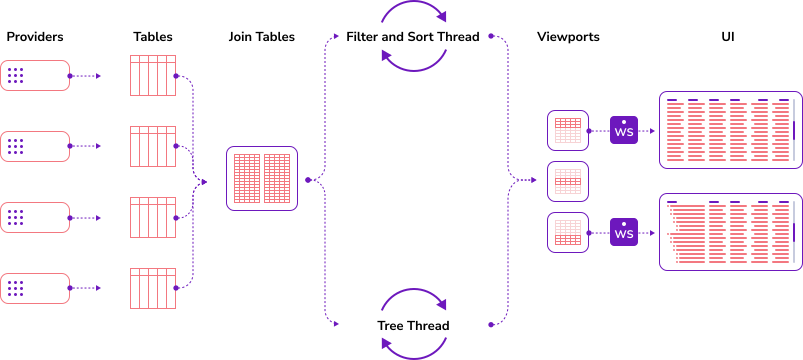

# How does it work

Let's start with a diagram.

This shows the basic flow through the system, there are components which have been omitted for clarity.

On the left hand side of the screen you can see **providers**. These source data from the external world, or a model in process
and push them into a table. The table acts like a sink and forwards the event onto any join tables that are composed of
this underlying table, and or to any viewports that are on this table directly.

**Viewports** are a users view onto a particular table, or join table. Viewports have knowledge of where a user is looking
onto the underlying data. They also know if the user has asked for a filter or sort on the data.

Finally we have the UI. This is connected to the Vuu server via a websocket and receives updates in realtime.

There are two important factors to take into account from this diagram, the first is that what is in your viewport is calculated
out of band on a separate thread to the update path (Filter and Sort Thread.) The filter and sort thread takes the underlying
table you have asked for in your viewport and applies the filters and sorts you've requested. The resulting array of
primary keys is then pushed into your viewport.

The update path, by comparison, is different. If you have a particular key in the visible range of your viewport already
and it is updated, it follows the tick() path, so it will progress through the system as an event, on the same thread
as the provider itself.

The upshot of this is that **Vuu favours the update path** (the orange line in the diagram) over the calculation of new data in your UI. You will most
likely rarely if ever notice this, but it is an important concept.
