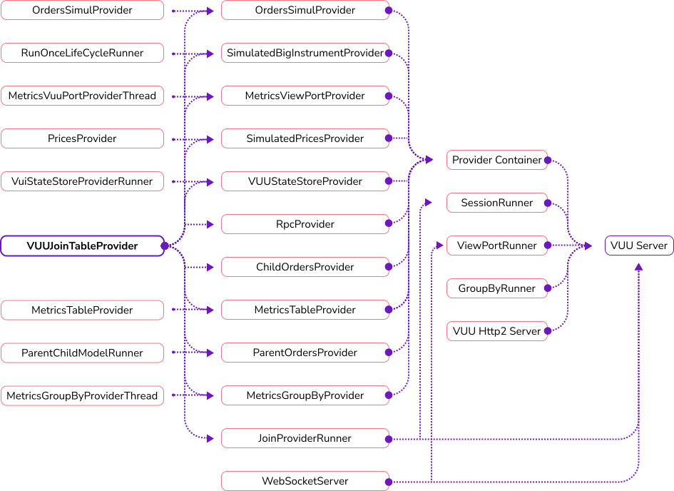

import { SvgDottySeparator } from "@site/src/components/SvgDottySeparator";

# Lifecycle

<SvgDottySeparator style={{marginBottom: 32}}/>

Vuu has a simple server side lifecycle component built it. The lifecycle is implemented as a DAG (Directed Acyclic Graph)
which allows components to be started and stopped in a sensible order.

## How does the lifecycle work?

The user interaction with the lifecycle component is very minimal by design. THe obligation is when there is a component
that depends on something else, it registers that dependency in the construction logic.

As an example if we take the VuiStateStoreProvider

```scala
class VuiStateStoreProvider(val table: DataTable, val store: VuiStateStore)(implicit clock: Clock, lifecycleContainer: LifecycleContainer) extends Provider {

  //we create a lifecycle enabled runner, which is basically a thread
  private final val runner = new LifeCycleRunner("vuiStateStoreProviderRunner", () => runOnce(), minCycleTime = 10)
  //then we tell the lifecycle that this node depends on the runner being created before we can be fully initialized.
  lifecycleContainer(this).dependsOn(runner)

  override val lifecycleId: String = "vuiStateStoreProvider"
  // <snip/>

  def runOnce() = {
    // <snip/>
  }

  override def subscribe(key: String): Unit = {}
  override def doStart(): Unit = {}
  override def doStop(): Unit = {}
  override def doInitialize(): Unit = {}
  override def doDestroy(): Unit = {}
}

```

By calling:

```scala
lifecycleContainer(this).dependsOn(runner)
```

What this means is that in the graph behind we have now created a vertex (directional dependency) between the runner and the VuiStateStoreProvider.

```
(Core Components)
    --> VuiStateStoreProvider
                --> LifeCycleRunner("vuiStateStoreProviderRunner")
```

When Vuuu starts up it evaluates components from the furthest node out back to the root node. So the lifecycle runners will be started before the VuiStateStoreProvider before the core componenets etc..

## What does the Vui lifecycle look like on startup?



As you can see from this graph. The server has as well defined startup and shutdown sequencer, controlled by its lifecycle.
