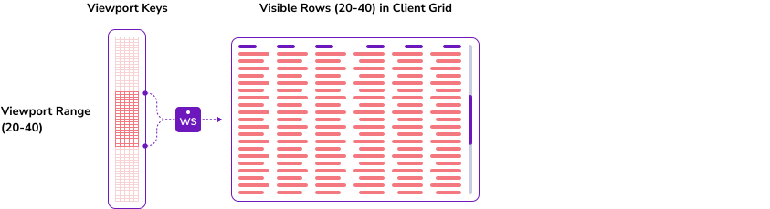
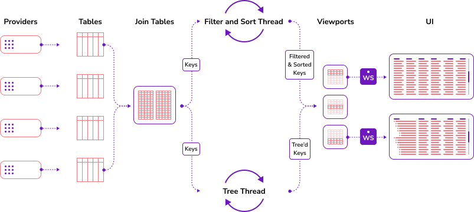

import { SvgDottySeparator } from "@site/src/components/SvgDottySeparator";

# Viewports

<SvgDottySeparator style={{marginBottom: 32}}/>

A Viewport is a specific client's view onto an underlying table. It has knowledge of the underlying table that a viewport is looking at. It also has knowledge of
the window of data that a client currently has displayed on her screen. It contains information on any sorts, or filters that a specific client
has requested on the data, on columns that the client has asked to display as well as information such as which rows are currently selected on the clients grid.

As well as the above, viewports contain references to immutable arrays of the keys of the underlying table. These arrays are sorted and filtered based on the clients
requested sort of the data.

When a user opens a viewport on a table from the client, a thread in the server will asynchronously populate the keys based on the viewports parameters (sorts, filters, etc..) into an immutable array
and will pass that array to the viewport. This thread will then continuously recalculate the keys (if there have been any changes) during the lifetime of the viewport.

The row that is sent to a user is only realized in the viewport at the point the row becomes visible in the client (or part of the pre-post fetch.) This occurs by dragging the fields from the underlying tables
when an update needs to be sent to the client.

And in the context of the wider Vuu server.

