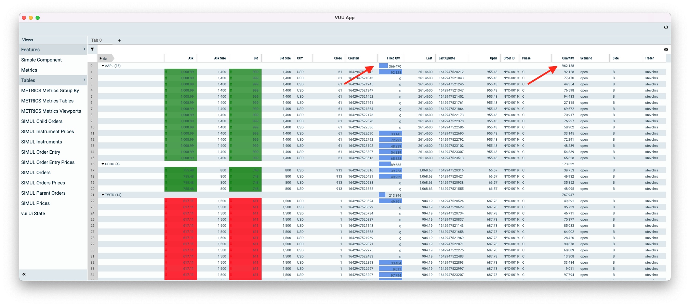

# Aggregates

Aggregates are mathematical operations we perform on the leaf nodes within a tree, that we want to display on the branch
rows of a tree.

Typically aggregrates are used to display sums or counts of values, we support the following types:

| Aggregate Type | Value | Description                                           |
| -------------- | ----- | ----------------------------------------------------- |
| Sum            | 1     | Sum of values in field of child                       |
| Average        | 2     | Average of a numerical value                          |
| Count          | 3     | Count of distint values (can be used in non numerics) |
| High           | 4     | Math.max(column)                                      |
| Low            | 5     | Math.min(column)                                      |

Below is a sample of the UI with a sum aggregate on the filled quantity and quantity columns.

