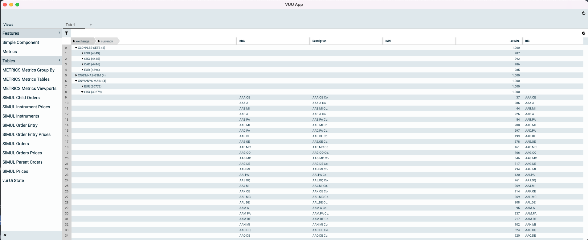

import { SvgDottySeparator } from "@site/src/components/SvgDottySeparator";

# Trees

<SvgDottySeparator style={{marginBottom: 32}}/>

Trees are a specialized views onto tables that live within specific users viewports. Trees are built on a separate thread
in a very similar manner to sorts and filters, but instead of creating a flat array of keys the output of the tree builder
is a tree where the leaf nodes are the keys.

When a viewport is changed to be tree'd the keys in the viewport are changed to be Tree Keys. Tree keys have mappings back to underlying rows
in the flat table in the data structure.
Also additional information is added to the table to denote whether a branch node is open or closed,
and how deep the specific tree key is indented in the structure.

Tree's are represented in a specific type of table TreeSessionTable, which unlike other tree's lives within a users viewport
and is a derivation on an underlying table. When the viewport is closed the TreeTable is deleted.

```
//Pre Tree'd Viewport:

Keys = [
    "order-001"
    "order-002"
    "order-003"
    "order-004"
]
```

```
//Post Tree'd Viewport keys, after we have tree'd by RIC
Keys = [
    "$root/AAPL"             //branch, isOpen = true, indent = 1
    "$root/AAPL/order-001"
    "$root/AAPL/order-002"
    "$root/GOOG"             //branch, isOpen = true , indent = 1
    "$root/GOOG/order-003"
    "$root/GOOG/order-004"
]
```

From the picture below you can see a grid that has been tree'd on two fields (exchange and currency)



If you look at the update messages sent across the websocket you will see that tree updates have additional columns within the data packet, specifically:

```json
{
  "requestId": "",
  "sessionId": "SESS-83321475-45ef-486c-99a9-cce1ccc28b34",
  "token": "",
  "user": "user",
  "body": {
    "type": "TABLE_ROW",
    "batch": "REQ-5",
    "isLast": true,
    "timeStamp": 1642946459556,
    "rows": [
      {
        "viewPortId": "user-VP-00000000",
        "vpSize": 4,
        "rowIndex": 2,
        "rowKey": "$root|XNYS/NYS-MAIN",
        "updateType": "U",
        "ts": 1642946459556,
        "sel": 0,
        "vpVersion": "3",
        "data": [
          1,
          false,
          "$root|XNYS/NYS-MAIN",
          false,
          "XNYS/NYS-MAIN",
          123032,
          "",
          "",
          "",
          "XNYS/NYS-MAIN",
          "",
          "1000",
          ""
        ]
      },
      {
        "viewPortId": "user-VP-00000000",
        "vpSize": 4,
        "rowIndex": 0,
        "rowKey": "$root|XLON/LSE-SETS",
        "updateType": "U",
        "ts": 1642946459556,
        "sel": 0,
        "vpVersion": "3",
        "data": [
          1,
          false,
          "$root|XLON/LSE-SETS",
          false,
          "XLON/LSE-SETS",
          17576,
          "",
          "",
          "",
          "XLON/LSE-SETS",
          "",
          "1000",
          ""
        ]
      },
      {
        "viewPortId": "user-VP-00000000",
        "vpSize": 4,
        "rowIndex": 3,
        "rowKey": "$root|XAMS/ENA-MAIN",
        "updateType": "U",
        "ts": 1642946459556,
        "sel": 0,
        "vpVersion": "3",
        "data": [
          1,
          false,
          "$root|XAMS/ENA-MAIN",
          false,
          "XAMS/ENA-MAIN",
          17576,
          "",
          "",
          "",
          "XAMS/ENA-MAIN",
          "",
          "1000",
          ""
        ]
      },
      {
        "viewPortId": "user-VP-00000000",
        "vpSize": 4,
        "rowIndex": 1,
        "rowKey": "$root|XNGS/NAS-GSM",
        "updateType": "U",
        "ts": 1642946459556,
        "sel": 0,
        "vpVersion": "3",
        "data": [
          1,
          false,
          "$root|XNGS/NAS-GSM",
          false,
          "XNGS/NAS-GSM",
          17576,
          "",
          "",
          "",
          "XNGS/NAS-GSM",
          "",
          "1000",
          ""
        ]
      }
    ]
  },
  "module": "CORE"
}
```

you'll see there are an additional 6 fields added to each row, these are:

- depth - what is the depth of this node in the tree (this is used to determine how to render the row)
- tree.isOpen(this) - boolean: is the node state open or closed (if its a branch)
- key - the treeKey value for this row
- isLeaf - boolean: is this a leaf
- originalKey - original row key, before tree'ing
- children.size()) - number of children at the next level below it

These fields allow us to render a tree on the client when the client only has a viewported window over the data set rather
than the full data.
