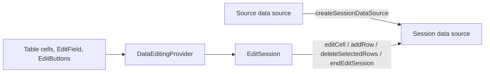
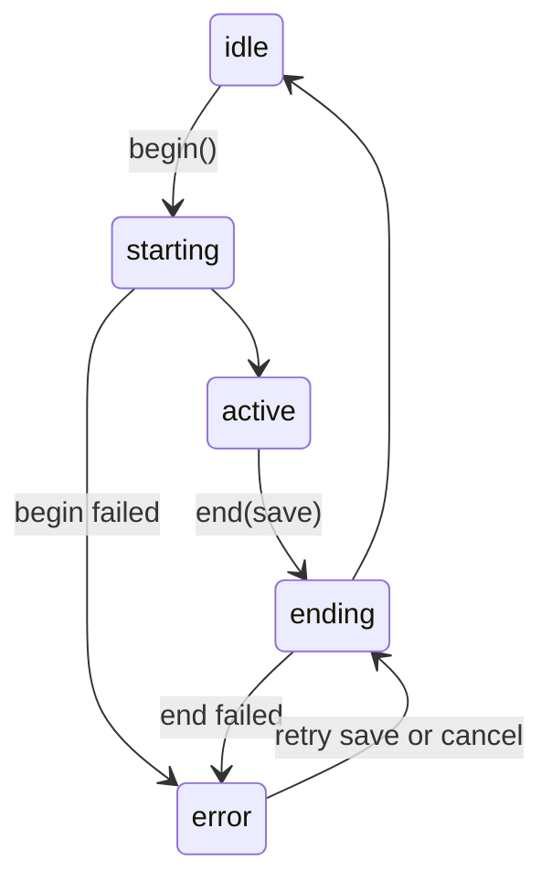

# Concepts and Lifecycle

## Edit sessions and session tables

Edits are made in an _edit session_. When a session begins, the Vuu server
creates a _session table_: a temporary copy of the rows that can be edited. All
edits, inserts and deletes go to the session table. When the session ends, the
user either:

- **saves**, and the server applies every change to the source table in one
  go, or
- **cancels**, and the session table is thrown away.

Other users see nothing until the save, and then they see all of it.

Which rows are copied into the session table is set by the _copy option_:

| Copy option | Session table starts with |
| ----------- | ------------------------- |
| `All` (default) | every row in the source viewport |
| `Selected` | the rows selected when editing began |
| `Empty` | no rows, for sessions that only add rows |

## The pieces



- **`EditSession`** owns one edit session. It begins and ends the session,
  sends edits to the session data source and keeps count of edits, inserts,
  deletes and invalid values. It emits events when its state changes.
- **`DataEditingProvider`** makes an edit session available to the cells,
  fields and buttons below it.
- **`EditModeProvider`** holds whether the UI is in view or edit mode, for
  controls such as `EditField` that read it.
- **`useEditableTable`** creates an `EditSession` for a data source, begins and
  ends it as edit mode changes, and gives you the data source to show: the
  source in view mode, the session table while editing.

The pattern components wire all of this up for you.

## Lifecycle

`editSession.lifecycle.status` moves through these states:



- **idle**: no session. The table shows the source data.
- **starting**: the session table is being created.
- **active**: the user can edit. `isEditSessionReady` from `useEditableTable`
  is true.
- **ending**: save or cancel is in progress.
- **error**: begin or end failed. After a failed end the session is still
  open, so the user can try to save again or cancel.

## Edit state

While a session is active, `editSession.editState` sums up the edits:

| Edit state | Meaning | Save enabled |
| ---------- | ------- | ------------ |
| `clean` | nothing has changed | no |
| `dirty` | there are valid, unsaved changes | yes |
| `invalid` | at least one value failed validation | no |
| `stale` | the last save was rejected because the source rows changed since the session began | yes, as a forced save |

`canSave` and `canCancel` combine the lifecycle and edit state into the
decisions a toolbar needs. To read them in React, use `useEditSessionState`,
which re-renders when they change:

```tsx
const { canSave, editState, isDirty } = useEditSessionState(editSession);
```

## New rows

A row being added is a draft held in the edit session (`newRowState`) until it
is added to the session table. The draft is addressed with the reserved key
`EditSession.newRowKey`. `addNewRow()` validates the draft, checks required
fields and sends `addRow`. If the server rejects the row, the draft is kept and
the error is shown, so the user can fix it and try again.

`rowDefaults` (on `useEditableTable`, `EditableTable` and `EditForm`) supplies
values for columns the user doesn't fill in, such as a parent id. Pass a stable
reference: a new object recreates the edit session.

## Deleting rows

By default deletes are _soft_: the row is marked with `vuuAction = "deleteRow"`
in the session table, styled with the `vuuTableRow-deleted` class, and removed
from the source table on save. Soft-deleted rows can't be edited or selected;
use `isEditRowReadOnly(row)` to check for one. Pass `deleteMode="hard"` to ask
the session table's service to remove the row instead.
