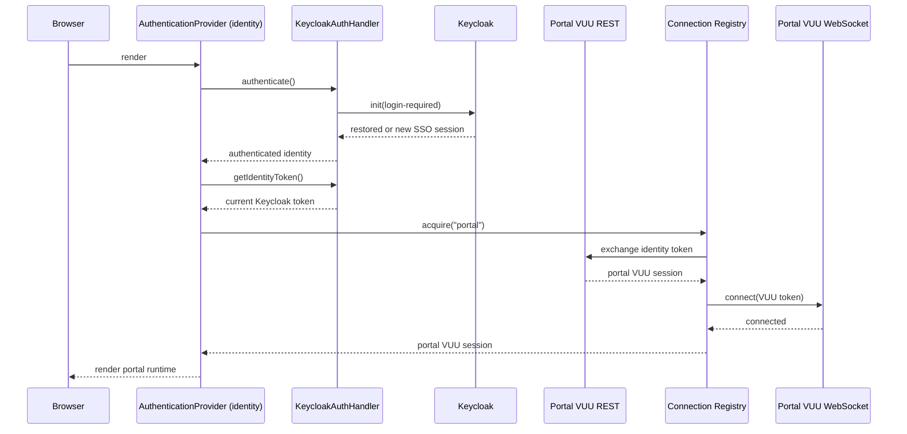
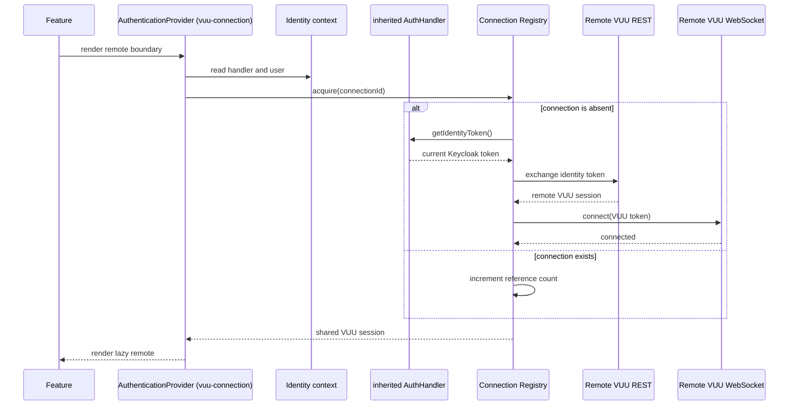

# Portal and Remote Module Authentication Design

## Status

Approved target design.

## Scope

This document defines authentication and VUU connection handling for:

- `vuu-portal`, the module-federation host.
- `PortalShell`, the authenticated portal runtime container.
- `Feature`, which lazy-loads module-federation remotes.
- `RemoteModule`, which establishes the VUU connection required by a remote.
- `@vuu-ui/core`, which owns identity authentication and VUU token
  exchange.
- `@vuu-ui/vuu-data-react`, which supplies VUU data-source implementations
  without performing authentication.

Projects whose names begin with `feature-` are module-federation remotes. They
do not authenticate directly and do not contain identity-provider integration.

## Design Goals

1. The portal authenticates the user before rendering `PortalShell`.
2. Keycloak login occurs once for the host application.
3. Existing Keycloak cookies restore the SSO session without another login
   prompt.
4. Each VUU server issues its own VUU token by exchanging the current Keycloak
   identity token.
5. Each VUU token is used to open the websocket for its corresponding VUU
   server.
6. Remote modules inherit the authenticated identity from the host.
7. Remote modules never initialize Keycloak or present a login screen.
8. Multiple feature instances with the same `connectionId` share one VUU
   session and websocket connection.
9. `VuuDataSourceProvider` supplies data-source dependencies only. It does not
   authenticate or open websocket connections.
10. Authentication failure for one remote does not terminate the portal or
    other remotes.

## Terminology

### Identity authentication

Identity authentication establishes or restores the user's Keycloak session.
It produces an identity token and an authenticated user.

The corresponding `AuthenticationProvider` mode is `"identity"`.

### VUU connection authentication

VUU connection authentication exchanges the current identity token for a VUU
token issued by a specific VUU server, then opens that server's websocket.

The corresponding `AuthenticationProvider` mode is `"vuu-connection"`.

### Authentication versus authorization

`AuthenticationProvider` is the correct name for the React provider.
Authentication establishes identity and authenticated server sessions.
Authorization is the later use of permissions and authorizations returned in a
VUU token.

## Package Responsibilities

### `@vuu-ui/core`

The auth package owns:

- `AuthConfig`
- `AuthHandler`
- `AuthHandlerClass`
- `KeycloakAuthHandler`
- `AuthenticationProvider`
- authenticated identity context
- VUU connection context
- identity-token refresh
- VUU token exchange
- authentication and connection error types
- VUU session acquisition and reconnection coordination

### `@vuu-ui/vuu-data-remote`

The remote-data package owns:

- `ConnectionManager`
- websocket creation and protocol handling
- server API access by `connectionId`
- VUU data sources
- connection status events
- connection cleanup

It does not own identity-provider integration or VUU token exchange.

`VuuAuthenticator` is not part of this architecture. Its token-exchange and
connection-coordination responsibilities belong to
`AuthenticationProvider` and focused auth functions.

### `@vuu-ui/vuu-data-react`

The React data package owns:

- `VuuDataSourceProvider`
- React data-source dependency injection
- connection-aware data-source construction

It does not:

- authenticate users
- exchange identity tokens
- receive authentication tokens as props
- open websocket connections
- retry authentication

### `@vuu-ui/vuu-shell`

The shell package owns:

- `Feature`
- `RemoteModule`
- lazy module-federation loading
- remote feature error isolation

`RemoteModule` composes `AuthenticationProvider` in `"vuu-connection"` mode.
It does not compose `VuuDataSourceProvider`.

## Identity Handler

`AuthHandler` is an imperative authentication service. It is not a React
provider.

```ts
export interface AuthenticatedIdentity {
  user: User;
}

export interface AuthHandler {
  authenticate(): Promise<AuthenticatedIdentity>;
  getIdentityToken(): Promise<string>;
  logout(): Promise<void> | void;
}

export type AuthHandlerClass = new (config: AuthConfig) => AuthHandler;
```

### `authenticate`

`authenticate()` establishes or restores the identity-provider session.

For `KeycloakAuthHandler`, it calls:

```ts
keycloak.init({ onLoad: "login-required" });
```

On the first visit, Keycloak may redirect the browser to login. On later
visits, Keycloak cookies restore the existing SSO session without prompting the
user again.

`authenticate()` does not call a VUU REST endpoint and does not open a
websocket.

### `getIdentityToken`

`getIdentityToken()` returns a currently valid identity token. The Keycloak
implementation refreshes the token when necessary before returning it.

All VUU connections, including the portal connection, acquire identity tokens
through this method.

### `logout`

`logout()` terminates the identity-provider session. Application logout also
disconnects all VUU connections before or while delegating to the handler.

## Keycloak Handler

`KeycloakAuthProvider` is renamed `KeycloakAuthHandler`.

One handler instance is created by the root `"identity"`
`AuthenticationProvider`. Nested `"vuu-connection"` providers inherit that
exact instance through context.

The handler owns:

- Keycloak initialization
- Keycloak SSO session restoration
- identity-token refresh
- Keycloak logout

The handler does not own:

- VUU REST endpoint selection
- VUU token exchange
- VUU websocket connection
- per-remote connection state

## VUU Authentication Types

```ts
export interface VuuAuthTarget {
  connectionId: string;
  restUrl: string;
  websocketUrl: string;
}

export interface VuuSession {
  authorizations: string[];
  token: string;
  user: User;
}
```

`VuuAuthTarget` is normalized before authentication begins. Its `restUrl` and
`websocketUrl` are always present at that point.

## VUU Token Exchange

VUU token exchange is independent of the identity-provider implementation.

```ts
export type ExchangeVuuToken = (
  identityToken: string,
  target: VuuAuthTarget,
) => Promise<VuuSession>;
```

The default exchange implementation:

1. Calls `target.restUrl`.
2. Sends the identity token in the authorization header.
3. Rejects non-success responses with a typed error.
4. Validates that a VUU token was returned.
5. Parses the VUU user and authorizations from the token.
6. Returns the `VuuSession`.

The exchange function does not open a websocket.

## `AuthenticationProvider`

`AuthenticationProvider` is the only React component that coordinates
authentication and VUU connection lifecycle.

It has a discriminated prop API.

```ts
export interface IdentityAuthenticationProps {
  mode: "identity";
  authConfig: AuthConfig;
  authHandlerClass: AuthHandlerClass;
  connectionId?: string;
  children: ReactNode;
  onError?: AuthenticationErrorHandler;
}

export interface VuuConnectionAuthenticationProps {
  mode: "vuu-connection";
  connection: RemoteModuleConnection;
  children: ReactNode;
  onError?: AuthenticationErrorHandler;
}

export type AuthenticationProviderProps =
  | IdentityAuthenticationProps
  | VuuConnectionAuthenticationProps;
```

The identity mode may be the default for compatibility, but application code
uses the explicit mode.

### Identity mode

`mode="identity"`:

1. Creates one configured `AuthHandler`.
2. Calls `authenticate()`.
3. Obtains a valid identity token with `getIdentityToken()`.
4. Exchanges it at the portal VUU REST endpoint.
5. Acquires the shared portal connection-registry entry.
6. Opens the portal websocket with the portal VUU token when it is not already
   connected.
7. Publishes the handler, authenticated identity, portal VUU session, and
   active `connectionId`.
8. Renders children only after authentication and portal connection succeed.

The portal is therefore authenticated before `PortalShell` or any remote
feature is reachable.

### VUU connection mode

`mode="vuu-connection"`:

1. Requires an ancestor `"identity"` provider.
2. Reads the inherited `AuthHandler` and authenticated identity.
3. Normalizes the remote connection configuration.
4. Acquires the connection-registry entry for `connectionId`.
5. If the entry is not authenticated or connected:
   1. calls the inherited handler's `getIdentityToken()`
   2. exchanges it at the target VUU REST endpoint
   3. opens the target websocket with the returned VUU token
6. Publishes the target VUU session and active `connectionId`.
7. Renders children only after the target connection succeeds.

This mode never calls `authenticate()` and never initializes Keycloak.

Using `"vuu-connection"` without an ancestor `"identity"` provider is a
configuration error.

## React Context

The auth package exposes hooks backed by two related contexts.

### Identity context

The identity context contains application-wide state:

```ts
export interface IdentityContextValue {
  authHandler: AuthHandler;
  user: User;
  getIdentityToken(): Promise<string>;
  logout(): Promise<void>;
}
```

There is exactly one identity context for the portal runtime.

### VUU connection context

The connection context contains the nearest authenticated VUU connection:

```ts
export interface VuuConnectionContextValue {
  connectionId: string;
  session: VuuSession;
}
```

The identity provider publishes the portal connection. Each nested
`"vuu-connection"` provider overrides it for its remote subtree.

## Host Composition

The portal bootstrap composes authentication and data access as follows:

```tsx
<AuthenticationProvider
  mode="identity"
  authConfig={config}
  authHandlerClass={KeycloakAuthHandler}
  connectionId="portal"
>
  <VuuDataSourceProvider>
    <App />
  </VuuDataSourceProvider>
</AuthenticationProvider>
```

`PortalShell` is rendered inside this boundary. It cannot be reached until
identity authentication, portal VUU token exchange, and portal websocket
connection have completed.

## Remote Composition

`Feature` lazy-loads a remote component and delegates its VUU runtime boundary
to `RemoteModule`.

```tsx
<RemoteModule connection={remoteDescriptor.vuu}>
  <LazyFeature />
</RemoteModule>
```

`RemoteModule` is implemented as:

```tsx
export const RemoteModule = ({
  children,
  connection,
}: RemoteModuleProps) => (
  <AuthenticationProvider
    mode="vuu-connection"
    connection={connection}
  >
    {children}
  </AuthenticationProvider>
);
```

It does not render `VuuDataSourceProvider`. Remote components inherit the root
data-source provider and the nested VUU connection context.

## Connection Registry

The connection registry is keyed by `connectionId`.

```ts
export interface VuuConnectionRegistryEntry {
  connectionId: string;
  state:
    | "idle"
    | "authenticating"
    | "connecting"
    | "connected"
    | "failed";
  session?: VuuSession;
  promise?: Promise<VuuSession>;
  refCount: number;
}
```

### Sharing

All feature and provider instances with the same `connectionId` share:

- one registry entry
- one in-flight token exchange
- one VUU token/session
- one websocket connection
- one reconnect operation

Mounting a second feature with an already-connected `connectionId` increments
the reference count and reuses the connection.

### Cleanup

Unmounting a provider decrements the reference count. The connection is
released only when no mounted consumer references it.

The portal connection remains active for the lifetime of the identity provider.

Application logout disconnects every registry entry regardless of reference
count.

### Concurrent mounting

The first consumer stores its authentication/connection promise in the
registry entry. Concurrent consumers await that same promise. This prevents
duplicate token exchanges and websocket connections.

### React Strict Mode

Registry acquisition and release are idempotent. Development Strict Mode
mount/unmount cycles do not initialize Keycloak twice, exchange duplicate
tokens, or open duplicate sockets.

## Data-Source Connection Resolution

There is one root `VuuDataSourceProvider`.

It supplies generic VUU data-source construction but does not capture a fixed
`connectionId` when it renders. Instead, data-source hooks and constructors
resolve the nearest `VuuConnectionContext`.

Portal descendants resolve `"portal"`. Descendants of a remote
`"vuu-connection"` provider resolve that remote's `connectionId`.

Conceptually:

```tsx
<VuuDataSourceProvider>
  {/* nearest connection: portal */}
  <PortalShell>
    <AuthenticationProvider
      mode="vuu-connection"
      connection={remoteConnection}
    >
      {/* nearest connection: remoteConnection.connectionId */}
      <LazyRemote />
    </AuthenticationProvider>
  </PortalShell>
</VuuDataSourceProvider>
```

`VuuDataSourceProvider` has no authentication props. The following props are
removed:

- `authenticate`
- `autoConnect`
- `autoLogin`
- `token`
- `websocketUrl`
- connection lifecycle props

Standalone examples that require a VUU connection compose
`AuthenticationProvider` explicitly.

## Remote Module Configuration

The canonical remote connection descriptor is shared by portal discovery,
`Feature`, and `RemoteModule`.

```ts
export interface RemoteModuleConnection {
  connectionId: string;
  restUrl?: string;
  websocketUrl?: string;
}
```

The host normalizes this descriptor to a complete `VuuAuthTarget`.

### Portal defaults

A remote explicitly targets the portal connection when its `connectionId`
matches the configured portal `connectionId`, normally `"portal"`.

For that connection only:

- omitted `restUrl` defaults to the portal `AuthConfig.restUrl`
- omitted `websocketUrl` defaults to the portal `AuthConfig.websocketUrl`

For any non-portal `connectionId`, both `restUrl` and `websocketUrl` are
required. Missing values produce a configuration error before token exchange.

### Registry example

Remote using the portal VUU server:

```json
{
  "mfScope": "UserAdmin",
  "mfComponent": "UserAdmin",
  "mfUrl": "http://localhost:5007",
  "vuu": {
    "connectionId": "portal"
  }
}
```

Remote using a separate VUU server:

```json
{
  "mfScope": "moduleAdmin",
  "mfComponent": "ModuleAdmin",
  "mfUrl": "http://localhost:5008",
  "vuu": {
    "connectionId": "module-admin",
    "restUrl": "https://localhost:8444/api/authn",
    "websocketUrl": "wss://localhost:8092/websocket"
  }
}
```

The descriptor has one canonical TypeScript definition. `vuu-portal` does not
define a duplicate interface.

## Runtime Sequences

### Portal identity and connection



### Remote VUU connection



## Reconnection

Connection status is observed per `connectionId`.

When a websocket disconnects unexpectedly:

1. One reconnect operation is registered for the connection.
2. The registry requests a current identity token from the shared
   `AuthHandler`.
3. The identity token is exchanged for a new VUU token.
4. The websocket is reopened with the new VUU token.
5. All consumers sharing the connection observe the restored connection.

Concurrent consumers do not start independent reconnect loops.

## Error Handling

Errors identify:

- authentication mode
- `connectionId`
- failing stage
- underlying response or connection status where safe

### Identity-mode errors

Identity-mode failures are application-critical. `PortalShell` is not rendered.
The top-level error boundary or configured error renderer displays the failure.

Examples:

- Keycloak initialization failed
- identity token unavailable
- portal VUU token exchange failed
- portal websocket connection failed

### VUU-connection-mode errors

Remote connection failures are isolated to the affected feature by
`FeatureErrorBoundary`.

The portal and other remote connections remain active.

Examples:

- incomplete remote connection configuration
- remote VUU token exchange failed
- remote websocket connection failed

## Public Hooks

The auth package exposes hooks with explicit token semantics:

```ts
useAuthenticatedUser(): User;
useIdentityToken(): () => Promise<string>;
useVuuAccessToken(): string;
useVuuConnectionId(): string;
useLogout(): () => Promise<void>;
```

`useBearerToken` is replaced by `useIdentityToken`; "bearer token" is ambiguous
because both identity and VUU tokens may be used as bearer tokens.

`useVuuAccessToken` returns the token for the nearest VUU connection context.

## Architectural Invariants

1. There is one `AuthHandler` instance per portal runtime.
2. Only `mode="identity"` calls `AuthHandler.authenticate()`.
3. Every VUU websocket is opened with a token issued by that VUU server.
4. Every non-portal remote declares its REST and websocket endpoints.
5. `connectionId` uniquely identifies a shared VUU session and websocket.
6. No feature remote initializes or imports Keycloak.
7. `VuuDataSourceProvider` performs no authentication or connection side
   effects.
8. Data-source routing uses the nearest VUU connection context.
9. Identity failure blocks the portal.
10. Remote connection failure is isolated to the affected feature.
11. Logout terminates the identity session and all VUU connections.

## Validation

The implementation includes automated coverage for:

- one-time Keycloak initialization
- SSO session restoration
- identity-token refresh
- successful and failed VUU token exchange
- portal authentication before `PortalShell` render
- rejection of `"vuu-connection"` without identity context
- inheritance of the exact root `AuthHandler`
- portal endpoint fallback
- rejection of incomplete non-portal connection configuration
- connection sharing by `connectionId`
- concurrent connection acquisition
- reference-counted release
- Strict Mode mount behaviour
- per-connection reconnection
- connection-aware data-source construction
- remote failure isolation
- logout of all VUU connections and the Keycloak session
