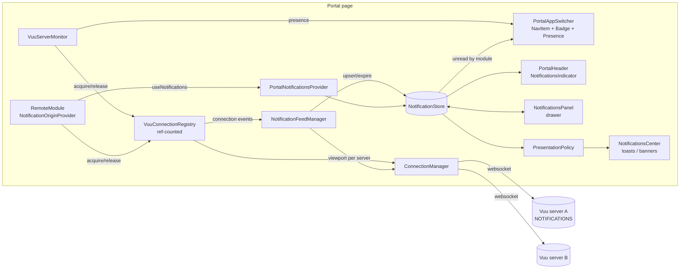

# Portal Server Presence and Notifications — Design

Status: **Proposed**
Package: `@vuu-ui/core/portal` (with changes to `@vuu-ui/vuu-notifications`,
`@vuu-ui/vuu-data-remote` and `core/src/connection-management`)
Reference host: `portal-examples/portal-host`

## 1. Summary

Every Vuu server can publish user-facing notifications (approvals required,
system availability, risk alerts and so on) through the generic
**Notifications module** (`NOTIFICATIONS` / `notifications` table). Today the
portal only connects to a remote's Vuu server when the user navigates to that
remote, so notifications from any other server go unseen.

This document specifies:

1. A **server monitor** owned by the portal that keeps a bounded number of
   Vuu server connections open — one per distinct server referenced by the
   modules shown in `PortalAppSwitcher` — and exposes each server's
   **presence** (online, connecting, offline, …).
2. A **notification feed** per connected server that subscribes to the
   server's notifications table, and a single **portal notification store**
   that consolidates notifications from every server and from client code.
   No websocket is opened solely for notifications: feeds attach to whatever
   connections already exist, whether opened by the monitor or by a remote.
3. **Nav item decorations**: a Salt `Badge` showing the unread count on each
   `PortalAppSwitcher` item (cleared when the app is opened), with items
   whose server is offline shown slightly greyed and not openable.
4. Moving `NotificationsProvider` to the **portal level**, with a
   **presentation policy** so that toasts are only shown for the application
   the user currently has open.
5. A **notifications viewer** with a compact form (most recent notification,
   unread indicator) in `PortalHeader` and an expanded form (browse, filter,
   mark read/unread, delete) in a drawer.

## 2. Background

### 2.1 Connections today

- `ConnectionManager` (`vuu-data-remote/src/ConnectionManager.ts`) is a
  process-wide singleton. It holds one `ConnectionChannel` (dedicated worker,
  websocket, `ServerProxy`) **per `connectionId`**, and exposes
  `serverAPIFor(id)`, `onConnectionStatus(id, listener)`,
  `destroyConnection(id)`.
- `VuuConnectionRegistry`
  (`core/src/connection-management/VuuConnectionRegistry.ts`) sits above it.
  `acquire(authHandler, target)` performs the token exchange and connects;
  `release(id)` decrements a **reference count** and disconnects (on the next
  tick) when it reaches zero. It reconnects with back-off
  (`[1,2,3,5,10,30,60,120]` s) while `refCount > 0`, then gives up, sets
  `state = "failed"` and notifies error listeners.
- `RemoteModule` wraps a remote in
  `<AuthenticationProvider mode="vuu-connection" connection={vuu}>`. Its
  `useConnectionSession` acquires the connection on mount and releases on
  unmount, and **throws** on connection failure (caught by
  `RemoteModuleErrorBoundary`).
- `useVuuServers()` (`core/src/auth/AuthenticationProvider.tsx`) already
  derives the distinct servers referenced by the module registry
  (`VuuServerDescriptor { connectionId, moduleTitles, restUrl?, websocketUrl? }`).
- Modules without `vuu`, or whose `vuu.connectionId` equals the portal's
  connection ID, use the **portal connection**, which is always open.
- In `local` mode, servers are simulated (`LocalVuuServer`) and there are no
  websockets.

Because the registry is reference counted and keyed by `connectionId`, a
connection acquired by the portal is reused — not duplicated — when the user
opens a remote that uses the same server. This is the property the design
relies on.

**Deployment assumption.** In real deployments a remote application and its
Vuu server are normally **1:1** — each nav icon represents one application
backed by its own Vuu server. Separate applications sharing a Vuu server is
rare. The only common exception is modules that use the **portal's own
server** (no `vuu` descriptor, e.g. admin applications). The design is
optimised for 1:1 and treats sharing as a degenerate case that still works
(§7.4). Consequences:

- The number of monitored connections is roughly the number of nav icons,
  so the monitoring cap is effectively a cap on monitored icons (§6.1).
- A nav item's presence and unread count are simply those of its server.

### 2.2 Notifications on the server

The generic module (`vuu/.../core/module/notifications/NotificationModule.scala`,
Java `NotificationsModuleBuilder`) creates table `notifications` in module
`NOTIFICATIONS`, key `id`, with columns (`NotificationsSchema`):

| Column       | Type           | Notes                                         |
| ------------ | -------------- | --------------------------------------------- |
| `id`         | string         | key                                           |
| `type`       | string         | `toast` \| `banner` (example provider)        |
| `expiryTime` | epochTimestamp | provider deletes the row after this time      |
| `title`      | string         |                                               |
| `message`    | string         |                                               |
| `level`      | string         | `INFO` \| `WARNING` \| `ERROR`                |
| `audience`   | string         | filtered per user by the permission function  |
| _additional_ | any            | per server, e.g. `source`, `priority`, `status` |

A notification therefore **arrives as a row insert** on a viewport subscribed
to that table, and **expires as a row delete**. Dismissal is server specific
(the example registers a `dismissNotification` viewport RPC that sets
`status = "dismissed"`). There is no creation timestamp column and no
per-user read state on the server.

Separately, `ShowNotificationAction` (`SHOW_NOTIFICATION_ACTION`) is returned
by menu RPCs and handled in `useVuuMenuActions`. This is a response to a user
action, not an unsolicited notification, but it should still be captured by
the consolidated store (§7.5).

### 2.3 Client notifications today

`@vuu-ui/vuu-notifications` provides `NotificationsProvider`,
`useNotifications() → { showNotification, hideNotification }` and
`NotificationsCenter`, which renders toasts (auto-dismiss ~6 s) and workspace
notifications. It is mounted by `vuu-shell`'s `Shell`, and by individual
remotes (e.g. `portal-examples/user-admin/src/UserAdmin.tsx`). Notifications
are fire-and-forget: there is no history, no origin and no read state.

### 2.4 Module Federation sharing

`portal-build.json` declares `react`, `react-dom`, `react-router-dom`,
`@vuu-ui/core`, `@vuu-ui/core/portal`, `@vuu-ui/vuu-data-editing` and
`@vuu-ui/vuu-shell` as shared singletons. **`@vuu-ui/vuu-notifications` is not
shared**, so a remote's `useNotifications()` cannot currently see a provider
mounted by the host. Contexts created in `@vuu-ui/core/portal` are shared.

### 2.5 Windows

Modules opened with **Open in new Window** run in a separate page
(`WindowHost` / `WindowShell`) with their own runtime and connections; there
is no cross-window state sharing (`portal-design.md`).

## 3. Goals and non-goals

### Goals

- G1. Show an unread-notification `Badge` on each app switcher item.
- G2. Show the presence of each item's Vuu server at a glance.
- G3. Open at most one websocket per Vuu server, and no more than a
  configured maximum for monitoring.
- G4. Consolidate all notifications (all servers, plus client-raised ones)
  in one portal-level store, with a compact and an expanded viewer,
  filtering, mark read/unread and delete.
- G5. Host `NotificationsProvider` at the portal level; never toast for an
  application that is not open.
- G6. Remotes keep using `useNotifications()` unchanged.

### Non-goals

- **Any server-side change.** This work uses the generic Notifications
  module exactly as it is (§13).
- Push notifications when no portal page is open (Web Push / OS
  notifications) — possible later, see §15.
- Cross-device read-state synchronisation (would need a server store; the
  persistence backend makes it possible later).
- Marking notifications read or dismissed **on the server**. Read and delete
  state is client-side only.

## 4. Requirements

| ID    | Requirement                                                                                                                                         |
| ----- | --------------------------------------------------------------------------------------------------------------------------------------------------- |
| FR-1  | On login, the portal connects to each distinct Vuu server referenced by navigable modules, up to `maxMonitoredServers` (default 8).                |
| FR-2  | Servers are prioritised: the open module's server, then servers of visible nav items, then app switcher display order.                            |
| FR-3  | When a remote is opened, it reuses the monitored connection if one exists.                                                                          |
| FR-4  | A server's presence is derived from connection state. A nav item whose server is offline (or denies the user) is shown slightly greyed and cannot be opened. |
| FR-5  | Monitoring failures never surface as errors in the shell; they only change presence. Unmonitored servers show presence `unknown`.                |
| FR-6  | For every connected server that publishes `NOTIFICATIONS/notifications`, the portal subscribes once and feeds the central store.                  |
| FR-7  | Servers without the table are supported (presence only).                                                                                           |
| FR-8  | Each nav item shows a `Badge` with the unread count for notifications attributed to it; a nav group shows the sum of its children. Opening a module marks its notifications read, clearing the badge. |
| FR-9  | Client notifications raised through `useNotifications()` are recorded in the store, tagged with the originating module.                          |
| FR-10 | Toasts are shown only for notifications attributed to the currently open module (or to the portal itself). Banners are portal-wide.           |
| FR-11 | The compact viewer shows the unread total and the latest notification text.                                                                        |
| FR-12 | The expanded viewer lists notifications with filters (application/server, level, read state, type, text, time) and client-side actions (mark read/unread, mark all read, delete, clear). |
| FR-13 | Read and deleted state persists per user across reloads.                                                                                           |
| FR-14 | Badge and presence are accessible (accessible description/tooltip and `aria-disabled`, not visual styling alone).                               |
| FR-16 | No server-side changes are required.                                                                                                                |
| FR-15 | Works in `local` mode with simulated servers.                                                                                                       |

## 5. Architecture overview



New pieces, all in `@vuu-ui/core/portal` (shared singleton) unless noted:

| Unit                          | Kind              | Responsibility                                                       |
| ----------------------------- | ----------------- | -------------------------------------------------------------------- |
| `VuuServerMonitor`            | class + provider  | Choose servers to monitor, hold registry refs, compute presence.     |
| `NotificationFeedManager`     | class             | Attach one notifications viewport to each connected server.          |
| `NotificationStore`           | class             | Consolidated, observable notification history and read state.        |
| `PresentationPolicy`          | function          | Decide toast / banner / silent for each new notification.            |
| `PortalNotificationsProvider` | provider          | Composes the above; hosts `NotificationsCenter`; replaces nested providers. |
| `NotificationOriginProvider`  | provider          | Mounted by `RemoteModule`; tags client notifications with origin.     |
| `NavItemDecoration`           | component         | Badge + presence on nav items.                                       |
| `NotificationsIndicator`      | component         | Compact viewer in `PortalHeader`.                                    |
| `NotificationsPanel`          | component         | Expanded viewer (drawer).                                            |

## 6. Server monitoring and presence

### 6.1 Which servers are monitored

The candidate list is computed from the module registry the switcher renders:

1. Take navigable modules (`!isNestedModule`) in **display order** (the order
   `buildNavItems` produces).
2. Map each to its server key: `vuu.connectionId`, or the portal connection ID
   if `vuu` is absent.
3. De-duplicate, keeping first occurrence; drop servers that are not usable
   (same rule as `isUsableServer` in `useVuuServers`).
4. Order by priority: the server of the **currently open module** (from the
   router location) first, then servers of nav items that are **visible**,
   then the rest in display order.
5. The portal server is always connected and does not count against the cap.
6. Take the first `maxMonitoredServers`.

With the 1:1 app/server assumption (§2.1) step 3 rarely removes anything, so
there is roughly one connection per icon and the cap is the real bound. The
default (8) should be at least the number of icons visible in a typical nav
rail; hosts with taller rails can raise it.

Visibility is tracked with an `IntersectionObserver` on nav items (the rail
root), registered by `NavItemDecoration`. Items in a collapsed nav group
count as not visible, but the group header shows the aggregate of whatever
of its children are monitored. Visibility only re-orders priority; it never
releases the open module's server.

Re-evaluation happens when the registry, open module or visible set changes.
Changes are applied with **hysteresis**: a server that drops out of the top N
is released only after `releaseDelayMs` (default 30 s), so scrolling the rail
or switching between applications does not churn connections.

### 6.2 Lifecycle

```mermaid
sequenceDiagram
  participant Shell as PortalShell
  participant Mon as VuuServerMonitor
  participant Reg as VuuConnectionRegistry
  participant RM as RemoteModule (B)
  Shell->>Mon: start(registry, authHandler, portalTarget)
  loop each selected server (staggered)
    Mon->>Reg: acquire(authHandler, target)  [refCount=1]
  end
  Note over Mon,Reg: presence = connecting → online
  RM->>Reg: acquire(B)  [refCount=2, session reused]
  RM-->>Reg: release(B) on navigate away [refCount=1, stays open]
  Shell->>Mon: logout → stop()
  Mon->>Reg: release all; registry.disconnectAll()
```

- Acquisitions are **staggered** (e.g. 150 ms apart, open module first) to
  avoid a burst of token exchanges at login.
- The monitor uses the same `authHandler` and `portalTarget` as
  `IdentityAuthenticationProvider` (it lives inside `IdentityContext`), so
  `normalizeVuuAuthTarget` and the registry's endpoint-conflict checks apply
  unchanged.
- Side benefit: opening a monitored remote is faster because its connection
  is already established.

### 6.3 Registry changes

`VuuConnectionRegistry` needs a non-throwing, observable view of entry state:

```ts
export type VuuServerConnectionState =
  | "idle" | "authenticating" | "connecting" | "connected"
  | "reconnecting" | "failed" | "unauthorized";

interface VuuConnectionRegistry {
  // existing: acquire, release, subscribe, disconnectAll, getRefCount
  getState(connectionId: string): VuuServerConnectionState | undefined;
  /** Fires for every state change, including entries created by others. */
  onStateChange(
    listener: (connectionId: string, state: VuuServerConnectionState) => void,
  ): () => void;
  /** Ids of entries currently connected (used by NotificationFeedManager). */
  connectedIds(): string[];
}
```

- `reconnecting` is set while `#reconnect` runs; `unauthorized` when the token
  exchange fails with `failure === "authorization-denied"`.
- The existing `subscribe`/error-listener behaviour used by
  `useConnectionSession` is unchanged, so an open remote still fails loudly
  through its error boundary.
- After the registry gives up (`failed`), the **monitor** keeps probing at a
  slow interval (`probeIntervalMs`, default 60 s, with jitter) by releasing
  and re-acquiring, so a server that comes back is detected. Probing stops for
  `unauthorized`.
- `onStateChange` lets feeds attach to connections acquired by **anyone** —
  including remotes over the monitoring cap — which is what satisfies "no
  additional websockets for notifications" (§7.1).

### 6.4 Presence model

```ts
export type VuuServerPresence =
  | "online"        // connected / reconnected
  | "connecting"    // authenticating, connecting (first attempt)
  | "degraded"      // reconnecting after having been online
  | "offline"       // failed, or disconnected and probing
  | "unauthorized"  // token exchange denied for this user
  | "unknown";      // not monitored (over cap) and not otherwise connected

export interface VuuServerStatus {
  connectionId: string;
  presence: VuuServerPresence;
  since: number;            // epoch ms of last presence change
  monitored: boolean;
  notificationsSupported?: boolean; // set by the feed (§7.2)
}
```

Hooks (all in `@vuu-ui/core/portal`):

```ts
useVuuServerStatus(connectionId: string): VuuServerStatus;
useVuuServerStatuses(): ReadonlyMap<string, VuuServerStatus>;
useModuleServerStatus(moduleId: RemoteModuleDescriptor["id"]): VuuServerStatus;
```

Implemented with `useSyncExternalStore` over the monitor, so only affected
nav items re-render.

### 6.5 Local mode

`LocalAuthenticationProvider` has no registry connections. A
`LocalServerMonitor` reports every local server as `online` (or a status a
`LocalVuuServer` may optionally expose for demos, e.g. `presence?:
Observable<VuuServerPresence>`), so the UI can be exercised in the showcase.

### 6.6 Configuration

```ts
export interface ServerMonitorOptions {
  enabled?: boolean;            // default true
  maxMonitoredServers?: number; // default 8, excludes portal server
  releaseDelayMs?: number;      // default 30_000
  probeIntervalMs?: number;     // default 60_000
  staggerMs?: number;           // default 150
}
```

Passed as `PortalShellProps.serverMonitor`.

## 7. Notification ingestion

### 7.1 Feed attachment

`NotificationFeedManager` listens to `registry.onStateChange` (and
`connectedIds()` at start). For each server that reaches `connected`, it
creates one `ServerNotificationFeed`, irrespective of who acquired the
connection. It **does not acquire** connections itself, so it never causes
one to open or keeps one open. When a connection is destroyed, the feed is
disposed and its notifications remain in the store, subject to retention
(§8.3).

The portal server's feed is created like any other.

A remote over the monitoring cap that is opened by the user therefore
contributes notifications for as long as it is open, and its server's
presence becomes known for that period.

### 7.2 Subscription

```ts
const NOTIFICATIONS_TABLE = { module: "NOTIFICATIONS", table: "notifications" };
```

1. On first connect, call `serverAPI.getTableList()`. If the table is absent,
   set `notificationsSupported = false` and stop. (Cached per connection.)
2. Fetch the schema (`getTableSchema`) to learn the additional columns.
3. Create a `VuuDataSource` with `connectionId`, all columns, sort
   `expiryTime` descending, range `{ from: 0, to: maxPerServer }` (default
   200).
4. Map rows to `ServerNotificationRecord` and pass inserts/updates/deletes
   to the store.
5. Re-subscribe automatically on `reconnected` (the existing viewport
   re-subscription in `ServerProxy` handles this).

A data source is used rather than raw `serverAPI.subscribe` so that existing
row/column mapping utilities apply. It is created through
`ConnectionManager.serverAPIFor(connectionId)`, so it travels over the
existing worker/websocket.

### 7.3 Row mapping

```ts
export type NotificationLevel = "info" | "warning" | "error" | "success";
export type NotificationKind = "toast" | "banner" | "silent";

export interface PortalNotification {
  key: string;                  // `${origin.connectionId ?? "client"}:${id}`
  id: string;
  origin: NotificationOrigin;
  kind: NotificationKind;
  level: NotificationLevel;
  title: string;
  message: string;
  receivedAt: number;           // client receipt time; the schema has no creation time (§13)
  expiresAt?: number;           // `expiryTime`
  expired: boolean;             // server deleted the row
  initial: boolean;             // part of the first snapshot
  read: boolean;
  attributes: Record<string, unknown>; // additional columns, e.g. source, priority
}

export interface NotificationOrigin {
  source: "server" | "client";
  connectionId?: string;        // server notifications, client ones within a vuu connection
  moduleIds: RemoteModuleDescriptor["id"][]; // attributed modules (§7.4)
}
```

- `level` maps `INFO→info`, `WARNING→warning`, `ERROR→error`, unknown → `info`.
- `type` maps `toast→toast`, `banner→banner`, anything else → `silent`.
- Rows in the **initial snapshot** are `initial: true`. They are added as
  unread unless their key is in the persisted read set (§8.4) or their module
  is currently open (§7.6), and they never toast (banners still show, §9.3).
  Their `receivedAt` is the snapshot time, so the viewer labels them
  "before <login time>" rather than giving a precise time.
- A row delete sets `expired: true` (the item stays in history until
  retention removes it; the viewer can hide expired items via a filter).
- Row updates refresh the record's fields (including additional columns)
  but do not change its read state.

### 7.4 Attribution to modules

A server notification belongs to a server. In the normal 1:1 case (§2.1)
attribution is trivial: the notification is attributed to the one navigable
module that uses that server (`origin.moduleIds = [thatModule]`), so the
nav item's badge is the server's unread count.

For the rare shared-server case, and for the portal's own server, attribution
is pluggable:

```ts
export type NotificationAttribution = (
  notification: PortalNotification,
  modulesForServer: RemoteModuleDescriptor[],
) => RemoteModuleDescriptor["id"][];
```

Default:

1. One module on the server → that module.
2. Several modules: if the notification has an attribute `module` /
   `clientIdentifier` matching a module's `clientIdentifier`, that module;
   otherwise all modules on the server.
3. Portal-server notifications not matching a module are attributed to the
   **portal** itself (shown in the viewer and header, not on any nav item).

### 7.5 Client notifications

`RemoteModule` wraps each remote in a `NotificationOriginProvider` that
supplies `{ moduleId, connectionId }`. `useNotifications().showNotification`
inside a remote then records a `PortalNotification` with
`origin.source = "client"` before presenting it, so:

- `SHOW_NOTIFICATION_ACTION` results, validation errors, etc. raised by a
  remote appear in the consolidated viewer;
- an origin is always known for the presentation policy.

Client notifications are recorded in the store only if the descriptor
requests it (`record?: boolean`), defaulting to `true` for `status` `error`
and `warning`, and `false` for transient `info`/`success` toasts, to avoid
flooding history with "Saved" confirmations. Workspace notifications (e.g.
`LostConnectionIndicator`) are never recorded.

A small explicit API is also exposed for remotes that receive notifications
by other means:

```ts
const { publish } = usePortalNotifications();
publish({ id, kind, level, title, message, attributes });
```

### 7.6 Read on open

The server has no per-user read state and this work makes no server changes,
so "read" is a client concept and the natural signal is the user opening the
application:

- When a module becomes the **active route**, all notifications attributed
  to it are marked read, clearing its badge.
- While it remains active, newly arriving notifications for it are stored as
  already read (they are still toasted, §9.2), so the badge never appears on
  the app the user is looking at.
- Notifications attributed to several modules (rare shared-server case) are
  marked read when any of them is opened.
- The viewer can still mark items unread again; that is honoured until the
  module is next opened.

## 8. Notification store

### 8.1 Interface

```ts
export interface NotificationQuery {
  moduleIds?: RemoteModuleDescriptor["id"][];
  connectionIds?: string[];
  levels?: NotificationLevel[];
  kinds?: NotificationKind[];
  read?: boolean;
  includeExpired?: boolean;  // default true
  text?: string;             // title/message/attribute contains, case-insensitive
  since?: number;
}

export interface NotificationStore {
  upsert(notification: PortalNotification): void;
  expire(key: string): void;
  markRead(keys: string[] | "all", read?: boolean): void;
  delete(keys: string[] | "all"): void;
  query(q?: NotificationQuery): readonly PortalNotification[]; // newest first
  latest(): PortalNotification | undefined;
  unreadCount(filter?: Pick<NotificationQuery, "moduleIds" | "connectionIds">): number;
  subscribe(listener: (event: NotificationStoreEvent) => void): () => void;
  getSnapshot(): number; // version, for useSyncExternalStore
}

export type NotificationStoreEvent =
  | { type: "added"; notification: PortalNotification }
  | { type: "updated"; notification: PortalNotification }
  | { type: "removed"; keys: string[] }
  | { type: "read-state"; keys: string[] | "all" };
```

Derived counts (`unreadByModule`, `unreadByConnection`) are maintained
incrementally so badge rendering is O(1).

### 8.2 Hooks

```ts
usePortalNotifications(): {
  publish, markRead, delete, store
};
useNotificationList(query?: NotificationQuery): readonly PortalNotification[];
useUnreadCount(filter?): number;
useModuleUnreadCount(moduleId): number;
useLatestNotification(): PortalNotification | undefined;
```

### 8.3 Retention

- Max `maxNotifications` (default 500) in memory, oldest read first evicted,
  then oldest.
- Deleted keys are remembered (tombstones, bounded, 7 days) so a deleted
  server notification is not re-added on reconnect snapshot.
- Expired notifications older than `expiredRetentionMs` (default 24 h) are
  pruned.

### 8.4 Persistence

Read keys and tombstones (not the notifications themselves — the server is
the source of truth for current rows) are stored per user in the portal's
persistence service under a portal-owned application key
(`"portal.notifications"`, version 1), using the existing
`PortalPersistenceService` / backend, so a remote backend would give
cross-device read state for free. Client-sourced notifications are not
persisted in v1.

Writes are debounced (500 ms).

## 9. Presentation policy and the portal-level provider

### 9.1 Hoisting `NotificationsProvider`

`PortalShell` mounts `PortalNotificationsProvider` inside `CommonShell`
(below `ModalProvider`, above the routes and the caller's chrome). It
composes the store, feed manager, monitor and a single `NotificationsCenter`.

Changes to `@vuu-ui/vuu-notifications`:

1. **Shared singleton.** Add `@vuu-ui/vuu-notifications` (and
   `@vuu-ui/vuu-data-remote`, whose `ConnectionManager` singleton must be one
   instance for feed attachment to see remote-acquired connections) to the
   shared singletons in every `portal-build.json` and in the host's
   `getSharedDependencies`. Without this, a remote's `useNotifications()`
   binds to its own copy of the context. As a belt-and-braces measure the
   context object is stored on a well-known `Symbol.for("vuu.notifications")`
   global so duplicate bundles still resolve one provider.
2. **Nested providers become pass-through.** `NotificationsProvider` checks
   for an ancestor provider; if present it renders only its children (no
   second `NotificationsCenter`). Existing remotes (e.g. `UserAdmin`) keep
   working standalone and in the portal without changes.
3. **Interceptor hook.** The context gains an optional
   `interceptor(notification, origin) → "present" | "suppress"` and a
   recording callback, used by the portal provider. The public
   `useNotifications()` signature is unchanged; `Notification` descriptors
   gain optional `record?: boolean` and `origin?` (filled automatically).

`vuu-shell`'s `Shell` is unaffected.

### 9.2 Policy

A notification is presented on screen (toast or banner) only when the policy
says so; it is always recorded in the store (subject to §7.5) and always
counted in badges.

```ts
export interface PresentationContext {
  activeModuleId?: RemoteModuleDescriptor["id"]; // from router location
  activeConnectionId?: string;
  documentVisible: boolean;
  panelOpen: boolean;  // expanded viewer showing
  doNotDisturb: boolean;
}

export type PresentationPolicy = (
  n: PortalNotification,
  ctx: PresentationContext,
) => "toast" | "banner" | "none";
```

Default policy:

| Condition                                                                | Result   |
| ------------------------------------------------------------------------ | -------- |
| `expired`, `doNotDisturb`, or `kind === "silent"`                        | `none`   |
| server `banner` (any server, any module, including the initial snapshot) | `banner` (portal-wide, §9.3) |
| `initial` (other kinds)                                                  | `none`   |
| client notification from the active module                                | as requested (unchanged behaviour) |
| client notification from a module that is not active (e.g. still unmounting) | `none` |
| server `toast` attributed to the active module                            | `toast`  |
| server notification for any other module                                  | `none` (badge + compact viewer only) |
| `panelOpen`                                                              | `none` (it appears in the list) |

Toasts are rate limited (max 3 visible; bursts of > 5 within 2 s from one
server collapse into one "5 new notifications from <server>" toast).

`PortalShellProps.notificationPolicy` overrides the default.

### 9.3 Banners

Banners are **portal-wide**: a server `banner` is shown regardless of which
module is open or which server sent it, because banner content (system
maintenance, market open/close) is relevant to the whole session. They render
at the top of the portal content area using the existing workspace
notification slot, labelled with the originating application, with a close
button. Closing a banner marks it read; it is removed when the underlying row
expires. Multiple banners stack (max 2 visible, then "+n more" opens the
panel). Unexpired banners present at login are shown unless already read.

## 10. UI

### 10.1 Nav item decorations

A shared `NavItemDecoration` is used by `IconNavItem`, `NestedNavItem` and
`DashboardNavItem`. `NavItem` gains no new fields; the decoration looks up
counts and presence by `moduleId` (and children's `moduleId`s for groups).

```
icon-only                 icon text / text-only           dashboard tile
┌──────┐                  ┌──────────────────────────┐    ┌─────────────────┐
│ [▣]③ │ ← Badge (unread) │ [▣] Trading: Baskets  ③  │    │ ③               │
│ [▢]  │ ← greyed: offline│ [▢] Risk: Limits (grey)  │    │   [icon]        │
└──────┘                  └──────────────────────────┘    │   Baskets       │
                                                          └─────────────────┘
```

- **Badge**: Salt `Badge` wrapping the icon (icon-only/dashboard) or
  trailing the label (text styles). `max={99}`. Hidden at 0. Groups sum
  their children.
- **Presence**: no extra glyph. Only states that stop the user opening the
  app are shown:
  - `offline` and `unauthorized`: the item is **slightly greyed**
    (`--vuuNavItem-unavailable-opacity`, default `0.45`, plus
    `filter: grayscale(1)` on the icon). The item is `aria-disabled="true"`
    and is not navigable — the user cannot use the app while its server is
    unreachable. Activating it triggers an immediate re-probe of the server
    (rather than waiting for `probeIntervalMs`) and shows the tooltip; if the
    probe succeeds the item un-greys and a second activation navigates.
    "Open in new Tab/Window" context menu items are disabled likewise.
  - `online`, `connecting`, `degraded`, `unknown`: rendered normally.
    `degraded` (reconnecting after being online) is shown only in the
    tooltip, to avoid flicker during brief reconnects; it greys only if the
    registry gives up and presence becomes `offline`.
  - If the open module's server goes offline, its item greys but the module
    stays mounted; the remote's own lost-connection handling applies.
- **Accessibility**: the link's accessible name stays the module title;
  an `aria-describedby` hidden span gives e.g. "3 unread notifications."
  or "Unavailable: server offline since 12:04." The same text is the hover tooltip (flyout
  for icon-only). Badge count changes are **not** announced individually;
  a single polite live region in the indicator (§10.2) announces new
  notifications.
- **Interaction**: clicking the item navigates as today. The nav item
  context menu gains "Show notifications" (opens the panel filtered to that
  module) and "Mark notifications read".
- Opening a module marks its notifications read (§7.6).

Styling via new CSS custom properties, e.g.
`--vuuNavItem-unavailable-opacity`, `--vuuNavItem-badge-offset`.

`PortalAppSwitcher` gains props:

```ts
showNotificationBadges?: boolean; // default true
showPresence?: boolean;           // default true (greys unavailable items)
```

### 10.2 Compact viewer — `NotificationsIndicator`

Placed in `PortalHeader` (`ToolbarContent position="end"`, before the user
menu) by default, also exported for custom chrome.

```
┌──────────────────────────────────────────────────────────────────────┐
│                    ⚠ Risk Limit Alert — ACC-1042 exceeded… 2m  🔔⑤ 👤 │
└──────────────────────────────────────────────────────────────────────┘
```

- Bell `Button` with `Badge` (total unread). Activates the panel.
- Optional "ticker" text: the latest unread notification's level icon,
  title, truncated message and relative time. It appears for
  `tickerDurationMs` (default 10 s) after arrival, then collapses to the
  bell only (`compactStyle: "bell" | "bell-and-latest"`).
- Clicking the ticker opens the panel scrolled to that notification.
- Polite `aria-live` region announces "New warning from Risk: Risk Limit
  Alert".

### 10.3 Expanded viewer — `NotificationsPanel`

A Salt `Drawer` (right, non-modal, `width ≈ 420px`), opened from the
indicator or the context menu.

```
┌ Notifications ───────────────────────────── ✓ Mark all read  ⋯  ✕ ┐
│ 🔍 Search…                                                        │
│ [All apps ▾] [Level: ⓘ ⚠ ⛔] [Unread|All] [Type ▾] [Show expired ☐] │
├───────────────────────────────────────────────────────────────────┤
│ Today                                                              │
│ ● ⚠ Risk Limit Alert                          Risk · 12:04        │
│     Account ACC-1042 exceeded intraday VaR limit by 12%            │
│     [Open Risk]                                     ✓  🗑           │
│   ⓘ Market Status                              Portal · 11:58     │
│     US Equity markets are now OPEN …                   ✓  🗑      │
│ Earlier                                                            │
│   ⛔ Order Rejection (expired)                 OMS · 09:12        │
├───────────────────────────────────────────────────────────────────┤
│ Servers: Portal ✓  OMS ✓  Risk ✕ offline 3m  Pricing –             │
└───────────────────────────────────────────────────────────────────┘
```

- **List**: grouped by day, newest first, virtualised when > 100 items.
  Unread items have a dot and bold title. Selecting an item marks it read
  (configurable) and expands long messages.
- **Filters** (Salt `ToggleButtonGroup`, `Dropdown`, `Input`):
  application/server (multi-select, options built from modules with
  notifications), level, read state, kind, show expired, free-text search.
  Filter state persists in the portal store. Clear-all link when filtered.
- **Item actions**: mark read/unread, delete (local), "Open <app>"
  (navigates to the attributed module — normally exactly one; disabled
  when its server is unavailable). Delete is local only: it removes the item
  and records a tombstone so it is not re-added by a later snapshot (§8.3).
- **Bulk**: mark all read (respects current filter), delete all read,
  multi-select with Shift/Ctrl.
- **Footer**: server presence summary — this is where the user sees all
  servers' availability at once, including servers not represented by a
  visible icon.
- Keyboard: list is a Salt `ListBox`-style composite; `Delete` deletes,
  `R` toggles read, `Esc` closes.

## 11. Public API summary

`PortalShellProps` additions:

```ts
interface PortalShellProps {
  serverMonitor?: ServerMonitorOptions | false;
  notifications?: {
    enabled?: boolean;                       // default true
    maxNotifications?: number;
    maxPerServer?: number;
    attribution?: NotificationAttribution;
    policy?: PresentationPolicy;
    recordClientNotifications?: (n: Notification) => boolean;
  } | false;
}
```

Exports from `@vuu-ui/core/portal`: `NotificationsIndicator`,
`NotificationsPanel`, `usePortalNotifications`, `useNotificationList`,
`useUnreadCount`, `useModuleUnreadCount`, `useLatestNotification`,
`useVuuServerStatus`, `useVuuServerStatuses`, `useModuleServerStatus`, and the
types above.

Remote authors need no changes. In the rare case of several modules sharing
a server, a module that wants module-specific attribution should publish a `clientIdentifier`/`module` attribute from their
server's notifications provider.

## 12. Multiple windows and tabs

Each portal page (main tab, extra tabs, module windows) owns its own runtime
and connections (§2.5).

- **Module windows** (`WindowShell`) mount the same provider with the
  monitor **disabled**; their remote's connection still feeds the window's
  store, and toasts show only for that module.
- **Read/delete state** is synchronised between pages of the same origin and
  user via a `BroadcastChannel("vuu-portal-notifications:<portalId>:<user>")`
  carrying `read-state` and `delete` events, and is persisted (§8.4).
- **Connection fan-out.** See §12.1. Not addressed in v1.

### 12.1 Why tab leader election might be needed

Every full portal tab is a separate JavaScript runtime with its own
`ConnectionManager`, registry and dedicated workers, and nothing is shared
between tabs (§2.5). With monitoring, each portal tab therefore opens up to
`1 + maxMonitoredServers` websockets as soon as it loads, whether or not the
user is using it. A user with T portal tabs holds `T × 9` connections, and
each one costs:

- a token exchange at startup and on every reconnect (load on the identity
  provider and each server's auth endpoint);
- a server-side session plus a notifications viewport on every Vuu server;
- a dedicated worker and heartbeat traffic in the browser;
- duplicate presence probing when a server is down (T tabs each probing).

Without monitoring, a background tab only holds connections for the apps
open in it, so this is a cost the feature introduces.

**Leader election** removes the duplication: tabs compete for a Web Lock
(`navigator.locks.request("vuu-portal-monitor:<portalId>:<user>")`). The holder
(leader) runs the `VuuServerMonitor` and feeds, and rebroadcasts presence
and notification events on the `BroadcastChannel`; followers build their
stores from those events and connect only for the modules they actually
open. When the leader tab closes, the lock passes automatically to another
tab, which starts monitoring. Server load then scales with users rather than
with users × tabs.

It is not needed for v1 because:

- module **windows** do not monitor (they only connect for their own app,
  which they need anyway), so the fan-out is limited to full portal tabs;
- users of a single-page portal app typically keep one portal tab;
- the cost is bounded (`maxMonitoredServers` = 8) and connections are mostly
  idle apart from heartbeats.

It becomes worthwhile if telemetry shows users routinely running several
portal tabs, or if Vuu servers enforce per-user session limits that
multiple tabs could exhaust. The design keeps it possible: the store is
already fed by events (§8.1), so a follower's store can be fed from the
channel instead of from feeds without UI changes. Followers must also apply
the presentation policy themselves, so a toast appears only in the tab where
the relevant module is open.

## 13. Server constraints

This work makes **no server-side changes**. It relies only on what the
generic Notifications module already provides, which means:

- **No creation time.** Ordering uses client receipt time; rows in the
  initial snapshot are only known to pre-date login (§7.3).
- **No server read state.** "Read" is client-side, derived from opening the
  module and from explicit user action (§7.6), persisted per user locally
  (§8.4).
- **No generic dismiss.** Dismissal RPCs are server specific (e.g. the
  example's `dismissNotification`), so delete is a local operation only.
- **No module column.** Attribution relies on the 1:1 app/server mapping
  (§7.4); additional columns such as `clientIdentifier` are used if a server
  happens to publish them.

Possible future server enhancements (out of scope): a `createdTime` column,
a standard dismiss RPC, a standard module/deep-link column, and server-side
per-user read state for cross-device sync.

## 14. Performance and failure modes

| Concern                                  | Mitigation                                                                |
| ---------------------------------------- | ------------------------------------------------------------------------- |
| Login burst of token exchanges/sockets  | Cap, stagger, open module first.                                          |
| A dedicated worker per connection       | Bounded by `maxMonitoredServers`; workers are idle apart from heartbeats.   |
| Server down at login                    | Presence `offline`, item greyed, slow probing (immediate on click); never throws into the shell. |
| Token exchange denied                    | Presence `unauthorized`; no probing; item greyed and not navigable.        |
| More modules than the cap               | Accept for now (`maxMonitoredServers` = 8). If needed, limit the rail to the monitored items and move the rest into a "… more" overflow menu. |
| Notification storms                      | Per-server `maxPerServer` viewport range; toast coalescing; store cap.    |
| Re-render cost                           | `useSyncExternalStore` selectors per module; incremental counts.          |
| Remote over cap opened then closed      | Feed disposed with connection; notifications retained; presence → `unknown` after release. |
| Logout                                   | Monitor stops before `registry.disconnectAll()`; store cleared.            |
| Server lacks notifications table        | Detected once via table list; presence only.                              |

## 15. Testing

- **Unit** (Vitest): monitor selection/cap/priority (open, visible, display order)/hysteresis with a fake
  registry; presence mapping from state sequences; registry `onStateChange`
  and `reconnecting`/`unauthorized` states; row mapping and
  insert/update/delete handling; store queries, counts, retention,
  tombstones; read-on-open; default presentation policy table (incl.
  portal-wide banners); nested
  `NotificationsProvider` pass-through.
- **Component**: nav item badge rendering, greyed/`aria-disabled`
  unavailable items and click-to-reprobe, and accessible descriptions in all
  display styles; indicator ticker; panel filters and
  actions.
- **Integration**: local-mode portal with a simulated server publishing a
  `NOTIFICATIONS/notifications` table (add to `vuu-data-test`), plus a
  showcase example under `VuuPortal/` with controls to change presence and
  inject notifications.
- **Manual/E2E**: portal-host against `SimulMain` with
  `SimulatedNotificationsModule` on two servers; kill one server to verify
  presence; verify one websocket per server in DevTools.

## 16. Phased delivery

1. **Connection foundation** — registry state API; `VuuServerMonitor`;
   visibility tracking; presence hooks; presence on nav items. Add shared
   singletons.
2. **Ingestion and store** — feed manager, store, persistence of read state,
   badges on nav items.
3. **Portal-level provider** — hoisting, pass-through nesting, origin
   tagging, presentation policy, banners.
4. **Viewer** — `NotificationsIndicator`, `NotificationsPanel` with filters
   and actions; context menu entries.
5. **Multi-page** — `BroadcastChannel` sync; window shell support; (later)
   leader-tab election.

Each phase is independently shippable behind `PortalShellProps` flags.

## 17. Decisions

| # | Question                                   | Decision                                                                                   |
| - | ------------------------------------------ | ------------------------------------------------------------------------------------------ |
| 1 | Does opening a module mark its notifications read? | Yes. The server cannot record read state, so opening the module clears its badge (§7.6). |
| 2 | Server changes?                            | None. Delete and read are client-side only (§13).                                          |
| 3 | `maxMonitoredServers` default              | 8. If registries outgrow it, limit the nav rail and add a "… more" overflow (§14).          |
| 4 | How is presence shown?                     | Only unavailability: offline/unauthorized items are slightly greyed and cannot be opened (§10.1). |
| 5 | Are banners portal-wide?                   | Yes (§9.3).                                                                               |
| 6 | Tab leader election in v1?                 | No; rationale and trigger conditions in §12.1.                                              |
