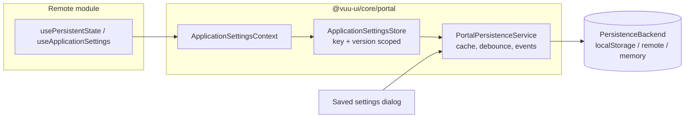
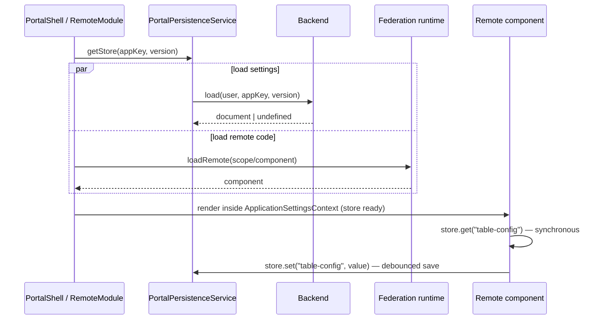

# Portal Persistence Service and Saved Settings UI — Design

Status: **Draft — for review before implementation**
Package: `@vuu-ui/core/portal`
Reference host: `portal-examples/portal-host`

## 1. Summary

Applications hosted in the portal (federated remote modules, and the portal
shell itself) need to persist runtime state for the user — applied filters,
named filters, sort criteria, column layouts, panel sizes and similar — and
restore it when the application next starts.

This document specifies:

1. A **persistence service** provided by `PortalShell` to every remote module.
   Each application reads and writes named JSON values under its own key. All
   data is scoped to the authenticated user and to the application version,
   and is stored as **one JSON document per user / application / version**.
2. A **pluggable storage backend**, defaulting to `localStorage` and
   substitutable with a remote (server-side) store without changes to
   applications.
3. A **Saved settings** UI, offered by the portal, that lets users selectively
   clear saved values for one, several or all applications, and for one, several
   or all keys within an application. The UI is built with the Salt design
   system, following the Preferences dialog, Button bar and Content status
   patterns.

## 2. Background

### 2.1 Current portal state

- `PortalShell` (`src/portal-shell/PortalShell.tsx`) composes `CommonShell`
  (Salt theme, `ModalProvider`, data-source provider), the router, and one
  route per `RemoteModuleDescriptor`.
- `RemoteModule` (`src/remote-module/RemoteModule.tsx`) lazy-loads the
  federated component and wraps it in a per-remote `AuthenticationProvider`
  (`mode="vuu-connection"`). There is currently **no persistence service**, and
  no general service contract exposed to remotes.
- `@vuu-ui/core` and `@vuu-ui/core/portal` are federation **singletons**
  (`scripts/module-federation-utils.ts`), so a React context created in
  `@vuu-ui/core/portal` is the same object in the host and in every remote. This
  is the mechanism the service relies on.
- The authenticated user is available via `useAuthenticatedUser()`
  (`User = { userName: string }`). In `local` mode it defaults to
  `local-user`.
- `PortalHeader` renders only a **Log out** button. The nav components
  (`PortalNav`, `PortalAppSwitcher`) have a per-module context menu with
  **Open in new Tab** / **Open in new Window**.

### 2.2 Existing application persistence

Several remotes (`feature-filter-table`, `basket-trading`,
`feature-instrument-tiles`) already call `useViewContext()` from
`@vuu-ui/vuu-layout` and use its `load` / `save` / `purge` functions, for
example:

```ts
const { load, save } = useViewContext();
const config = useMemo(() => load?.() ?? NO_CONFIG, [load]);
save?.(tableConfig, "table-config");
```

When mounted directly by the portal there is no `View` above the remote, so
`save` is `undefined` and nothing is persisted. The new service must provide a
path for these remotes to persist without rewriting them (see §6.6).

### 2.3 Reference: `vuu-shell` persistence-manager

`packages/vuu-shell/src/persistence-manager` contains `IPersistenceManager`
(`Local`, `Remote`, `Static` implementations) and the newer
`WorkspacePersistenceService`. Lessons taken from it:

| Observation in `vuu-shell`                                                                                   | Improvement in this design                                                                        |
| ------------------------------------------------------------------------------------------------------------ | ------------------------------------------------------------------------------------------------- |
| `IPersistenceManager` mixes domain concerns (layouts, metadata, application JSON, user settings) with storage. | Separate a small **storage backend** interface from the **application-facing** API.              |
| `clearUserSettings()` clears everything; the remote implementation is a `// todo`.                           | Granular clear by application, version and key is a first-class operation.                       |
| `Settings` is `Record<string, string \| number \| boolean>`.                                                 | Values are arbitrary JSON.                                                                        |
| No versioning of stored data.                                                                                | One document per application version plus an envelope `schemaVersion`.                           |
| `saveUserSettings` silently does nothing if application JSON has not been loaded.                            | Explicit lifecycle (`loading` → `ready` / `error`); writes before ready are rejected in dev.      |
| No change notification; other tabs or a clear operation are invisible to a running app.                     | Subscriptions for key changes and clears, including cross-tab `storage` events.                   |
| URLs (`/api/...`) hard-coded in the remote implementation.                                                   | Remote backend is configured (base URL, token provider).                                          |
| Local workspace service maintains separate index keys that can drift from the data they index.              | Enumerate by key prefix — the documents are the index.                                           |
| Every write re-serialises immediately.                                                                       | Debounced write-behind with flush on page hide.                                                   |

The `vuu-shell` classes remain in place for existing VUU shell applications;
this design does not change them.

## 3. Goals and non-goals

### Goals

- G1. Any remote module can save and restore JSON values at runtime with a
  minimal API, and read restored values **synchronously on first render**.
- G2. Data is isolated per user, per application, per application version.
- G3. The default backend is `localStorage`; a remote store can be substituted
  by portal configuration only.
- G4. Users can inspect what is saved and selectively clear it.
- G5. Clearing is safe while applications are running (no immediate re-save of
  the cleared value; applications can react).
- G6. Existing `useViewContext` `load` / `save` consumers can be supported
  without code changes.

### Non-goals

- Server-side implementation of the remote store (only its contract, §7.4).
- Layout / workspace persistence (`vuu-shell` workspace services). A future
  workspace feature may use this service as its backend.
- Sharing settings between users, or admin-managed defaults.
- Encryption at rest in `localStorage`.
- Import/export of settings (possible later; see §12).

## 4. Terminology

| Term                     | Meaning                                                                                                                          |
| ------------------------ | -------------------------------------------------------------------------------------------------------------------------------- |
| Application              | A remote module registered with the portal, or the portal shell itself.                                                         |
| Application key          | Stable, unique string identifying an application for persistence (§5.2).                                                         |
| Application version      | `RemoteModuleDescriptor.version` (number).                                                                                       |
| Settings document        | The single JSON document holding all saved values for one *user / application key / application version*.                       |
| Entry / key              | A named value within a settings document, e.g. `table-config`.                                                                   |
| Storage backend          | Implementation that loads, saves, deletes and lists settings documents (`localStorage`, remote, in-memory).                      |
| Persistence service      | Shell-level object that owns the backend, caches documents, and hands out application-scoped stores.                             |
| Application settings store | The object an application uses — scoped to its own key and version.                                                          |

## 5. Data model

### 5.1 Settings document

```json
{
  "schemaVersion": 1,
  "user": "steve",
  "applicationKey": "local-feature-filter-table",
  "applicationVersion": 1,
  "applicationTitle": "Instruments",
  "revision": 7,
  "createdAt": "2026-09-28T08:00:00.000Z",
  "updatedAt": "2026-09-28T08:42:13.512Z",
  "entries": {
    "table-config": {
      "value": { "columns": [{ "name": "ric", "width": 120 }] },
      "updatedAt": "2026-09-28T08:42:13.512Z",
      "label": "Table layout",
      "group": "Table"
    },
    "filters/named": {
      "value": [{ "name": "EUR only", "filter": "currency = \"EUR\"" }],
      "updatedAt": "2026-09-27T16:03:55.004Z",
      "label": "Saved filters",
      "group": "Filters"
    }
  }
}
```

| Field                | Rules                                                                                                               |
| -------------------- | ------------------------------------------------------------------------------------------------------------------- |
| `schemaVersion`      | Version of the envelope format, not of application data. Starts at `1`.                                             |
| `user`               | `User.userName` of the authenticated identity. Required.                                                            |
| `applicationKey`     | See §5.2. Required.                                                                                                 |
| `applicationVersion` | Integer from the descriptor. Required.                                                                              |
| `applicationTitle`   | Last-known display title; lets the Saved settings UI name applications that are no longer in the registry.          |
| `revision`           | Monotonic integer incremented by every successful save; used for optimistic concurrency.                             |
| `entries`            | Map of key → entry. `value` is any JSON value (`null` allowed; `undefined` is not stored).                           |
| entry `label`/`group`| Optional, human-readable metadata supplied by the application so the UI can describe entries without loading the app. |

Key rules:

- Keys are non-empty strings, max 256 characters. `/` is a convention for
  grouping (`filters/named`) but has no structural meaning to the service.
- Keys beginning with `vuu.` are reserved for the shell and shared VUU
  components.

### 5.2 Application key

The shell — not the remote — determines the application key, from the
descriptor that mounted the remote. This prevents one application reading or
clearing another's data and removes the risk of two remotes choosing the same
key.

- Default: `descriptor.clientIdentifier` (unique, stable, admin-managed; e.g.
  `local-feature-filter-table`).
- The same federated component registered twice (e.g. the filter table with
  two different `tableSchema` props) gets two descriptors and therefore two
  independent settings documents.
- The portal shell's own settings use the reserved key `vuu.portal` at
  version `1`. (Portals on the same origin are separated by the storage key
  prefix, §7.2.)

Open question Q1 covers whether a dedicated `persistenceKey` descriptor field
is preferable.

### 5.3 Versioning

- A new application version starts with an **empty** document. Documents for
  earlier versions are retained until cleared by the user (or by a retention
  policy, Q4).
- Applications that want to carry settings forward do so explicitly on
  startup (§6.3, `previousVersions()` / `importFrom()`), because only the
  application knows how to migrate its own data.
- `schemaVersion` migrations of the envelope are handled inside the service.

## 6. Application-facing API

### 6.1 Overview



`RemoteModule` resolves the store for its descriptor and provides it through
`ApplicationSettingsContext`. Because `@vuu-ui/core/portal` is a federation
singleton, the remote's `useApplicationSettings()` reads the host's context.

### 6.2 Startup sequence



- The settings document is loaded **in parallel** with the remote code and the
  remote is rendered only once both are ready (the existing `Suspense`
  boundary is reused; the store exposes a `ready` promise). This guarantees
  synchronous reads on first render — required by the existing
  `useMemo(() => load?.() ...)` style.
- If loading fails, the store becomes `ready` with an empty document and
  `status = "error"`; the application renders with defaults and writes are
  held in memory (not persisted) until the next successful load. The failure is
  logged and surfaced in the Saved settings UI. Persistence failures must never
  prevent an application from rendering.

### 6.3 Types

```ts
export type JsonValue =
  | null
  | boolean
  | number
  | string
  | JsonValue[]
  | { [key: string]: JsonValue };

export interface EntryMetadata {
  /** Human-readable name shown in the Saved settings UI. */
  label?: string;
  /** Optional grouping shown in the Saved settings UI. */
  group?: string;
}

export type SettingsChangeReason = "set" | "remove" | "clear" | "external";

export interface SettingsChangeEvent {
  keys: readonly string[];
  reason: SettingsChangeReason;
}

export interface ApplicationSettingsStore {
  readonly applicationKey: string;
  readonly applicationVersion: number;
  readonly status: "loading" | "ready" | "error";
  /** Resolves when the document has been loaded (or failed to load). */
  readonly ready: Promise<void>;

  get<T extends JsonValue = JsonValue>(key: string): T | undefined;
  getAll(): Readonly<Record<string, JsonValue>>;
  has(key: string): boolean;
  keys(): readonly string[];

  /** Updates the in-memory value immediately; persistence is debounced. */
  set<T extends JsonValue>(key: string, value: T, metadata?: EntryMetadata): void;
  /** Declares metadata for a key without setting a value. */
  describe(key: string, metadata: EntryMetadata): void;
  remove(key: string): void;
  /** Removes every entry for this application version. */
  clear(): void;

  /** Writes any pending changes now. */
  flush(): Promise<void>;
  subscribe(listener: (event: SettingsChangeEvent) => void): () => void;

  /** Versions of this application that have saved documents, newest first. */
  previousVersions(): Promise<readonly number[]>;
  /** Copies entries (optionally a subset / transformed) from an earlier version. */
  importFrom(
    version: number,
    options?: {
      keys?: readonly string[];
      transform?: (key: string, value: JsonValue) => JsonValue | undefined;
    },
  ): Promise<readonly string[]>;
}
```

Notes:

- `get` returns a structurally cloned (or frozen) value so callers cannot mutate
  cached state.
- `set` with a value deep-equal to the stored value is a no-op (no write, no
  event).
- Values that are not JSON-serialisable (functions, `undefined`, class
  instances, cycles) throw in development builds and are rejected with a
  logged error in production.

### 6.4 React hooks (exported from `@vuu-ui/core/portal`)

```ts
/** The store for the enclosing application. Throws outside a portal application. */
export function useApplicationSettings(): ApplicationSettingsStore;

/** Same, but returns undefined when not hosted by a portal (standalone apps, tests). */
export function useOptionalApplicationSettings(): ApplicationSettingsStore | undefined;

/**
 * useState-like hook backed by the store. Returns defaultValue when there is
 * no saved value, and reverts to defaultValue when the key is cleared.
 */
export function usePersistentState<T extends JsonValue>(
  key: string,
  defaultValue: T,
  metadata?: EntryMetadata,
): [T, (value: T | ((previous: T) => T)) => void];
```

Example:

```tsx
const [sort, setSort] = usePersistentState<SortDef>("table/sort", NO_SORT, {
  label: "Sort order",
  group: "Table",
});
```

### 6.5 Shell-level service API

Used by `PortalShell`, `RemoteModule`, and the Saved settings UI. Not intended
for remote modules.

```ts
export interface DocumentRef {
  user: string;
  applicationKey: string;
  applicationVersion: number;
}

export interface EntrySummary extends EntryMetadata {
  key: string;
  updatedAt: string;
  /** Serialised size in bytes (UTF-16 length × 2 for localStorage). */
  size: number;
}

export interface DocumentSummary extends Omit<DocumentRef, "user"> {
  applicationTitle?: string;
  revision: number;
  updatedAt: string;
  size: number;
  entries: readonly EntrySummary[];
}

export type ClearSelection = ReadonlyArray<{
  applicationKey: string;
  applicationVersion: number;
  /** Omit to clear the whole document. */
  keys?: readonly string[];
}>;

export interface ClearResult {
  cleared: ReadonlyArray<{ ref: DocumentRef; keys: readonly string[] | "all" }>;
  failed: ReadonlyArray<{ ref: DocumentRef; error: Error }>;
}

export interface PortalPersistenceService {
  readonly user: string;
  getStore(applicationKey: string, applicationVersion: number, title?: string): ApplicationSettingsStore;
  list(): Promise<readonly DocumentSummary[]>;
  clear(selection: ClearSelection): Promise<ClearResult>;
  clearAll(): Promise<ClearResult>;
  flushAll(): Promise<void>;
  subscribe(listener: (ref: DocumentRef, event: SettingsChangeEvent) => void): () => void;
  dispose(): void;
}
```

- One store instance per `(applicationKey, version)` is cached for the lifetime
  of the service, so multiple mounts of the same application (e.g. route
  re-mounts) share state.
- A `usePortalPersistence()` hook exposes the service to shell components.

### 6.6 `useViewContext` compatibility

Existing remotes call `useViewContext().load/save/purge`. A
`PersistentViewContextProvider` adapter maps these to the store:

| `ViewContextAPI`     | Store call                                                  |
| -------------------- | ----------------------------------------------------------- |
| `load()`             | `getAll()` (the filter table reads its whole config object) |
| `load(key)`          | `get(key)`                                                  |
| `save(state, key)`   | `set(key, state)`                                           |
| `purge(key)`         | `remove(key)`                                               |

`@vuu-ui/core` does not depend on `@vuu-ui/vuu-layout`, so the adapter cannot
live in `core` without adding that dependency. See Q2 for placement options.

## 7. Storage backends

### 7.1 Backend interface

Backends are document-oriented and deliberately small; all key-level logic
(partial clear, merge) lives in the service, so a remote backend only needs
CRUD on whole documents.

```ts
export interface PersistenceBackend {
  load(ref: DocumentRef): Promise<SettingsDocument | undefined>;
  /**
   * Saves the document. If expectedRevision is supplied and does not match the
   * stored revision, rejects with PersistenceConflictError carrying the
   * current document.
   */
  save(doc: SettingsDocument, expectedRevision?: number): Promise<{ revision: number }>;
  delete(ref: DocumentRef): Promise<void>;
  /** Metadata only — values are not required. */
  list(user: string): Promise<readonly DocumentSummary[]>;
  /** Optional: notification of changes made elsewhere (other tabs, server push). */
  subscribe?(user: string, listener: (ref: DocumentRef) => void): () => void;
}
```

Errors: `PersistenceError` (base, with `operation`, `ref`, optional `status`),
`PersistenceConflictError`, `PersistenceQuotaError`,
`PersistenceValidationError` (stored data is not a valid document).

### 7.2 `LocalStoragePersistenceBackend` (default)

- Storage key: `vuu-portal:{portalId}:{user}:{applicationKey}:v{version}`, each
  segment `encodeURIComponent`-encoded. `portalId` is the `PortalShell` `id`
  (default `"vuu-portal"`) so multiple portals on one origin do not collide.
- `list(user)` enumerates `localStorage` keys with the user prefix — no
  separate index to keep in sync.
- `subscribe` uses the `window` `storage` event to detect writes from other
  tabs / `WindowHost` windows on the same origin.
- `QuotaExceededError` is mapped to `PersistenceQuotaError`; the service keeps
  the change in memory, marks the store `error`, and the Saved settings UI shows
  a warning with a prompt to clear space.
- Invalid JSON or a document that fails validation is moved to
  `{key}:corrupt:{timestamp}` (one retained copy), logged, and treated as
  absent. It appears in the UI so it can be cleared.
- Constructor accepts any `Storage` (for tests / `sessionStorage`).

### 7.3 `InMemoryPersistenceBackend`

For tests, the showcase, and `local` authentication mode when persistence is
not wanted.

### 7.4 `RemotePersistenceBackend`

Configured with `{ baseUrl, getToken?: () => Promise<string>, fetch? }`. The
host would typically pass `useIdentityToken()`.

Proposed REST contract (server implementation out of scope):

| Operation | Request                                                               | Response                                                        |
| --------- | --------------------------------------------------------------------- | --------------------------------------------------------------- |
| list      | `GET {base}/users/{user}/settings`                                    | `200` `DocumentSummary[]`                                       |
| load      | `GET {base}/users/{user}/settings/{applicationKey}/versions/{version}` | `200` document + `ETag: "{revision}"`, or `404`                 |
| save      | `PUT` same path, body = document, `If-Match: "{revision}"` (omit on create; `If-None-Match: *`) | `200`/`201` + `ETag`; `412` on conflict (body = current document) |
| delete    | `DELETE` same path                                                    | `204` (also for already absent)                                 |

- Requests carry `Authorization: Bearer {token}`. The server **must** derive
  or verify `user` from the token and reject mismatches with `403`; the path
  segment is not trusted.
- Transient failures (network, `5xx`) retry with backoff for saves; loads fail
  to the `error` state described in §6.2.
- Save on page hide uses `fetch(..., { keepalive: true })`.

### 7.5 Configuration

`PortalShell` gains an optional prop:

```ts
export interface PortalShellProps extends CommonShellProps {
  // existing props…
  /**
   * Storage backend for application settings.
   * Default: LocalStoragePersistenceBackend.
   * Pass `false` to disable persistence (applications receive an in-memory store).
   */
  persistence?: PersistenceBackend | false;
}
```

`WindowShell` / `WindowHost` accept the same prop so a module opened in its
own window reads and writes the same document. The portal-host example keeps
the default and documents how to switch to the remote backend via
`window.vuuConfig`.

## 8. Behavioural requirements

### 8.1 Functional

| ID    | Requirement |
| ----- | ----------- |
| FR-1  | `PortalShell` creates one `PortalPersistenceService` for the authenticated user and makes it available to shell components. |
| FR-2  | `RemoteModule` provides each remote with an `ApplicationSettingsStore` scoped to the descriptor's application key and version. |
| FR-3  | A remote cannot address another application's document through the application-facing API. |
| FR-4  | The remote renders only after its settings document is loaded or has failed to load; first-render reads are synchronous. |
| FR-5  | `set` updates memory immediately and persists within a debounce window (default 500 ms, configurable), coalescing multiple keys into one document save. |
| FR-6  | Pending writes are flushed on `visibilitychange` → hidden, `pagehide`, logout, and service disposal. |
| FR-7  | Stored data is one JSON document per user / application key / application version, in the format in §5.1. |
| FR-8  | A new application version starts empty; earlier-version documents are retained and listed. `importFrom` copies entries forward on request. |
| FR-9  | The backend is `localStorage` by default and can be replaced by configuration only, with no change to applications. |
| FR-10 | On save conflict, the service reloads the document and re-applies only the locally changed keys (key-level last-writer-wins), then retries once. |
| FR-11 | Changes from other tabs/windows (backend `subscribe`) update cached documents and notify subscribers with reason `external`. |
| FR-12 | `clear` removes selected keys, or whole documents, across any set of applications and versions in one operation, returning per-document success/failure. |
| FR-13 | Clearing cancels pending writes for the cleared keys and notifies running applications with reason `clear`; `usePersistentState` reverts to its default. |
| FR-14 | Clearing every key in a document deletes the document rather than saving an empty one. |
| FR-15 | Logout flushes pending writes, then disposes the service. A different user logging in on the same browser never sees the previous user's data. |
| FR-16 | The portal shell's own state (e.g. nav expanded, app switcher mode) uses the reserved `vuu.portal` application key and appears in the Saved settings UI as "Portal". |
| FR-17 | A `useViewContext` adapter lets existing remotes persist without code changes (§6.6). |
| FR-18 | Hooks work outside a portal (`useOptionalApplicationSettings`, and `usePersistentState` falls back to plain state) so remotes remain usable standalone and in tests. |

### 8.2 Non-functional

| ID    | Requirement |
| ----- | ----------- |
| NFR-1 | Persistence failures (quota, network, corrupt data) never throw into application render; they are logged and surfaced in the Saved settings UI. |
| NFR-2 | Document load adds no serial latency to remote startup (parallel with code load, §6.2). |
| NFR-3 | Default size warnings: 256 KB per entry, 1 MB per document (configurable). Oversized writes are rejected with a logged error. |
| NFR-4 | `localStorage` is not a security boundary. Applications must not store secrets or tokens; this is documented and entries containing obvious tokens are not specially handled. |
| NFR-5 | All public types and hooks are exported from `@vuu-ui/core/portal` and documented. |
| NFR-6 | Unit tests (vitest) cover the service, each backend, conflict handling, debounce/flush, cross-tab events and clear semantics; component tests cover the Saved settings dialog including keyboard use. |

## 9. Saved settings UI

### 9.1 Principles

- Follow the Salt **Preferences dialog** pattern: a single, centralised dialog
  using `Dialog`, `ParentChildLayout`, `VerticalNavigation` /
  `NavigationItem`, and a **Button bar** of actions.
- When opened from a specific application, open directly on that
  application's panel (Preferences dialog guidance: "immediately display the
  relevant settings").
- Selection is explicit and reviewable; destructive actions require
  confirmation and report their outcome.
- The UI reads only metadata (`list()`), never loads remote code, and works for
  applications that are not currently loaded, disabled, or no longer in the
  user's registry.

### 9.2 Entry points

1. **Header user menu** (Salt `Menu` / `MenuTrigger` / `MenuPanel` / `MenuItem`,
   per the App header and Menu button patterns). `PortalHeader` replaces the
   standalone **Log out** button with a user menu button showing the user name
   (`Avatar` + name, `appearance="transparent"`):
   - **Saved settings…** → opens the dialog on *All applications*.
   - Divider
   - **Log out**
2. **Navigation context menu** in `PortalNav` and `PortalAppSwitcher`, after the
   existing *Open in new Tab / Window* items:
   - **Saved settings…** → opens the dialog on that application's panel.
3. **Programmatic**: `usePortalPersistence().openSavedSettings(applicationKey?)`
   for applications that want their own "Reset settings" affordance.

### 9.3 Dialog structure

```text
┌─ Saved settings ─────────────────────────────────────────────────── [×] ┐
│ Settings saved by applications are restored when they next open.        │
├─────────────────────────┬───────────────────────────────────────────────┤
│ ▸ All applications   18 │  All applications                             │
│ ─────────────────────── │  [Filter keys…                 ] (search)     │
│   Portal              2 │                                               │
│   Instruments         9 │  ☐ ▾ Portal                    2 · 3 KB · 1d  │
│   Basket trading      5 │      ☐ Navigation expanded                    │
│   User admin          2 │      ☐ App switcher style                     │
│ ─────────────────────── │  ◩ ▾ Instruments   v1          9 · 42 KB · 2h │
│   Unavailable         1 │      ▾ Filters                                │
│                         │        ☑ Saved filters          2h            │
│                         │        ☑ Active filter          2h            │
│                         │      ▸ Table (4)                              │
│                         │  ☐ ▸ Basket trading            5 · 8 KB · 5d  │
│                         │  ☐ ▸ User admin                2 · 1 KB · 9d  │
├─────────────────────────┴───────────────────────────────────────────────┤
│ Clear all saved settings…            2 selected   [Cancel] [Clear…]     │
└─────────────────────────────────────────────────────────────────────────┘
```

**Header** — `DialogHeader` with title *Saved settings* and a short
description (`Text`, secondary). `DialogCloseButton` in the top-right.

**Parent (navigation)** — `VerticalNavigation` with `NavigationItem`s:

- *All applications* (default) with a `Badge` showing the total number of
  saved entries.
- One item per application with saved data, ordered as in the portal
  navigation, labelled with the descriptor `title` (falling back to
  `applicationTitle`, then the key) and a `Badge` count.
- An *Unavailable* item grouping documents whose application is no longer in
  the registry, and any corrupt documents (§7.2).
- Applications with no saved data are omitted.

**Child (content)** — both the *All applications* and the per-application
panels use a Salt `Tree` with `multiselect` (checkbox nodes with
tri-state/indeterminate parents):

- *All applications*: level 1 = application (plus version tag when more than
  one version exists), level 2 = `group` (if any), leaf = entry.
- Per-application panel: a summary block (title, current version, total
  entries, size, last saved — `Text` / `Label` in a `FlowLayout`) followed by
  the same tree rooted at that application's groups. Earlier versions appear as
  a collapsed group *Previous versions* with one node per version (selecting it
  selects the whole document).
- Leaf labels show `label` (fallback: key), with the raw key, relative last
  saved time and size as secondary text; `Tooltip` shows the absolute
  timestamp.
- A search `Input` above the tree filters by label, key, or group (List
  filtering pattern); filtered-out nodes keep their selection.
- A "Select all / none" is implicit in the tree's parent checkboxes; in the
  per-application panel the root node acts as select-all.

Selection is **one shared set** across all panels (identified by
`applicationKey / version / key`), so moving between panels does not lose
selections and the button bar count is always global.

**Button bar** — `DialogActions` following the Button bar pattern:

- Start (secondary): **Clear all saved settings…** (`sentiment="negative"`,
  `appearance="transparent"`), always available when any data exists.
- End: selection summary `Text` ("3 selected in 2 applications"),
  **Cancel** (`appearance="bordered"`, `sentiment="neutral"`), and
  **Clear…** (`sentiment="negative"`, `appearance="solid"`), disabled when
  nothing is selected.

**Responsiveness** — `ParentChildLayout` collapses below the `md` breakpoint:
the navigation becomes the first view and the content view shows a back
button, per the Preferences dialog guidance; the button bar stacks at `xs`.

### 9.4 States (Content status pattern)

| State                         | Presentation |
| ----------------------------- | ------------ |
| Loading summaries             | `Spinner` with "Loading saved settings" centred in the content area. |
| No saved settings             | Info status: "No saved settings", "Settings are saved as you use applications." Clear actions disabled. |
| List failed (remote backend)  | Error status with **Retry** button. |
| Store in error / quota exceeded | Warning `Banner` above the tree: "Some settings could not be saved. Clearing unused settings may help." |
| Corrupt document              | Shown under *Unavailable* as "Unreadable data" with a warning `StatusIndicator`; can only be cleared as a whole. |

### 9.5 Confirmation

Selecting **Clear…** or **Clear all saved settings…** opens a nested
`Dialog` with `status="warning"` (Salt alert-style dialog):

```text
┌─ ⚠ Clear saved settings? ──────────────────────────────┐
│ The following will be permanently removed:             │
│   • Instruments — Saved filters, Active filter         │
│   • Portal — all settings                              │
│                                                        │
│ Open applications will revert to their defaults.       │
│ This can't be undone.                                  │
├────────────────────────────────────────────────────────┤
│                              [Cancel] [Clear settings] │
└────────────────────────────────────────────────────────┘
```

- The summary lists at most 5 applications, then "and N more".
- Initial focus is on **Cancel**.
- *Clear all* uses the same dialog with the text "all saved settings for all
  applications".

### 9.6 Outcome

- Success: the confirmation closes, the tree refreshes, selection is reset,
  and a Salt `Toast` (`status="success"`) reports "Cleared 3 settings from 2
  applications". The main dialog stays open.
- Partial failure: `Toast` `status="error"` names the failed applications; the
  remaining selection contains only the failed items so the user can retry.
- If any cleared application is currently open, the toast offers a
  **Reload** action (reloads the page) for applications that do not react to
  clear events.
- All outcomes are also announced via `useAriaAnnouncer`.

### 9.7 Accessibility

- Dialog has `aria-labelledby` / `aria-describedby`; focus is trapped and
  returned to the invoking control on close.
- `Tree` provides roving focus, arrow-key navigation, `Space` to toggle a
  checkbox, and `aria-checked="mixed"` for partial parents.
- Destructive buttons carry explicit text, not icon-only.
- Counts in `Badge`s have accessible labels ("9 saved settings").

### 9.8 Components

| Concern                | Salt (`@salt-ds/core` 1.67.0) |
| ---------------------- | ----------------------------- |
| Dialog shell           | `Dialog`, `DialogHeader`, `DialogContent`, `DialogActions`, `DialogCloseButton` |
| Layout                 | `ParentChildLayout`, `StackLayout`, `FlowLayout`, `SplitLayout` (button bar) |
| Navigation             | `VerticalNavigation`, `NavigationItem`, `Badge` |
| Selection              | `Tree` (`multiselect`), `Input` (filter) |
| Metadata               | `Text`, `Label`, `Tag` (version), `Tooltip`, `StatusIndicator` |
| Actions / menus        | `Button`, `Menu`, `MenuTrigger`, `MenuPanel`, `MenuItem`, `Avatar`, `Divider` |
| Feedback               | `Banner`, `Spinner`, `Toast`, `useAriaAnnouncer` |

`@salt-ds/lab` is not required.

### 9.9 Proposed components (in `@vuu-ui/core/portal`)

- `SavedSettingsDialog` — `{ open, onOpenChange, initialApplicationKey? }`.
- `SavedSettingsTree` — the selection tree (reusable in both panels).
- `PortalUserMenu` — header user menu; `PortalHeader` renders it by default and
  accepts additional menu items via props.
- `useSavedSettingsDialog()` — opens the dialog from anywhere in the shell.

## 10. Package structure

```text
core/src/
|-- persistence/
|   |-- PersistenceBackend.ts             // interfaces, errors, DocumentRef
|   |-- SettingsDocument.ts               // schema, validation, envelope migration
|   |-- LocalStoragePersistenceBackend.ts
|   |-- InMemoryPersistenceBackend.ts
|   |-- RemotePersistenceBackend.ts
|   |-- PortalPersistenceService.ts
|   |-- ApplicationSettingsStore.ts
|   |-- PersistenceContext.tsx            // providers + hooks
|   `-- index.ts
|-- saved-settings/
|   |-- SavedSettingsDialog.tsx / .css
|   |-- SavedSettingsTree.tsx
|   |-- ClearSettingsConfirmation.tsx
|   `-- index.ts
|-- portal-header/
|   `-- PortalUserMenu.tsx
core/test/persistence/, core/test/saved-settings/
```

`portal.ts` re-exports `persistence` and `saved-settings`.
`portal-design.md` is updated to reference this document when implemented.

## 11. Implementation phases

1. **Core service** — types, document validation, in-memory and localStorage
   backends, `PortalPersistenceService`, `ApplicationSettingsStore`, hooks,
   unit tests.
2. **Shell integration** — `PortalShell` / `WindowHost` `persistence` prop,
   `RemoteModule` store provisioning and ready gating, logout flush, portal
   shell's own settings under `vuu.portal`.
3. **Saved settings UI** — dialog, tree, confirmation, toasts, header user menu,
   nav context-menu entry; component tests.
4. **Adoption** — `useViewContext` adapter; migrate `feature-filter-table` as the
   reference remote; update `remote-module-template` and docs.
5. **Remote backend** — `RemotePersistenceBackend` against the §7.4 contract,
   conflict handling, retry; portal-host configuration example.

## 12. Open questions

| #  | Question | Proposal |
| -- | -------- | -------- |
| Q1 | Application key: `clientIdentifier`, `name`, or a new `persistenceKey` descriptor field? | `clientIdentifier` by default, with an optional `persistenceKey` override for admins who need to preserve data across re-registration. |
| Q2 | Where does the `useViewContext` adapter live, given `core` does not depend on `vuu-layout`? | Option A: add `vuu-layout` as a `core` dependency and wrap every remote. Option B: export the adapter from `vuu-shell` and let `RemoteModule` accept a `wrapper` component supplied by the host. Option C: remotes wrap themselves. Recommend **B**. |
| Q3 | Is `descriptor.version` the right version dimension, or should remotes declare a settings schema version independent of deployment version? | Use `descriptor.version`, as requested; revisit if admins bump versions for non-breaking releases. |
| Q4 | Retention of previous-version documents. | Keep indefinitely in v1; users clear via UI. Consider "keep last N versions" later. |
| Q5 | Should the user be able to view saved values (read-only JSON) in the UI? | Not in v1; useful for support — candidate for a later "Details" disclosure. |
| Q6 | Import/export of settings (Preferences dialog secondary actions). | Out of scope for v1; the document format supports it. |
| Q7 | Should `local` authentication mode default to `localStorage` or in-memory? | `localStorage`, consistent with the example host. |
