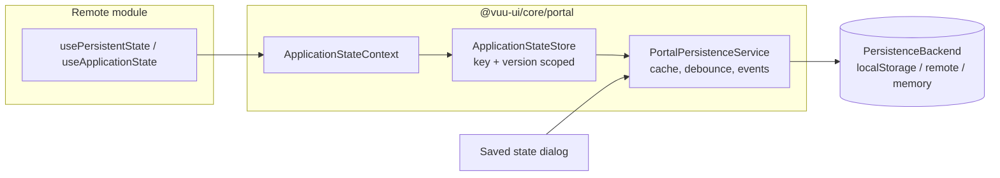
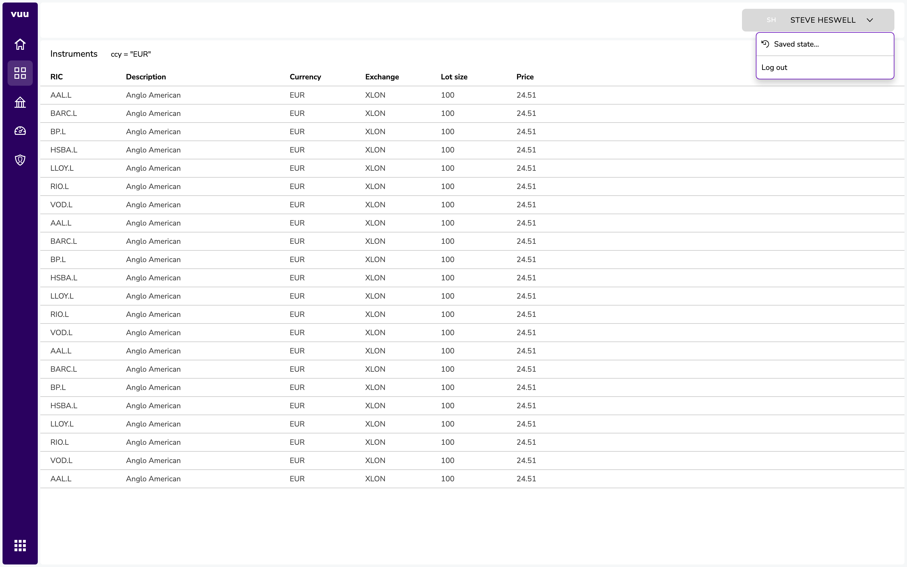
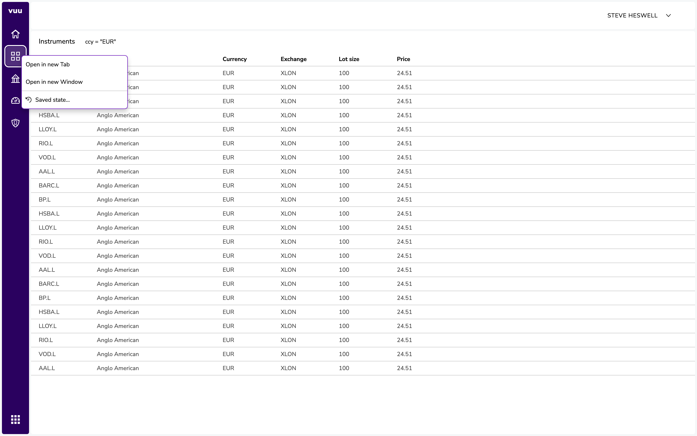
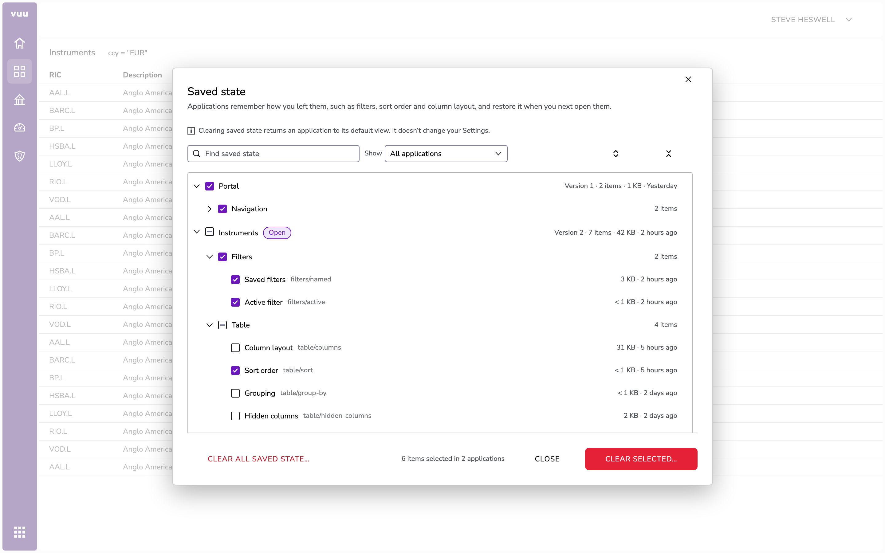
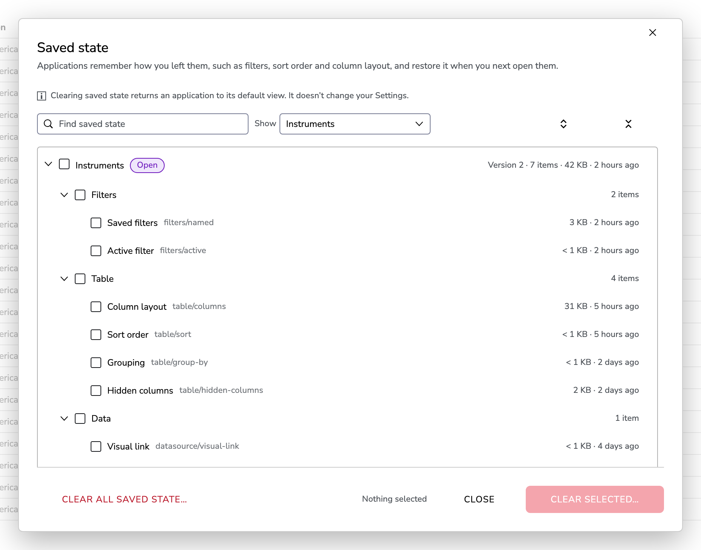
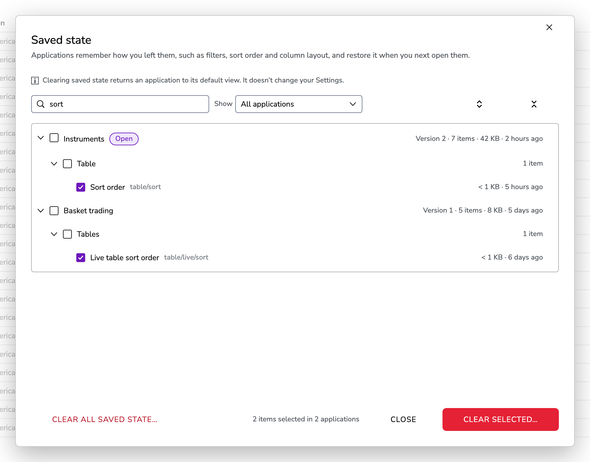
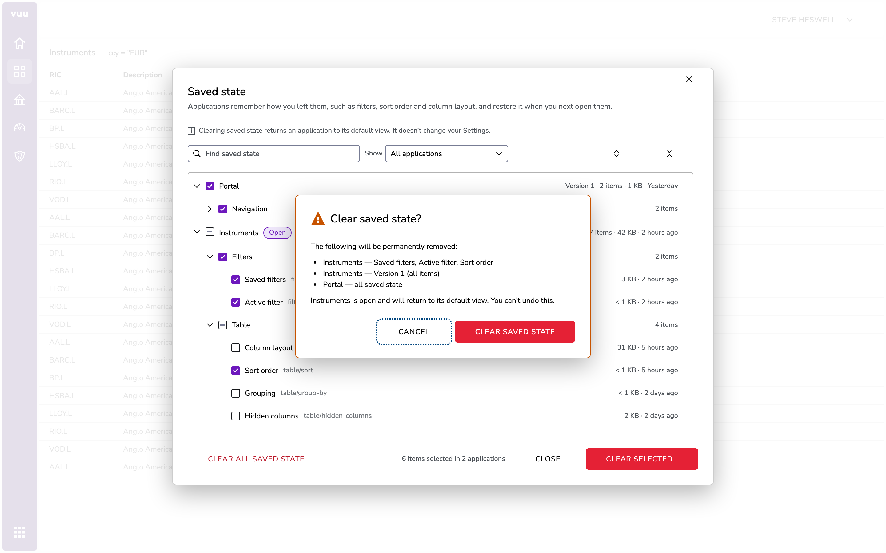
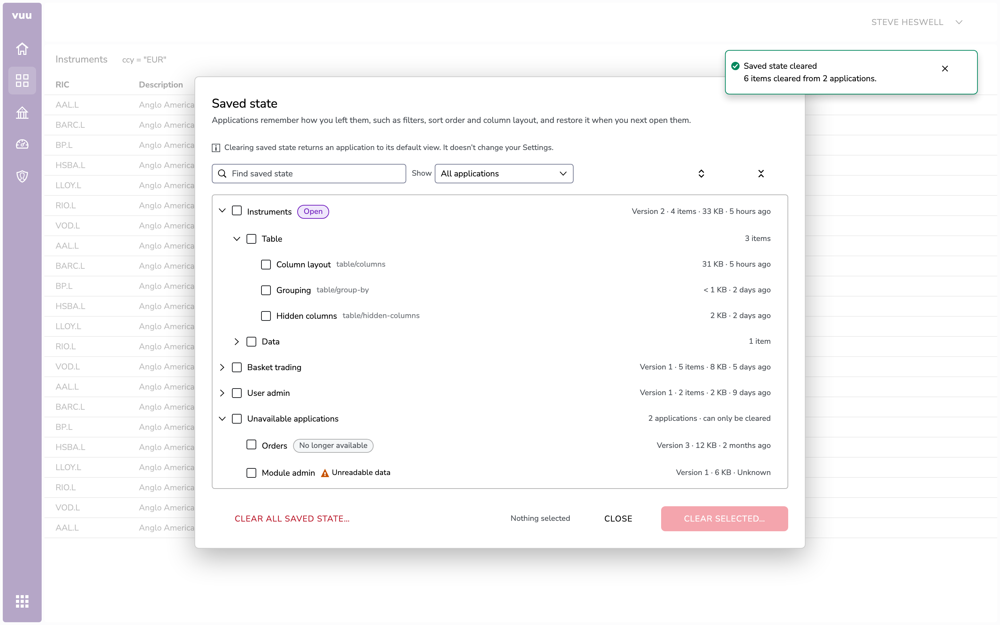
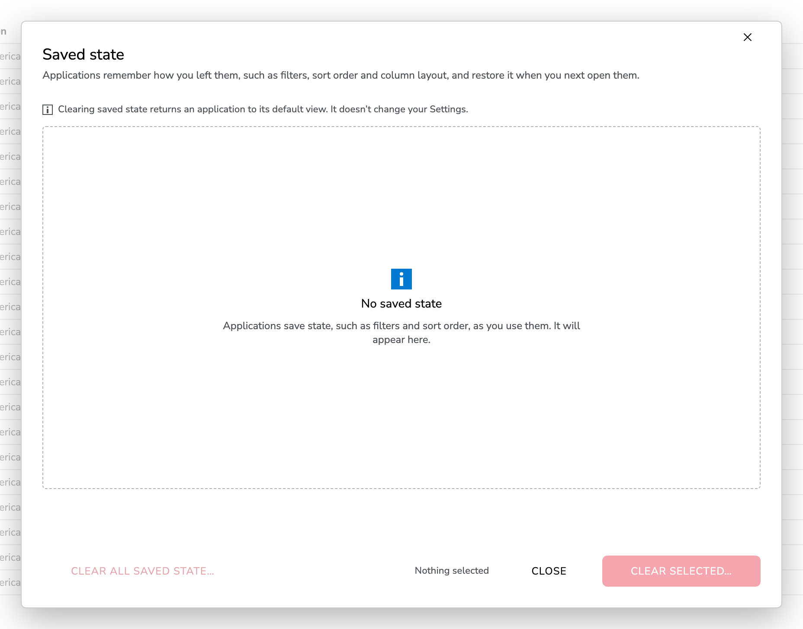
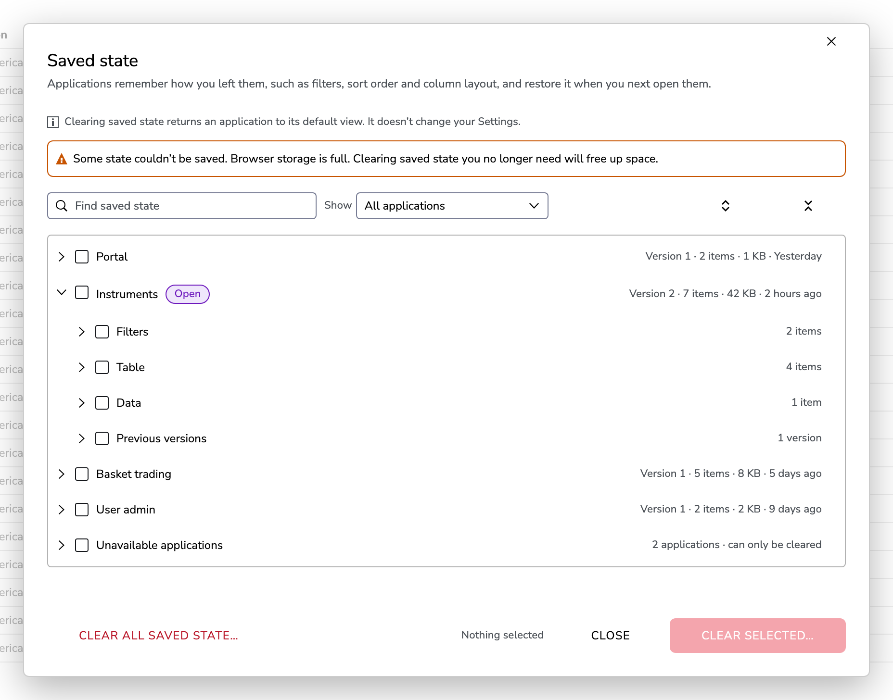

# Portal Application State Persistence and Saved State UI — Design

Status: **Implemented** (phases 1–4 of §11; decisions in §12; implementation
notes and deviations in §13). Remote authors should start with
[saved-state-guide.md](./saved-state-guide.md).
Package: `@vuu-ui/core/portal`
Reference host: `portal-examples/portal-host`

## 1. Summary

Applications hosted in the portal (federated remote modules, and the portal
shell itself) need to persist runtime state for the user — applied filters,
named filters, sort criteria, column layouts, panel sizes and similar — and
restore it when the application next starts. This is **saved state**. It is
distinct from user **Settings** (theme, number formatting and so on), which a
later feature will manage through a portal Settings dialog (§4.1).

This document specifies:

1. A **persistence service** provided by `PortalShell` to every remote module.
   Each application reads and writes named JSON values under its own key. All
   data is scoped to the authenticated user and to the application version,
   and is stored as **one JSON document per user / application / version**.
2. A **pluggable storage backend**, defaulting to `localStorage` and
   substitutable with a remote (server-side) store without changes to
   applications.
3. A **Saved state** dialog, offered by the portal, that lets users
   selectively clear saved state for one, several or all applications, and
   for one, several or all items within an application. It is built with Salt
   components, following the App header, Menu button, Button bar, List
   filtering and Content status patterns. High-fidelity mockups are in §9.

## 2. Background

### 2.1 Current portal state

- `PortalShell` (`src/portal-shell/PortalShell.tsx`) creates a browser router
  (`createBrowserRouter`) with two routes: `WINDOW_HOST_ROUTE`, which renders
  `WindowHost` (in its own `WindowShell`), and a catch-all portal layout. The
  layout composes `CommonShell` (Salt theme, `ModalProvider`, data-source
  provider), the caller's children (header and navigation), and one route per
  `RemoteModuleDescriptor`.
- `RemoteModule` (`src/remote-module/RemoteModule.tsx`) lazy-loads the
  federated component and wraps it in a per-remote `AuthenticationProvider`
  (`mode="vuu-connection"`). There is currently **no persistence service**, and
  no general service contract exposed to remotes.
- `@vuu-ui/core` and `@vuu-ui/core/portal` are federation **singletons**
  (`scripts/module-federation-utils.ts`), so a React context created in
  `@vuu-ui/core/portal` is the same object in the host and in every remote. This
  is the mechanism the service relies on.
- The authenticated user is available via `useAuthenticatedUser()`
  (`User = { userName: string }`). In `local` mode it defaults to
  `local-user`.
- `PortalHeader` renders only a **Log out** button. The nav components
  (`PortalNav`, and `PortalAppSwitcher` through `NestedNavItem` and
  `IconNavItem`) share a per-module context menu, `useNavContextMenu`
  (`src/portal-app-switcher/`), with **Open in new Tab** / **Open in new
  Window**.

### 2.2 Existing application persistence

Several remotes (`feature-filter-table`, `basket-trading`,
`feature-instrument-tiles`) and shared components such as `vuu-table` persist
state through `useViewContext()` `load` / `save` / `purge` from
`@vuu-ui/vuu-layout`. When mounted directly by the portal there is no `View`
above the remote, so nothing is persisted.

`@vuu-ui/vuu-layout` is to be removed. This design **does not** provide a
`useViewContext` compatibility layer. Components that save properties will be
migrated to the portal persistence service separately, after it is delivered
(see §3, non-goals).

### 2.3 Reference: `vuu-shell` persistence-manager

`packages/vuu-shell/src/persistence-manager` contains `IPersistenceManager`
(`Local`, `Remote`, `Static` implementations) and the newer
`WorkspacePersistenceService`. Lessons taken from it:

| Observation in `vuu-shell`                                                                                   | Improvement in this design                                                                        |
| ------------------------------------------------------------------------------------------------------------ | ------------------------------------------------------------------------------------------------- |
| `IPersistenceManager` mixes domain concerns (layouts, metadata, application JSON, user settings) with storage. | Separate a small **storage backend** interface from the **application-facing** API.              |
| `clearUserSettings()` clears everything; the remote implementation is a `// todo`.                           | Granular clear by application, version and key is a first-class operation.                       |
| `Settings` is `Record<string, string \| number \| boolean>`.                                                 | Values are arbitrary JSON.                                                                        |
| No versioning of stored data.                                                                                | One document per application version plus an envelope `schemaVersion`.                           |
| `saveUserSettings` silently does nothing if application JSON has not been loaded.                            | Explicit lifecycle (`loading` → `ready` / `error`); writes before ready are rejected in dev.      |
| No change notification; other tabs or a clear operation are invisible to a running app.                     | Subscriptions for key changes and clears, including cross-tab `storage` events.                   |
| URLs (`/api/...`) hard-coded in the remote implementation.                                                   | Remote backend is configured (base URL, token provider).                                          |
| Local workspace service maintains separate index keys that can drift from the data they index.              | Enumerate by key prefix — the documents are the index.                                           |
| Every write re-serialises immediately.                                                                       | Debounced write-behind with flush on page hide.                                                   |

The `vuu-shell` classes remain in place for existing VUU shell applications;
this design does not change them.

## 3. Goals and non-goals

### Goals

- G1. Any remote module can save and restore JSON values at runtime with a
  minimal API, and read restored values **synchronously on first render**.
- G2. Data is isolated per user, per application, per application version.
- G3. The default backend is `localStorage`; a remote store can be substituted
  by portal configuration only.
- G4. Users can inspect what is saved and selectively clear it.
- G5. Clearing is safe while applications are running (no immediate re-save of
  the cleared value; applications can react).
- G6. The API is general enough for shared components (e.g. `vuu-table`,
  filters) to adopt later as the replacement for `useViewContext`
  `load` / `save`.

### Non-goals

- Server-side implementation of the remote store (only its contract, §7.4).
- A `useViewContext` adapter, and migration of existing components or remotes
  to the new service. Both are follow-up work.
- Layout / workspace persistence (`vuu-shell` workspace services). A future
  workspace feature may use this service as its backend.
- Sharing saved state between users, or admin-managed defaults.
- User **Settings** and the Settings dialog (§4.1). These are a separate, later
  feature and are not stored or cleared by anything in this design.
- Encryption at rest in `localStorage`.
- Import/export of saved state (possible later; see §12, Q6).
- Viewing saved values in the UI (possible later; see §12, Q5).

## 4. Terminology

### 4.1 Saved state vs Settings

The portal will have two different kinds of persisted user data. They must
never be confused in code, documentation or the UI.

| | **Saved state** (this design) | **Settings** (future) |
| - | - | - |
| What it is | How the user left an application, captured **automatically** as they work: filters, named filters, sort order, column layout, grouping, selected tab, panel sizes. | Choices the user makes **deliberately** in a portal-managed Settings dialog: theme (light/dark), density, number and date formatting, and application-specific settings. |
| Who writes it | The application, via `ApplicationStateStore` / `usePersistentState`. | The user, via the Settings dialog. |
| Scope | Per user, application and application version. | Portal-wide, or per application. |
| When it's lost | When the user clears it, or when the application version changes. | Only when the user changes it. |
| User-facing UI | **Saved state** dialog: review and clear only. | **Settings** dialog: view and edit, using the Salt Preferences dialog pattern. |
| Code vocabulary | `state`, `StateDocument`, `ApplicationStateStore`, `useApplicationState`, `SavedStateDialog` | `settings`, `Settings*` (reserved) |

Rules:

- In code and docs for this feature, never use *settings*, *preferences* or
  *config* for saved state. The words `settings` and `Settings*` are reserved
  for the future feature.
- In the UI, the user-facing term is **saved state**. The Saved state dialog
  always states that clearing saved state doesn't change Settings (§9.11).
- Storage is namespaced by kind: `…:state:…` keys and `/state/` REST paths
  (§7). The future Settings feature can then share the backend interface
  without sharing documents.
- Clearing saved state never touches Settings, and resetting Settings never
  touches saved state.

### 4.2 Glossary

| Term | Meaning |
| ---- | ------- |
| Application | A remote module registered with the portal, or the portal shell itself. |
| Application key | Stable, unique string identifying an application for persistence (§5.2). |
| Application version | `RemoteModuleDescriptor.version` (number). |
| Saved state | The collective term for everything persisted automatically for a user and application (§4.1). |
| State document | The single JSON document holding all saved state for one *user / application key / application version*. |
| Item (entry) | One named value within a state document, e.g. `table/sort`. The UI says "item", the code says "entry". |
| Storage backend | Implementation that loads, saves, deletes and lists state documents (`localStorage`, remote, in-memory). |
| Persistence service | Shell-level object (`PortalPersistenceService`) that owns the backend, caches documents, and hands out application-scoped stores. |
| Application state store | The object an application uses (`ApplicationStateStore`), scoped to its own key and version. |

## 5. Data model

### 5.1 State document

```json
{
  "schemaVersion": 1,
  "user": "steve",
  "applicationKey": "local-feature-filter-table",
  "applicationVersion": 1,
  "applicationTitle": "Instruments",
  "revision": 7,
  "carriedForwardFrom": 1,
  "createdAt": "2026-09-28T08:00:00.000Z",
  "updatedAt": "2026-09-28T08:42:13.512Z",
  "entries": {
    "table-config": {
      "value": { "columns": [{ "name": "ric", "width": 120 }] },
      "formatVersion": 2,
      "updatedAt": "2026-09-28T08:42:13.512Z",
      "label": "Table layout",
      "group": "Table"
    },
    "filters/named": {
      "value": [{ "name": "EUR only", "filter": "currency = \"EUR\"" }],
      "updatedAt": "2026-09-27T16:03:55.004Z",
      "label": "Saved filters",
      "group": "Filters"
    },
    "filters/active": {
      "value": "ccy = \"EUR\" and exchange = \"XLON\"",
      "updatedAt": "2026-09-27T16:04:10.117Z",
      "label": "Active filter",
      "group": "Filters"
    }
  },
  "migrationsApplied": [2],
  "notCarriedForward": [
    {
      "key": "grouping",
      "label": "Grouping",
      "fromVersion": 1,
      "reason": "Column 'lotSize' was removed in version 2"
    }
  ]
}
```

| Field                | Rules                                                                                                               |
| -------------------- | ------------------------------------------------------------------------------------------------------------------- |
| `schemaVersion`      | Version of the envelope format, not of application data. Starts at `1`.                                             |
| `user`               | `User.userName` of the authenticated identity. Required.                                                            |
| `applicationKey`     | See §5.2. Required.                                                                                                 |
| `applicationVersion` | Integer from the descriptor. Required.                                                                              |
| `applicationTitle`   | Last-known display title; lets the Saved state UI name applications that are no longer in the registry.          |
| `revision`           | Monotonic integer incremented by every successful save; used for optimistic concurrency.                             |
| `carriedForwardFrom` | Set when the document was created by copying an earlier version's document (§5.4.3).                                 |
| `entries`            | Map of key → entry. `value` is any JSON value (`null` allowed; `undefined` is not stored).                           |
| entry `label`/`group`| Optional, human-readable metadata supplied by the application so the UI can describe entries without loading the app. |
| entry `formatVersion`| Optional version of the value's format, owned by the component that writes it (§5.4.6). Defaults to `1`.             |
| `migrationsApplied`  | Versions whose release migrations ran when the document was carried forward (§5.4.4). |
| `notCarriedForward`  | Entries a migration rejected, with the reason (§5.4.5). Shown in the Saved state UI; removed when the user clears the application. |

Key rules:

- Keys are non-empty strings, max 256 characters. `/` is a convention for
  grouping (`filters/named`) but has no structural meaning to the service.
- Keys beginning with `vuu.` are reserved for the shell and shared VUU
  components.

### 5.2 Application key

The shell — not the remote — determines the application key, from the
descriptor that mounted the remote. This prevents one application reading or
clearing another's data and removes the risk of two remotes choosing the same
key.

- Resolution: `descriptor.persistenceKey ?? descriptor.clientIdentifier`.
- `clientIdentifier` is the default (unique, stable, admin-managed; e.g.
  `local-feature-filter-table`).
- `persistenceKey` is a new optional field on `RemoteModuleDescriptor`.
  Admins set it to keep a user's saved state when a module is
  re-registered under a new `clientIdentifier`. It must be unique across the
  registry; the registry rejects duplicates.
- The same federated component registered twice (e.g. the filter table with
  two different `tableSchema` props) gets two descriptors and therefore two
  independent state documents.
- The portal shell's own state uses the reserved key `vuu.portal` at
  version `1`. (Portals on the same origin are separated by the storage key
  prefix, §7.2.)

### 5.3 Versioning

- The version dimension is `descriptor.version` (Q3).
- A new application version starts with a **copy** of the most recent earlier
  version's document, updated by the release's migrations before the
  application renders (§5.4). (Q8)
- Earlier-version documents are never modified, and are kept until the user
  clears them (Q4; a "keep last N versions" policy may follow). Rolling an
  application back therefore restores exactly the state it had before.
- `schemaVersion` migrations of the envelope are handled inside the service.

### 5.4 Keeping saved state compatible

#### 5.4.1 The problem

Server and UI are always released together, so saved state can only become
incompatible at an **application version boundary**. A release may:

- rename or remove columns, leaving saved filters, sorts, groupings and
  layouts that refer to the old names;
- change the format of a saved value (e.g. a new table config shape);
- rename or remove a saved key.

State carried into the new version has to be migrated once, when the new
version first starts for that user. After that it is ordinary saved state
again.

#### 5.4.2 Principles

- **The release that makes a change migrates the state.** A renamed column
  looks exactly like a removed one plus a new one, so renames can't be
  inferred. The release that renames a column ships a migration for it,
  alongside the server change.
- **Migrate once, before first use.** Migrations run when the new version's
  document is created, before the application renders. Application code only
  ever sees state in the current version's shape.
- **Contain the damage.** Migrations work per entry, and within an entry per
  element (one named filter, one column). One incompatible value never costs
  the user everything else.
- **Never silently change meaning.** A migrated value must mean what it meant
  before, or not be used. Dropping a removed column from a layout is safe.
  Dropping one clause from `ccy = "EUR" and exchange = "XLON"` is not: the
  user would see rows they believe are filtered out. If any part of a filter
  can't be migrated, the entire filter is rejected (Q9).
- **Forwards only, never in place.** Migrations run on a copy. The previous
  version's document is never modified, so a failed migration can't lose the
  original, and rolling back restores exactly the state the old version had.
- **Tell the user only when it matters.** Silent when a change is fully
  handled (a renamed column), visible when something the user chose
  deliberately couldn't be kept (a filter on a removed column).

#### 5.4.3 Carry forward (service, automatic)

When a store is requested for version *N* and no document exists for *N*:

1. The service copies the document of the **highest earlier version** *M*.
2. It runs the application's migrations for every version *M + 1 … N*, in
   ascending order, against the copy (§5.4.4). A release with no migration
   changes nothing.
3. It saves the result as version *N*'s document, with `carriedForwardFrom: M`
   and `migrationsApplied`. The save is create-if-absent: if another tab
   migrated first, the service discards its own result and loads theirs.
4. The application renders.

Because version *N*'s document now exists, migrations never run twice.

If only **later** versions exist (the application was rolled back and never
ran at this version), the store starts empty; there are no down-migrations.

This also resolves the Q3 caveat: version bumps for releases that change
nothing keep state automatically.

#### 5.4.4 Release migrations

A migration is a runtime script shipped with a release. It knows how to update
that application's saved state from the previous version:

```ts
// instruments/src/stateMigrations.ts
import { renameColumns, removeColumns } from "@vuu-ui/vuu-table/migrations";
import { renameFilterColumns, filterUsesColumns } from "@vuu-ui/vuu-filters/migrations";

export const stateMigrations: StateMigration[] = [
  {
    version: 2,
    description: "ccy renamed to currency; lotSize removed",
    migrate(state) {
      state.update("instruments/table", (config) =>
        removeColumns(renameColumns(config, { ccy: "currency" }), ["lotSize"]),
      );
      state.update("filters/active", (filter, entry) =>
        filterUsesColumns(filter, ["lotSize"])
          ? entry.reject("Uses the Lot size column, which has been removed")
          : renameFilterColumns(filter, { ccy: "currency" }),
      );
      state.update("filters/named", (named, entry) =>
        named.flatMap((f) => {
          if (filterUsesColumns(f.filter, ["lotSize"])) {
            entry.notify(`Saved filter "${f.name}" used a removed column`);
            return [];
          }
          return [{ ...f, filter: renameFilterColumns(f.filter, { ccy: "currency" }) }];
        }),
      );
    },
  },
  {
    version: 3,
    migrate(state) {
      state.rename("table-config", "instruments/table");
      state.remove("legacy/view");
    },
  },
];
```

- **Where they live.** The remote's exposed component module exports
  `stateMigrations`, next to the component. `RemoteModule` already has both the
  code and the document before rendering (§6.2), so migrations run at that
  point. A large migration can `import()` its helpers so they only load when
  needed.
- **Per-entry isolation.** `update(key, fn)` catches errors thrown by `fn` and
  rejects just that entry. A migration that throws outside `update` aborts the
  carry-forward: version *N* starts empty, the user is told, and the error is
  logged. The previous document is untouched either way.
- **Pure and synchronous by default.** Migrations work on JSON only; they
  don't have access to the server or the running application. `migrate` may
  return a promise (for lazy imports), but not wait on anything else.
- **Composition is sequential.** A user jumping from version 1 to 3 simply
  runs the migrations for 2 and then 3. `ccy → currency` then
  `currency → ccyCode` needs no special handling.
- **Helpers belong to value owners.** Shared components publish helpers for
  their value formats (`renameColumns`, `removeColumns`, `renameFilterColumns`,
  `filterUsesColumns`, …), so each application's migrations are a few lines
  and don't depend on internal formats.

Guidance for migration authors:

| Value | Change in the release | Migration |
| ----- | --------------------- | --------- |
| Column layout | Column renamed or removed | Rename or drop the column. Silent. |
| Sort | Sort column renamed or removed | Rename, or drop that sort column. Silent. |
| Group by | Group column removed | Drop it, and `notify`: grouping changes what the user sees. |
| Active filter | Column renamed | Rewrite the filter. Silent. |
| Active filter | Any clause refers to a removed column | `reject`: the filter isn't applied. |
| Named filters | Some filters refer to removed columns | Remove each affected filter whole and `notify`; keep the rest, with renames applied. |
| Any | Feature removed | `remove` the key. Silent. |

#### 5.4.5 API

Additions to `@vuu-ui/core/portal`:

```ts
export interface StateMigration {
  /** The application version this migration upgrades to. */
  version: number;
  description?: string;
  migrate(state: MigratableState): void | Promise<void>;
}

export interface MigratableState {
  readonly fromVersion: number;
  readonly toVersion: number;
  keys(): readonly string[];
  has(key: string): boolean;
  get<T extends JsonValue = JsonValue>(key: string): T | undefined;
  set<T extends JsonValue>(key: string, value: T, metadata?: EntryMetadata): void;
  /** Transforms one entry. A missing key is skipped; an error rejects only this entry. */
  update<T extends JsonValue>(
    key: string,
    fn: (value: T, entry: MigrationEntry) => T | Rejected,
  ): void;
  rename(from: string, to: string): void;
  remove(key: string): void;
}

export interface MigrationEntry {
  /** Removes the entry and records it in notCarriedForward. */
  reject(reason: string): Rejected;
  /** Keeps the entry, and tells the user something changed. */
  notify(message: string): void;
}

/** Test helper: runs migrations against a fixture document. */
export function runStateMigrations(
  document: StateDocument,
  migrations: readonly StateMigration[],
  toVersion: number,
): Promise<{ document: StateDocument; notifications: readonly string[] }>;
```

- Migration `version`s must be unique and no higher than the application's
  current version. Duplicates are a startup error in development.
- `reject` reasons and `notify` messages are user-facing, so write them in
  plain language.
- `importFrom` and `previousVersions` (§6.3) remain available for unusual
  cases, such as an application that wants to offer the user a choice.

#### 5.4.6 Component format versions

A shared component can change the shape of its own saved value in a release
that doesn't rename anything, e.g. `vuu-table` restructures its config. Each
application's migrations shouldn't have to know about that. Instead:

- the component writes an optional `formatVersion` with its values (via `set`
  options, §6.3);
- it reads older formats of its **own** values ("tolerant reader") and writes
  the current format on the next save.

Release migrations handle application changes (columns, keys, features).
Format versions handle component internals. Neither needs to know about the
other.

#### 5.4.7 Letting the user know

- `reject` and `notify` results are collected during carry-forward.
  `RemoteModule` shows one `Toast` when the application first renders:
  **Some saved state wasn't carried forward**, *"Instruments has been updated.
  2 items couldn't be kept: Active filter, Grouping."* The **Review** action
  opens the Saved state dialog scoped to that application (§9.15).
- Rejected entries are recorded in `notCarriedForward`. Their original values
  remain in the previous version's document.
- If the carry-forward was aborted, the toast says *"Instruments has been
  updated. Your saved state couldn't be carried forward, so it has opened with
  its default view."*

#### 5.4.8 Testing

- Each application tests its migrations with `runStateMigrations` against
  saved-state fixtures captured from each released version. The tests cover
  every path to the current version: 1 → current, 2 → current, and so on.
- Shared components test their migration helpers, and their tolerant readers
  for each older format version.
- Service tests cover:
  - carry-forward from the latest earlier version, never a later one;
  - migrations run in order, and only once;
  - the create-if-absent race between tabs;
  - per-entry isolation in `update`;
  - an aborted carry-forward;
  - `notCarriedForward` recording.

## 6. Application-facing API

### 6.1 Overview



`RemoteModule` resolves the store for its descriptor and provides it through
`ApplicationStateContext`. Because `@vuu-ui/core/portal` is a federation
singleton, the remote's `useApplicationState()` reads the host's context.

### 6.2 Startup sequence


- The state document is loaded **in parallel** with the remote code and the
  remote is rendered only once both are ready (the store exposes a `ready`
  promise, which `RemoteModule` suspends on; see §13.2 for the `Suspense`
  boundary). This guarantees
  synchronous reads on first render, so components can initialise state from
  saved values without an extra render or loading state.
- If loading fails, the store becomes `ready` with an empty document and
  `status = "error"`; the application renders with defaults and writes are
  held in memory (not persisted) until the next successful load. The failure is
  logged and surfaced in the Saved state UI. Persistence failures must never
  prevent an application from rendering.

### 6.3 Types

```ts
export type JsonValue =
  | null
  | boolean
  | number
  | string
  | JsonValue[]
  | { [key: string]: JsonValue };

export interface EntryMetadata {
  /** Human-readable name shown in the Saved state UI. */
  label?: string;
  /** Optional grouping shown in the Saved state UI. */
  group?: string;
}

export type StateChangeReason = "set" | "remove" | "clear" | "external";

export interface StateChangeEvent {
  keys: readonly string[];
  reason: StateChangeReason;
}

export interface ApplicationStateStore {
  readonly applicationKey: string;
  readonly applicationVersion: number;
  readonly status: "loading" | "ready" | "error";
  /** Resolves when the document has been loaded (or failed to load). */
  readonly ready: Promise<void>;

  get<T extends JsonValue = JsonValue>(key: string): T | undefined;
  getAll(): Readonly<Record<string, JsonValue>>;
  has(key: string): boolean;
  keys(): readonly string[];

  /**
   * Updates the in-memory value immediately; persistence is debounced.
   * `formatVersion` is set by components that version their own values (§5.4.6).
   */
  set<T extends JsonValue>(
    key: string,
    value: T,
    options?: EntryMetadata & { formatVersion?: number },
  ): void;
  /** Declares metadata for a key without setting a value. */
  describe(key: string, metadata: EntryMetadata): void;
  remove(key: string): void;
  /** Removes every entry for this application version. */
  clear(): void;

  /** Writes any pending changes now. */
  flush(): Promise<void>;
  subscribe(listener: (event: StateChangeEvent) => void): () => void;

  /** Versions of this application that have saved documents, newest first. */
  previousVersions(): Promise<readonly number[]>;
  /** Copies entries (optionally a subset / transformed) from an earlier version. */
  importFrom(
    version: number,
    options?: {
      keys?: readonly string[];
      transform?: (key: string, value: JsonValue) => JsonValue | undefined;
    },
  ): Promise<readonly string[]>;
}
```

Notes:

- `get` returns a structurally cloned (or frozen) value so callers cannot mutate
  cached state.
- `set` with a value deep-equal to the stored value is a no-op (no write, no
  event).
- Values that are not JSON-serialisable (functions, `undefined`, class
  instances, cycles) throw in development builds and are rejected with a
  logged error in production.

### 6.4 React hooks (exported from `@vuu-ui/core/portal`)

```ts
/** The store for the enclosing application. Throws outside a portal application. */
export function useApplicationState(): ApplicationStateStore;

/** Same, but returns undefined when not hosted by a portal (standalone apps, tests). */
export function useOptionalApplicationState(): ApplicationStateStore | undefined;

/**
 * useState-like hook backed by the store. Returns defaultValue when there is
 * no saved value, and reverts to defaultValue when the key is cleared.
 */
export function usePersistentState<T>(
  key: string,
  defaultValue: T & JsonValue,
  metadata?: EntryMetadata,
): [T, (value: T | ((previous: T) => T)) => void];
```

Example:

```tsx
const [sort, setSort] = usePersistentState<SortDef>("table/sort", NO_SORT, {
  label: "Sort order",
  group: "Table",
});
```

### 6.5 Shell-level service API

Used by `PortalShell`, `RemoteModule`, and the Saved state UI. Not intended
for remote modules.

```ts
export interface DocumentRef {
  user: string;
  applicationKey: string;
  applicationVersion: number;
}

export interface EntrySummary extends EntryMetadata {
  key: string;
  updatedAt: string;
  /** Serialised size in bytes (UTF-16 length × 2 for localStorage). */
  size: number;
}

export interface DocumentSummary extends Omit<DocumentRef, "user"> {
  applicationTitle?: string;
  revision: number;
  updatedAt: string;
  size: number;
  entries: readonly EntrySummary[];
}

export type ClearSelection = ReadonlyArray<{
  applicationKey: string;
  applicationVersion: number;
  /** Omit to clear the whole document. */
  keys?: readonly string[];
}>;

export interface ClearResult {
  cleared: ReadonlyArray<{ ref: DocumentRef; keys: readonly string[] | "all" }>;
  failed: ReadonlyArray<{ ref: DocumentRef; error: Error }>;
}

export interface PortalPersistenceService {
  readonly user: string;
  getStore(applicationKey: string, applicationVersion: number, title?: string): ApplicationStateStore;
  list(): Promise<readonly DocumentSummary[]>;
  clear(selection: ClearSelection): Promise<ClearResult>;
  clearAll(): Promise<ClearResult>;
  flushAll(): Promise<void>;
  subscribe(listener: (ref: DocumentRef, event: StateChangeEvent) => void): () => void;
  dispose(): void;
}
```

- One store instance per `(applicationKey, version)` is cached for the lifetime
  of the service, so multiple mounts of the same application (e.g. route
  re-mounts) share state.
- A `usePortalPersistence()` hook exposes the service to shell components.

### 6.6 Use by shared components

Shared components (e.g. `vuu-table`) are used by many applications, so they
must not assume a fixed key. When they are migrated (out of scope here), they
should:

- take an optional key (or key prefix) prop from the owning application, e.g.
  `persistenceKey="instruments/table"`;
- read and write through `useOptionalApplicationState()` so they work with
  or without a portal;
- supply `label` / `group` metadata so their entries are identifiable in the
  Saved state UI;
- publish migration helpers for their value formats (§5.4.4), and read older
  formats of their own values (§5.4.6).

## 7. Storage backends

### 7.1 Backend interface

Backends are document-oriented and deliberately small; all key-level logic
(partial clear, merge) lives in the service, so a remote backend only needs
CRUD on whole documents.

```ts
export interface PersistenceBackend {
  load(ref: DocumentRef): Promise<StateDocument | undefined>;
  /**
   * Saves the document. If expectedRevision is supplied and does not match the
   * stored revision, rejects with PersistenceConflictError carrying the
   * current document.
   */
  save(doc: StateDocument, expectedRevision?: number): Promise<{ revision: number }>;
  delete(ref: DocumentRef): Promise<void>;
  /** Metadata only — values are not required. */
  list(user: string): Promise<readonly DocumentSummary[]>;
  /** Optional: notification of changes made elsewhere (other tabs, server push). */
  subscribe?(user: string, listener: (ref: DocumentRef) => void): () => void;
}
```

Errors: `PersistenceError` (base, with `operation`, `ref`, optional `status`),
`PersistenceConflictError`, `PersistenceQuotaError`,
`PersistenceValidationError` (stored data is not a valid document).

### 7.2 `LocalStoragePersistenceBackend` (default)

- Storage key: `vuu-portal:{portalId}:state:{user}:{applicationKey}:v{version}`, each
  segment `encodeURIComponent`-encoded. `portalId` is the `PortalShell` `id`
  (default `"vuu-portal"`) so multiple portals on one origin do not collide.
- `list(user)` enumerates `localStorage` keys with the user prefix — no
  separate index to keep in sync.
- `subscribe` uses the `window` `storage` event to detect writes from other
  tabs / `WindowHost` windows on the same origin.
- `QuotaExceededError` is mapped to `PersistenceQuotaError`; the service keeps
  the change in memory, marks the store `error`, and the Saved state UI shows
  a warning with a prompt to clear space.
- Invalid JSON or a document that fails validation is moved to
  `{key}:corrupt:{timestamp}` (one retained copy), logged, and treated as
  absent. It appears in the UI so it can be cleared.
- Constructor accepts any `Storage` (for tests / `sessionStorage`).

### 7.3 `InMemoryPersistenceBackend`

For tests, the showcase, and `local` authentication mode when persistence is
not wanted.

### 7.4 `RemotePersistenceBackend`

Configured with `{ baseUrl, getToken?: () => Promise<string>, fetch? }`. The
host would typically pass `useIdentityToken()`.

Proposed REST contract (server implementation out of scope):

| Operation | Request                                                               | Response                                                        |
| --------- | --------------------------------------------------------------------- | --------------------------------------------------------------- |
| list      | `GET {base}/users/{user}/state`                                       | `200` `DocumentSummary[]`                                       |
| load      | `GET {base}/users/{user}/state/{applicationKey}/versions/{version}`    | `200` document + `ETag: "{revision}"`, or `404`                 |
| save      | `PUT` same path, body = document, `If-Match: "{revision}"` (omit on create; `If-None-Match: *`) | `200`/`201` + `ETag`; `412` on conflict (body = current document) |
| delete    | `DELETE` same path                                                    | `204` (also for already absent)                                 |

- Requests carry `Authorization: Bearer {token}`. The server **must** derive
  or verify `user` from the token and reject mismatches with `403`; the path
  segment is not trusted.
- Transient failures (network, `5xx`) retry with backoff for saves; loads fail
  to the `error` state described in §6.2.
- Save on page hide uses `fetch(..., { keepalive: true })`.

### 7.5 Configuration

`PortalShell` gains an optional prop:

```ts
export interface PortalShellProps extends CommonShellProps {
  // existing props…
  /**
   * Storage backend for saved application state.
   * Default: LocalStoragePersistenceBackend.
   * Pass `false` to disable persistence (applications receive an in-memory store).
   */
  persistence?: PersistenceBackend | false;
}
```

`WindowShell` / `WindowHost` accept the same prop so a module opened in its
own window reads and writes the same document. The portal-host example keeps
the default and documents how to switch to the remote backend via
`window.vuuConfig`.

## 8. Behavioural requirements

### 8.1 Functional

| ID    | Requirement |
| ----- | ----------- |
| FR-1  | `PortalShell` creates one `PortalPersistenceService` for the authenticated user and makes it available to shell components. |
| FR-2  | `RemoteModule` provides each remote with an `ApplicationStateStore` scoped to the descriptor's application key and version. |
| FR-3  | A remote cannot address another application's document through the application-facing API. |
| FR-4  | The remote renders only after its state document is loaded or has failed to load; first-render reads are synchronous. |
| FR-5  | `set` updates memory immediately and persists within a debounce window (default 500 ms, configurable), coalescing multiple keys into one document save. |
| FR-6  | Pending writes are flushed on `visibilitychange` → hidden, `pagehide`, logout, and service disposal. |
| FR-7  | Stored data is one JSON document per user / application key / application version, in the format in §5.1. |
| FR-8  | A new application version starts with a copy of the most recent earlier version's document (§5.4.3), never a later one; earlier-version documents are never modified, and are retained and listed. |
| FR-9  | The backend is `localStorage` by default and can be replaced by configuration only, with no change to applications. |
| FR-10 | On save conflict, the service reloads the document and re-applies only the locally changed keys (key-level last-writer-wins), then retries once. |
| FR-11 | Changes from other tabs/windows (backend `subscribe`) update cached documents and notify subscribers with reason `external`. |
| FR-12 | `clear` removes selected keys, or whole documents, across any set of applications and versions in one operation, returning per-document success/failure. |
| FR-13 | Clearing cancels pending writes for the cleared keys and notifies running applications with reason `clear`; `usePersistentState` reverts to its default. |
| FR-14 | Clearing every key in a document deletes the document rather than saving an empty one. |
| FR-15 | Logout flushes pending writes, then disposes the service. A different user logging in on the same browser never sees the previous user's data. |
| FR-16 | The portal shell's own state (e.g. nav expanded, app switcher mode) uses the reserved `vuu.portal` application key and appears in the Saved state UI as "Portal". |
| FR-17 | Hooks work outside a portal (`useOptionalApplicationState`, and `usePersistentState` falls back to plain state) so remotes remain usable standalone and in tests. |
| FR-18 | On first load of a new version, the service copies the latest earlier document and runs the application's `stateMigrations` for each intervening version, in order, once, before the application renders (§5.4.3). |
| FR-19 | An error inside `update` rejects only that entry. Any other migration error aborts the carry-forward, so the version starts empty; the previous document is never modified (§5.4.4). |
| FR-20 | Rejected entries are removed from the new version's document and recorded in `notCarriedForward`; the previous version's document is unchanged (§5.4.5). |
| FR-21 | `reject` and `notify` results produce one toast when the application first renders after carry-forward, with a **Review** action opening the Saved state dialog scoped to that application (§5.4.7). |

### 8.2 Non-functional

| ID    | Requirement |
| ----- | ----------- |
| NFR-1 | Persistence failures (quota, network, corrupt data) never throw into application render; they are logged and surfaced in the Saved state UI. |
| NFR-2 | Document load adds no serial latency to remote startup (parallel with code load, §6.2). |
| NFR-3 | Default size warnings: 256 KB per entry, 1 MB per document (configurable). Oversized writes are rejected with a logged error. |
| NFR-4 | `localStorage` is not a security boundary. Applications must not store secrets or tokens; this is documented and entries containing obvious tokens are not specially handled. |
| NFR-5 | All public types and hooks are exported from `@vuu-ui/core/portal` and documented. |
| NFR-6 | Unit tests (vitest) cover the service, each backend, conflict handling, debounce/flush, cross-tab events and clear semantics; component tests cover the Saved state dialog including keyboard use. |

## 9. Saved state UI

The mockups below are rendered from real Salt components
(`@salt-ds/core` 1.67.0) using `vuu-theme` (purple accent, rounded corners,
medium density), at 2× resolution. Data is illustrative. Click an image to
view it at full size.

### 9.1 Principles

- **Never call it Settings or Preferences.** The dialog title, menu items,
  buttons and messages all say *saved state* (§4.1). Every view of the dialog
  says what saved state is and that clearing it doesn't change the user's
  Settings.
- **Visually distinct from the future Settings dialog.** The Settings dialog
  will use the Salt Preferences dialog pattern, with vertical navigation
  between panels. The Saved state dialog is a **single-pane** dialog. The
  application → group → item hierarchy is shown in one `Tree`, so there's no
  left navigation that could be mistaken for Settings. Later, the Settings
  dialog may link to Saved state, but the two are never combined.
- **Explicit, reviewable selection.** Users choose exactly what to clear,
  confirm before anything is removed, and are told what happened.
- **Metadata only.** The dialog reads `list()` summaries and never loads
  remote code. It works for applications that aren't loaded, are disabled, or
  are no longer in the user's registry.

### 9.2 Entry points

**Header user menu.** `PortalHeader` replaces the standalone **Log out**
button with a user menu (`Menu`, `MenuTrigger`, `MenuPanel`, `MenuItem`,
following the Salt *App header* and *Menu button* patterns). The trigger is a
transparent `Button` with an `Avatar` and the user name.

- **Saved state…** opens the dialog showing all applications.
- A divider, then **Log out**.
- When the Settings dialog is delivered, **Settings…** is added as a separate
  item above **Saved state…**.

[](assets/saved-state/01-entry-user-menu.png)

**Navigation context menu.** In `PortalNav` and `PortalAppSwitcher`, a
divider and **Saved state…** follow the existing *Open in new Tab / Window*
items. This opens the dialog scoped to that application (§9.4).

[](assets/saved-state/02-entry-nav-context-menu.png)

**Programmatic.** `useSavedStateDialog().open(applicationKey?)` lets an
application offer its own "Reset view" action that opens the dialog scoped to
itself.

### 9.3 Dialog: all applications

[](assets/saved-state/03-saved-state-all.png)

Anatomy, top to bottom:

1. **Header.** `DialogHeader` with the title **Saved state** and the
   description *"Applications remember how you left them, such as filters,
   sort order and column layout, and restore it when you next open them."*
   `DialogCloseButton` sits at the top right.
2. **Distinction note.** An info icon with secondary `Text`: *"Clearing saved
   state returns an application to its default view. It doesn't change your
   Settings."*
3. **Filter bar** (`FlexLayout`):
   - a bordered search `Input` with a search icon, placeholder *"Find saved
     state"* (§9.5);
   - a **Show** `Dropdown` offering *All applications* or one application
     (§9.4);
   - **Expand all** / **Collapse all** transparent icon buttons, right-aligned.
4. **Tree.** A Salt `Tree` with `multiselect`, in a bordered, scrollable
   container:
   - **Level 1: application.** Bold title, an **Open** tag if it's currently
     mounted, and right-aligned metadata: *Version · N items · size · last
     saved*. Ordered as in the portal navigation, with **Portal** first.
     Applications with no saved state are omitted.
   - **Level 2: group** (from entry `group` metadata), with an item count.
     Entries without a group sit directly under the application.
   - **Leaf: item.** The entry `label`, with the raw key in secondary
     monospace text, and right-aligned *size · last saved*. A `Tooltip` shows
     the absolute timestamp.
   - **Previous versions.** A collapsed group under the application, with one
     node per earlier version. Selecting a version node selects its whole
     document.
   - **Unavailable applications.** A final top-level node (§9.9).
   - Parent checkboxes are tri-state: selecting a parent selects all its
     descendants, and a partial selection shows as indeterminate.
5. **Button bar** (`DialogActions`, Salt *Button bar* pattern):
   - start: **Clear all saved state…** (`appearance="transparent"`,
     `sentiment="negative"`), disabled when there's no saved state;
   - end: a selection summary (*"6 items selected in 2 applications"* or
     *"Nothing selected"*), **Close** (`bordered`, `neutral`), and **Clear
     selected…** (`solid`, `negative`), disabled when nothing is selected.

The selection is a single set keyed by `applicationKey / version / key`. It
is kept when the search text or **Show** scope changes, so the summary always
reflects everything that will be cleared.

Size: `Dialog size="large"`, 880 × 680 px, capped at the viewport height minus
80 px. The tree scrolls; the header, filter bar and button bar stay fixed.

### 9.4 Dialog: scoped to one application

Opening from the navigation context menu (or `open(applicationKey)`) sets
**Show** to that application and expands its groups. The user can switch
**Show** back to *All applications* without losing their selection.

[](assets/saved-state/04-saved-state-application.png)

### 9.5 Finding items

Typing in the search box filters the tree by item label, key or group name
(Salt *List filtering* pattern). Matching items are shown with their ancestors,
which are expanded. Applications and groups with no matches are hidden.
Selections on hidden items are kept, and still counted in the summary.

[](assets/saved-state/05-saved-state-find.png)

### 9.6 Confirmation

**Clear selected…** or **Clear all saved state…** opens a nested `Dialog`
with `status="warning"` and `size="small"`.

[](assets/saved-state/06-confirm-clear.png)

- Title: **Clear saved state?**
- Body: *"The following will be permanently removed:"*, then a list of one
  line per application: *"Instruments — Saved filters, Active filter, Sort
  order"*. A whole application or version is shown as *"— all saved state"* or
  *"— Version 1 (all items)"*. At most five lines are shown, then *"and N
  more"*.
- If any affected application is open: *"Instruments is open and will return
  to its default view."* Always ends with *"You can't undo this."*
- **Clear all** uses the same dialog, with the body *"All saved state for all
  applications will be permanently removed."*
- Actions: **Cancel** (`bordered`, `neutral`, receives initial focus) and
  **Clear saved state** (`solid`, `negative`).

### 9.7 Outcome

On success the confirmation closes and the main dialog stays open. The tree
refreshes and the selection resets. A `Toast` with `status="success"` says
*"Saved state cleared — 6 items cleared from 2 applications."*

[](assets/saved-state/07-clear-result.png)

- **Partial failure:** a `Toast` with `status="error"` names the applications
  that failed. The selection then contains only the failed items, so the user
  can retry.
- **Open applications** that were cleared are notified (FR-13) and reset. If
  an application can't react to clear events, the toast offers **Reload**.
- Every outcome is also announced with `useAriaAnnouncer`.

### 9.8 Other states

Following the Salt *Content status* pattern:

| State | Presentation |
| ----- | ------------ |
| Loading | `Spinner` with *"Loading saved state"*, centred in the tree area. |
| No saved state | Info status: **No saved state**, *"Applications save state, such as filters and sort order, as you use them. It will appear here."* Filter bar hidden; clear actions disabled. |
| List failed (remote backend) | Error status: **Saved state couldn't be loaded**, with a **Retry** button. |
| Store error or storage full | Warning `Banner` above the filter bar: **Some state couldn't be saved.** *"Browser storage is full. Clearing saved state you no longer need will free up space."* |

[](assets/saved-state/08-empty.png)

[](assets/saved-state/09-storage-warning.png)

### 9.9 Unavailable applications

Documents whose application key is no longer in the user's registry, and
documents that couldn't be read (§7.2), are grouped under **Unavailable
applications**, with the summary *"N applications · can only be cleared"*.
Each shows its last known title and version:

- a neutral **No longer available** tag, for applications removed from the
  registry;
- a warning `StatusIndicator` and **Unreadable data**, for corrupt documents.

These nodes have no children, so they can only be cleared as a whole. See the
bottom of the §9.7 mockup.

### 9.10 Accessibility

- The dialog has `aria-labelledby` / `aria-describedby`. Focus is trapped, and
  returns to the invoking control on close.
- The `Tree` provides roving focus and arrow-key navigation. `Space` toggles a
  checkbox, and partial parents report `aria-checked="mixed"`.
- Tree node accessible names include the metadata, e.g. *"Sort order, 5 hours
  ago, less than 1 KB"*.
- Destructive buttons use explicit text, never icons alone. The icon-only
  Expand all / Collapse all buttons have `aria-label` and a `Tooltip`.
- The selection summary is an `aria-live="polite"` region.

### 9.11 User-facing copy

To keep the terminology consistent (§4.1), use only these strings:

| Context | Text |
| ------- | ---- |
| Menu item | Saved state… |
| Dialog title | Saved state |
| Dialog description | Applications remember how you left them, such as filters, sort order and column layout, and restore it when you next open them. |
| Distinction note | Clearing saved state returns an application to its default view. It doesn't change your Settings. |
| Search placeholder | Find saved state |
| Scope label / default | Show / All applications |
| Selection summary | N item(s) selected in M application(s) · Nothing selected |
| Buttons | Clear all saved state… · Close · Clear selected… |
| Confirm title / action | Clear saved state? / Clear saved state |
| Success toast | Saved state cleared · N items cleared from M applications. |
| Empty | No saved state |
| Group of removed apps | Unavailable applications |

Avoid *settings*, *preferences*, *configuration*, *reset settings* and
*delete* in this UI.

### 9.12 Salt components and patterns

| Concern | Salt (`@salt-ds/core` 1.67.0) |
| ------- | ----------------------------- |
| Dialogs | `Dialog` (`size="large"`, and `status="warning"` for confirmation), `DialogHeader`, `DialogContent`, `DialogActions`, `DialogCloseButton` |
| Layout | `StackLayout`, `FlexLayout` |
| Selection | `Tree` / `TreeNode` (`multiselect`) |
| Filtering | `Input` (bordered, search adornment), `Dropdown` / `Option` |
| Metadata | `Text`, `Tag`, `Tooltip`, `StatusIndicator` |
| Menus | `Menu`, `MenuTrigger`, `MenuPanel`, `MenuItem`, `Divider`, `Avatar`, `Button` |
| Feedback | `Banner`, `Spinner`, `Toast`, `useAriaAnnouncer` |
| Icons (`@salt-ds/icons`) | `HistoryIcon`, `SearchIcon`, `InfoIcon`, `ExpandAllIcon`, `CollapseAllIcon`, `ChevronDownIcon` |

Salt patterns followed: *App header*, *Menu button*, *Button bar*, *List
filtering* and *Content status*. `@salt-ds/lab` is not required.

### 9.13 Theme notes for implementation

Building the mockups showed two `vuu-theme` issues the dialog must handle:

- `--salt-palette-neutral` resolves to white, so **unchecked `Tree`
  checkboxes have an invisible border** on a white background. Fix this in
  `vuu-theme` (preferred), or scope a border-colour override to the dialog.
- `vuu-theme/css/components/dropdown.css` hides `.saltDropdown-toggle`, so a
  `Dropdown` looks like a text input. The **Show** control needs the chevron
  back. Re-enable it for this dialog, or revisit the theme rule.

Implementation found a third:

- `vuu-theme` doesn't define the `--salt-category-*` tokens that Salt's `Tag`
  uses, so tags have no border or background. The dialog sets the tag
  variables with fallbacks (§13.5).

Tree construction note: Salt's `Tree` builds its model from `TreeNode`
elements. Nodes must be direct `TreeNode` children, or arrays of them, not
wrapped in custom components. A controlled `selected` array must include
fully-selected parents as well as their leaves.

### 9.14 Proposed components (in `@vuu-ui/core/portal`)

- `SavedStateDialog`: `{ open, onOpenChange, initialApplicationKey? }`.
- `SavedStateTree`: the selection tree.
- `ClearSavedStateConfirmation`: the confirmation dialog.
- `PortalUserMenu`: the header user menu. `PortalHeader` renders it by
  default, and it accepts additional menu items (for the future
  **Settings…**).
- `useSavedStateDialog()`: `{ open(applicationKey?) }`, to open the dialog
  from anywhere in the shell.

### 9.15 Carried-forward state (§5.4)

- An application whose document was carried forward shows *"Carried forward
  from version M"* in its metadata.
- Entries in `notCarriedForward` appear under the application in a
  **Not carried forward** group. Each item has a neutral **Not carried
  forward** `Tag`, and a `Tooltip` with the reason, e.g. *"Column 'lotSize' was
  removed in version 2."* Selecting and clearing them removes the records. The
  originals remain under **Previous versions** until those are cleared.

Additional copy:

| Context | Text |
| ------- | ---- |
| Application metadata | Carried forward from version M |
| Group / item tag | Not carried forward |
| Toast title / body | Some saved state wasn't carried forward / {Application} has been updated. N items couldn't be kept: {labels}. |
| Toast action | Review |

## 10. Package structure

```text
core/src/
|-- persistence/
|   |-- PersistenceBackend.ts             // interfaces, errors, DocumentRef
|   |-- StateDocument.ts                  // schema, validation, envelope migration
|   |-- LocalStoragePersistenceBackend.ts
|   |-- InMemoryPersistenceBackend.ts
|   |-- RemotePersistenceBackend.ts
|   |-- PortalPersistenceService.ts
|   |-- ApplicationStateStore.ts
|   |-- StateMigrations.ts                // carry-forward, migration runner, runStateMigrations
|   |-- PersistenceContext.tsx            // providers + hooks
|   `-- index.ts
|-- saved-state/
|   |-- SavedStateDialog.tsx / .css
|   |-- SavedStateTree.tsx
|   |-- ClearSavedStateConfirmation.tsx
|   `-- index.ts
|-- portal-header/
|   `-- PortalUserMenu.tsx
core/test/persistence/, core/test/saved-state/
```

`portal.ts` re-exports `persistence` and `saved-state`.
`portal-design.md` is updated to reference this document when implemented.

## 11. Implementation phases

1. **Core service** — types, document validation, in-memory and localStorage
   backends, `PortalPersistenceService`, `ApplicationStateStore`, hooks,
   carry-forward, the migration runner and `runStateMigrations` (§5.4), unit
   tests.
2. **Shell integration** — `PortalShell` / `WindowHost` `persistence` prop,
   `persistenceKey` on `RemoteModuleDescriptor`, `RemoteModule` store provisioning, ready gating and running `stateMigrations`, logout flush, portal
   shell's own state under `vuu.portal`.
3. **Saved state UI** — dialog, tree, confirmation, toasts, header user menu,
   nav context-menu entry, carried-forward indicators and toast (§9.15);
   component tests.
4. **Documentation** — usage guide for remote authors; update
   `remote-module-template` and `portal-design.md`; a guide to writing release
   migrations.
   Migrating existing components (e.g. `vuu-table`) and remotes, including
   their migration helpers, is follow-up work.
5. **Remote backend** — `RemotePersistenceBackend` against the §7.4 contract,
   conflict handling, retry; portal-host configuration example.

## 12. Decisions

| #  | Question | Decision |
| -- | -------- | -------- |
| Q1 | Application key: `clientIdentifier`, `name`, or a new `persistenceKey` descriptor field? | `clientIdentifier` by default, with an optional `persistenceKey` descriptor override for admins who need to preserve data across re-registration (§5.2). |
| Q2 | How do existing `useViewContext` `load` / `save` consumers persist? | No adapter. `@vuu-ui/vuu-layout` will be removed; components that save properties (e.g. `vuu-table`) will be migrated to the portal service later (§2.2, §6.6). |
| Q3 | Is `descriptor.version` the right version dimension, or should remotes declare a state schema version independent of deployment version? | Use `descriptor.version` for documents. Value formats are versioned separately per entry (`formatVersion`, §5.4.4), and carry-forward means non-breaking version bumps keep state. |
| Q4 | Retention of previous-version documents. | Keep indefinitely in v1; users clear via UI. Consider "keep last N versions" later. |
| Q5 | Should the user be able to view saved values (read-only JSON) in the UI? | Not in v1; candidate for a later "Details" disclosure. |
| Q6 | Import/export of saved state. | Out of scope for v1; the document format supports it. |
| Q7 | Should `local` authentication mode default to `localStorage` or in-memory? | `localStorage`, consistent with the example host. |
| Q8 | Should a new application version start empty, or with the previous version's state? | Carry forward automatically, running the release migrations shipped with each version (§5.4). |
| Q9 | Can a filter be partially migrated (dropping clauses that reference removed columns)? | No. If any part of a filter is rejected, the entire filter is rejected, because partial migration changes its meaning. This applies to each named filter individually (§5.4.2, §5.4.4). |
| Q10 | What happens to values a migration can't keep? | Remove them from the new version, record them in `notCarriedForward`, and tell the user; the original stays in the previous version's document (§5.4.5). |

## 13. Implementation notes

Phases 1–4 are implemented. This section records where the implementation
differs from, or makes precise, the sections above. Where the two disagree,
this section describes the code.

### 13.1 Service and store (§5, §6, §7)

- **`getStore` options.** `getStore(applicationKey, version, options?)` takes
  `{ title?, migrations? }` rather than a positional `title`. `migrations` may
  be a promise, so the document loads in parallel with the remote code that
  exports them. A rejected promise means the code didn't load, so nothing is
  carried forward.
- **Extra service members.** `PortalPersistenceService` also has `markOpen` /
  `isOpen` (which applications are mounted, for §9.7), `problems()` (stores
  whose last load or save failed, for the storage warning),
  `consumeCarryForwardReport` (the one-time report behind the §5.4.7 toast)
  and `isDisposed()`. The `useOptionalPortalPersistence()` hook returns the
  service or `undefined`.
- **Summaries and selections.** `DocumentSummary` also carries
  `carriedForwardFrom`, `notCarriedForward` and `unreadable`. A
  `ClearSelection` item can name `notCarriedForward` records, or the
  `unreadable` copy of a document. `ClearResult` adds `requiresReload`: open
  applications that were cleared but don't subscribe to changes (§9.7).
- **Backend.** `save` returns the revision the backend assigns;
  `expectedRevision: 0` means create-if-absent. `delete` takes
  `{ unreadable: true }` to remove only the retained corrupt copy. `subscribe`
  can report `undefined`, meaning "anything may have changed" (for example,
  `localStorage.clear()` in another tab). Backends may implement `dispose`.
- **Empty documents (FR-14).** An emptied document is deleted, except while
  an earlier version still has saved state. Then it's kept, empty, so that the
  cleared state isn't carried forward again on the next start. When the user
  clears several versions together, the service clears them in ascending
  version order, then deletes any documents that are left empty for an
  application with nothing else saved.
- **Aborted carry-forward.** Nothing is saved for the new version, so the next
  start tries again (for example, after a fix to the migration). The user is
  told each time it's aborted.
- **Writes before `ready`.** `set`, `remove` and `clear` on a store that's
  still loading are ignored and logged, rather than queued. `RemoteModule`
  doesn't render the remote until the store is ready, so remotes can't hit
  this.
- **Migrations.** Migrations whose `version` is higher than the application's
  current version, or duplicated, or not an integer, abort the carry-forward
  (in every build, not only development). `update`'s callback receives the
  entry helper as its second argument; `reject` is on that helper, not on
  `MigratableState`.
- **`usePersistentState` signature (§6.4).** It's
  `usePersistentState<T>(key, defaultValue: T & JsonValue, metadata?)`. With
  `T extends JsonValue`, TypeScript inferred literal types
  (`usePersistentState("count", 0)` was typed `0`). The intersection widens
  literals like `useState` does, and still rejects non-JSON values.
- **Sizes** are UTF-16 bytes (string length × 2), matching localStorage's
  quota, for every backend.

### 13.2 Shell integration (§2.1, §6.2, §7.5)

- **Code references.** Since #2481, `PortalShell` creates its own browser
  router, with a `WINDOW_HOST_ROUTE` route (`PortalWindowRoute` → `WindowHost`)
  and a catch-all portal layout. The navigation context menu is
  `useNavContextMenu`, shared by `PortalNav` and `PortalAppSwitcher` (through
  `NestedNavItem` and `IconNavItem`). §2.1 has been updated.
- **Where the service lives.** `CommonShell` renders `PortalPersistenceRoot`,
  which creates the service. `PortalShell`, `WindowShell` and `WindowHost` all
  accept `persistence` and `portalId`. `PortalShell` passes both to its window
  route, so a module in its own window uses the same documents.
- **`portalId`.** It's a separate prop, defaulting to the shell's `id`, then
  to `"vuu-portal"`. Hosts can then change the element `id` without losing
  saved state.
- **User.** The service uses `useAuthenticatedUser().userName`. Without an
  authenticated user (for example, in tests), it uses `"anonymous"`.
- **`persistence={false}`** uses an `InMemoryPersistenceBackend`, so
  applications and the Saved state dialog behave normally for the session. If
  `localStorage` isn't available, the default falls back to in-memory with a
  warning.
- **Disposal.** The service is disposed after the shell unmounts or the user
  changes. Disposal is deferred by a tick, so that React StrictMode's
  unmount/remount doesn't dispose a service that's still in use.
- **Logout.** `PortalUserMenu`'s **Log out** uses `usePortalLogout`, which
  flushes and disposes the service before logging out (FR-15).
- **Portal state.** The portal's own store (`vuu.portal`, version 1) isn't
  ready-gated: nothing waits for it. Navigation group expansion is saved there
  under `nav/expanded`, and applied when it has loaded.
- **Store provisioning.** `RemoteModule` creates a store only when it has an
  application key (`persistenceKey ?? clientIdentifier`) and an integer
  `version`. Otherwise it provides no store, so the portal's own store is
  never visible to a remote (FR-3), and `usePersistentState` behaves like
  `useState`. The remote's exposed module is loaded once, for both its default
  export and its `stateMigrations` export.
- **`Suspense` boundary.** §6.2 assumed an existing `Suspense` boundary. There
  wasn't one below the router, so a suspending module suspended the whole
  shell. The persistence service, created in the shell, was then recreated on
  every retry, and each new service's `ready` promise suspended again.
  `RemoteModule` now has its own `<Suspense fallback={null}>` inside its error
  boundary. While a module's code and saved state load, the header and
  navigation stay visible and only the module area is blank.
- **Descriptor.** `persistenceKey` is on `RemoteModuleDescriptor`. The client
  doesn't check it for uniqueness; the registry must (§5.2).

### 13.3 Saved state UI (§9)

- **Application order.** Applications appear in navigation order, grouped by
  the top level of their `navLocation` as `PortalAppSwitcher` groups them,
  with **Portal** first. The confirmation lists applications in the same
  order; the §9.6 mockup shows Portal last.
- **Whole-document selection.** Selecting every entry and not-carried-forward
  record of a document clears the whole document, not just those keys.
- **Unavailable applications (§9.9).** An application that's no longer in the
  registry appears once, under **Unavailable applications**, with a **No
  longer available** tag and its newest version's details. Selecting it
  clears every version. Data that couldn't be read appears as its own item,
  per document, so that it can be cleared.
- **Search (§9.5).** Matches application titles and keys, entry labels, keys
  and groups, and not-carried-forward records. Previous-version documents
  aren't matched individually; they appear when their application matches.
- **Scoped open (§9.4).** Opening the dialog for an application with no saved
  state shows the empty status for that application, rather than falling back
  to all applications.
- **Copy additions (§9.11).** When clearing fails: *"Saved state for
  {Application} couldn't be cleared. It is still selected, so you can try
  again."* When carry-forward produced only `notify` messages: an information
  toast, **Saved state carried forward**, with *"{Application} has been
  updated. {messages}"*. When open applications don't subscribe to changes,
  the outcome toast adds *"Reload to return {Application} to its default
  view."* with a **Reload** action.
- **Toasts.** One toast host for the shell, rendered only while there are
  toasts (an always-mounted host interfered with Salt's floating-ui dismissal
  of the dialog). The action and close buttons are in a column to the right of
  the text.
- **Dialog dismissal.** The main dialog doesn't dismiss (Escape, outside
  click) while the confirmation is open, so Escape closes only the
  confirmation.
- **Context menu.** `vuu-context-menu` gains `dividerBefore` on item
  descriptors, for the divider above **Saved state…**. It indents every item
  when any item has an icon, so **Open in new Tab** and **Open in new Window**
  are indented too; the §9.2 mockup indents only **Saved state…**.

### 13.4 API additions

- `useSavedStateDialog()` returns `{ available, open(applicationKey?) }`.
  `available` is `false` outside a shell, where `open` does nothing.
- `PortalHeader` takes `userMenuItems`, rendered above **Saved state…** in
  `PortalUserMenu` (for the future **Settings…** item).
- `CommonShell` takes `remoteModules`, so that the dialog can name and order
  applications. `PortalShell` passes its own.
- `SavedStateProvider` provides the dialog, its toasts and
  `useSavedStateDialog`. `SavedStateDialog` also takes `applications`,
  `portalTitle` and `onNotify`.
- **Package structure (§10).** There's no `RemotePersistenceBackend.ts`
  (§13.6). `saved-state/` also contains `SavedStateProvider`,
  `SavedStateContext` (with `useSavedStateDialog`), `SavedStateToasts`, and the
  pure `saved-state-model` and `saved-state-format` modules that build the tree
  and its copy. `PortalPersistenceRoot` is in `common-shell/`, and
  `usePortalLogout` is in `portal-header/`. Tests are in `core/test/persistence/`,
  `core/test/saved-state/`, and alongside the existing shell, nav and
  remote-module tests.

### 13.5 Theme (§9.13)

- **Checkbox borders.** Fixed in `vuu-theme`
  (`css/components/checkbox.css`): unchecked checkboxes in a `Tree` use
  `--vuu-color-gray-30`.
- **Dropdown chevron.** Re-enabled for the dialog only
  (`SavedStateDialog.css`). The global rule is unchanged.
- **Tag tokens.** `vuu-theme` doesn't define `--salt-category-*`. The dialog
  sets the `Tag` variables with fallbacks: accent colours for **Open**, and a
  neutral border with secondary text for **Not carried forward** and **No
  longer available**.
- **Scrolling.** `DialogContent`'s inner element is made a flex column, so the
  tree scrolls and the search and summary stay in place.

### 13.6 Not implemented

- **Phase 5, `RemotePersistenceBackend` (§7.4).** Not implemented. The
  `PersistenceBackend` interface supports it; `portal-host` doesn't yet show
  how to select it through `window.vuuConfig`.
- **Migrating components** such as `vuu-table`, and existing remotes, to the
  service (§6.6) is follow-up work, as planned.
- **Documentation.** The remote author guide, including writing release
  migrations, is [saved-state-guide.md](./saved-state-guide.md).
  `remote-module-template` contains only an HTML page, so it has no example to
  update. `portal-examples/feature-simple-div` is the example instead: it uses
  `usePersistentState`, exports `stateMigrations`, and is registered in
  `portal-host` as **Saved state demo**.
