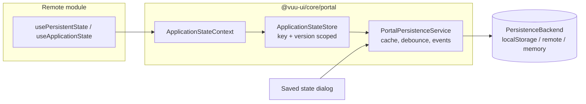

# Portal Application State Persistence and Saved State UI — Design

Status: **Reviewed — ready for implementation** (decisions recorded in §12),
except §5.4 *Keeping saved state compatible*, which is **proposed** (Q8–Q10)
Package: `@vuu-ui/core/portal`
Reference host: `portal-examples/portal-host`

## 1. Summary

Applications hosted in the portal (federated remote modules, and the portal
shell itself) need to persist runtime state for the user — applied filters,
named filters, sort criteria, column layouts, panel sizes and similar — and
restore it when the application next starts. This is **saved state**. It is
distinct from user **Settings** (theme, number formatting and so on), which a
later feature will manage through a portal Settings dialog (§4.1).

This document specifies:

1. A **persistence service** provided by `PortalShell` to every remote module.
   Each application reads and writes named JSON values under its own key. All
   data is scoped to the authenticated user and to the application version,
   and is stored as **one JSON document per user / application / version**.
2. A **pluggable storage backend**, defaulting to `localStorage` and
   substitutable with a remote (server-side) store without changes to
   applications.
3. A **Saved state** dialog, offered by the portal, that lets users
   selectively clear saved state for one, several or all applications, and
   for one, several or all items within an application. It is built with Salt
   components, following the App header, Menu button, Button bar, List
   filtering and Content status patterns. High-fidelity mockups are in §9.

## 2. Background

### 2.1 Current portal state

- `PortalShell` (`src/portal-shell/PortalShell.tsx`) composes `CommonShell`
  (Salt theme, `ModalProvider`, data-source provider), the router, and one
  route per `RemoteModuleDescriptor`.
- `RemoteModule` (`src/remote-module/RemoteModule.tsx`) lazy-loads the
  federated component and wraps it in a per-remote `AuthenticationProvider`
  (`mode="vuu-connection"`). There is currently **no persistence service**, and
  no general service contract exposed to remotes.
- `@vuu-ui/core` and `@vuu-ui/core/portal` are federation **singletons**
  (`scripts/module-federation-utils.ts`), so a React context created in
  `@vuu-ui/core/portal` is the same object in the host and in every remote. This
  is the mechanism the service relies on.
- The authenticated user is available via `useAuthenticatedUser()`
  (`User = { userName: string }`). In `local` mode it defaults to
  `local-user`.
- `PortalHeader` renders only a **Log out** button. The nav components
  (`PortalNav`, `PortalAppSwitcher`) have a per-module context menu with
  **Open in new Tab** / **Open in new Window**.

### 2.2 Existing application persistence

Several remotes (`feature-filter-table`, `basket-trading`,
`feature-instrument-tiles`) and shared components such as `vuu-table` persist
state through `useViewContext()` `load` / `save` / `purge` from
`@vuu-ui/vuu-layout`. When mounted directly by the portal there is no `View`
above the remote, so nothing is persisted.

`@vuu-ui/vuu-layout` is to be removed. This design **does not** provide a
`useViewContext` compatibility layer. Components that save properties will be
migrated to the portal persistence service separately, after it is delivered
(see §3, non-goals).

### 2.3 Reference: `vuu-shell` persistence-manager

`packages/vuu-shell/src/persistence-manager` contains `IPersistenceManager`
(`Local`, `Remote`, `Static` implementations) and the newer
`WorkspacePersistenceService`. Lessons taken from it:

| Observation in `vuu-shell`                                                                                   | Improvement in this design                                                                        |
| ------------------------------------------------------------------------------------------------------------ | ------------------------------------------------------------------------------------------------- |
| `IPersistenceManager` mixes domain concerns (layouts, metadata, application JSON, user settings) with storage. | Separate a small **storage backend** interface from the **application-facing** API.              |
| `clearUserSettings()` clears everything; the remote implementation is a `// todo`.                           | Granular clear by application, version and key is a first-class operation.                       |
| `Settings` is `Record<string, string \| number \| boolean>`.                                                 | Values are arbitrary JSON.                                                                        |
| No versioning of stored data.                                                                                | One document per application version plus an envelope `schemaVersion`.                           |
| `saveUserSettings` silently does nothing if application JSON has not been loaded.                            | Explicit lifecycle (`loading` → `ready` / `error`); writes before ready are rejected in dev.      |
| No change notification; other tabs or a clear operation are invisible to a running app.                     | Subscriptions for key changes and clears, including cross-tab `storage` events.                   |
| URLs (`/api/...`) hard-coded in the remote implementation.                                                   | Remote backend is configured (base URL, token provider).                                          |
| Local workspace service maintains separate index keys that can drift from the data they index.              | Enumerate by key prefix — the documents are the index.                                           |
| Every write re-serialises immediately.                                                                       | Debounced write-behind with flush on page hide.                                                   |

The `vuu-shell` classes remain in place for existing VUU shell applications;
this design does not change them.

## 3. Goals and non-goals

### Goals

- G1. Any remote module can save and restore JSON values at runtime with a
  minimal API, and read restored values **synchronously on first render**.
- G2. Data is isolated per user, per application, per application version.
- G3. The default backend is `localStorage`; a remote store can be substituted
  by portal configuration only.
- G4. Users can inspect what is saved and selectively clear it.
- G5. Clearing is safe while applications are running (no immediate re-save of
  the cleared value; applications can react).
- G6. The API is general enough for shared components (e.g. `vuu-table`,
  filters) to adopt later as the replacement for `useViewContext`
  `load` / `save`.

### Non-goals

- Server-side implementation of the remote store (only its contract, §7.4).
- A `useViewContext` adapter, and migration of existing components or remotes
  to the new service. Both are follow-up work.
- Layout / workspace persistence (`vuu-shell` workspace services). A future
  workspace feature may use this service as its backend.
- Sharing saved state between users, or admin-managed defaults.
- User **Settings** and the Settings dialog (§4.1). These are a separate, later
  feature and are not stored or cleared by anything in this design.
- Encryption at rest in `localStorage`.
- Import/export of saved state (possible later; see §12, Q6).
- Viewing saved values in the UI (possible later; see §12, Q5).

## 4. Terminology

### 4.1 Saved state vs Settings

The portal will have two different kinds of persisted user data. They must
never be confused in code, documentation or the UI.

| | **Saved state** (this design) | **Settings** (future) |
| - | - | - |
| What it is | How the user left an application, captured **automatically** as they work: filters, named filters, sort order, column layout, grouping, selected tab, panel sizes. | Choices the user makes **deliberately** in a portal-managed Settings dialog: theme (light/dark), density, number and date formatting, and application-specific settings. |
| Who writes it | The application, via `ApplicationStateStore` / `usePersistentState`. | The user, via the Settings dialog. |
| Scope | Per user, application and application version. | Portal-wide, or per application. |
| When it's lost | When the user clears it, or when the application version changes. | Only when the user changes it. |
| User-facing UI | **Saved state** dialog: review and clear only. | **Settings** dialog: view and edit, using the Salt Preferences dialog pattern. |
| Code vocabulary | `state`, `StateDocument`, `ApplicationStateStore`, `useApplicationState`, `SavedStateDialog` | `settings`, `Settings*` (reserved) |

Rules:

- In code and docs for this feature, never use *settings*, *preferences* or
  *config* for saved state. The words `settings` and `Settings*` are reserved
  for the future feature.
- In the UI, the user-facing term is **saved state**. The Saved state dialog
  always states that clearing saved state doesn't change Settings (§9.11).
- Storage is namespaced by kind: `…:state:…` keys and `/state/` REST paths
  (§7). The future Settings feature can then share the backend interface
  without sharing documents.
- Clearing saved state never touches Settings, and resetting Settings never
  touches saved state.

### 4.2 Glossary

| Term | Meaning |
| ---- | ------- |
| Application | A remote module registered with the portal, or the portal shell itself. |
| Application key | Stable, unique string identifying an application for persistence (§5.2). |
| Application version | `RemoteModuleDescriptor.version` (number). |
| Saved state | The collective term for everything persisted automatically for a user and application (§4.1). |
| State document | The single JSON document holding all saved state for one *user / application key / application version*. |
| Item (entry) | One named value within a state document, e.g. `table/sort`. The UI says "item", the code says "entry". |
| Storage backend | Implementation that loads, saves, deletes and lists state documents (`localStorage`, remote, in-memory). |
| Persistence service | Shell-level object (`PortalPersistenceService`) that owns the backend, caches documents, and hands out application-scoped stores. |
| Application state store | The object an application uses (`ApplicationStateStore`), scoped to its own key and version. |

## 5. Data model

### 5.1 State document

```json
{
  "schemaVersion": 1,
  "user": "steve",
  "applicationKey": "local-feature-filter-table",
  "applicationVersion": 1,
  "applicationTitle": "Instruments",
  "revision": 7,
  "carriedForwardFrom": 1,
  "createdAt": "2026-09-28T08:00:00.000Z",
  "updatedAt": "2026-09-28T08:42:13.512Z",
  "entries": {
    "table-config": {
      "value": { "columns": [{ "name": "ric", "width": 120 }] },
      "formatVersion": 2,
      "updatedAt": "2026-09-28T08:42:13.512Z",
      "label": "Table layout",
      "group": "Table"
    },
    "filters/named": {
      "value": [{ "name": "EUR only", "filter": "currency = \"EUR\"" }],
      "updatedAt": "2026-09-27T16:03:55.004Z",
      "label": "Saved filters",
      "group": "Filters"
    },
    "filters/active": {
      "value": "ccy = \"EUR\" and exchange = \"XLON\"",
      "updatedAt": "2026-09-27T16:04:10.117Z",
      "label": "Active filter",
      "group": "Filters",
      "issue": {
        "status": "rejected",
        "code": "column-not-found",
        "message": "Column 'ccy' is not in the table schema",
        "at": "2026-09-28T08:40:02.310Z"
      }
    }
  }
}
```

| Field                | Rules                                                                                                               |
| -------------------- | ------------------------------------------------------------------------------------------------------------------- |
| `schemaVersion`      | Version of the envelope format, not of application data. Starts at `1`.                                             |
| `user`               | `User.userName` of the authenticated identity. Required.                                                            |
| `applicationKey`     | See §5.2. Required.                                                                                                 |
| `applicationVersion` | Integer from the descriptor. Required.                                                                              |
| `applicationTitle`   | Last-known display title; lets the Saved state UI name applications that are no longer in the registry.          |
| `revision`           | Monotonic integer incremented by every successful save; used for optimistic concurrency.                             |
| `carriedForwardFrom` | Set when the document was created by copying an earlier version's document (§5.4.3).                                 |
| `entries`            | Map of key → entry. `value` is any JSON value (`null` allowed; `undefined` is not stored).                           |
| entry `label`/`group`| Optional, human-readable metadata supplied by the application so the UI can describe entries without loading the app. |
| entry `formatVersion`| Version of the value's format, owned by whoever writes the value (§5.4.4). Defaults to `1`.                           |
| entry `issue`        | Present when the value couldn't be restored in the running application (§5.4.6). Removed when the entry is next written or passes validation. |

Key rules:

- Keys are non-empty strings, max 256 characters. `/` is a convention for
  grouping (`filters/named`) but has no structural meaning to the service.
- Keys beginning with `vuu.` are reserved for the shell and shared VUU
  components.

### 5.2 Application key

The shell — not the remote — determines the application key, from the
descriptor that mounted the remote. This prevents one application reading or
clearing another's data and removes the risk of two remotes choosing the same
key.

- Resolution: `descriptor.persistenceKey ?? descriptor.clientIdentifier`.
- `clientIdentifier` is the default (unique, stable, admin-managed; e.g.
  `local-feature-filter-table`).
- `persistenceKey` is a new optional field on `RemoteModuleDescriptor`.
  Admins set it to keep a user's saved state when a module is
  re-registered under a new `clientIdentifier`. It must be unique across the
  registry; the registry rejects duplicates.
- The same federated component registered twice (e.g. the filter table with
  two different `tableSchema` props) gets two descriptors and therefore two
  independent state documents.
- The portal shell's own state uses the reserved key `vuu.portal` at
  version `1`. (Portals on the same origin are separated by the storage key
  prefix, §7.2.)

### 5.3 Versioning

- The version dimension is `descriptor.version` (Q3).
- A new application version starts with a **copy** of the most recent earlier
  version's document, which is then checked entry by entry as the application
  reads it (§5.4). *(Proposed, Q8. Previously a new version started empty.)*
- Earlier-version documents are never modified, and are kept until the user
  clears them (Q4; a "keep last N versions" policy may follow). Rolling an
  application back therefore restores exactly the state it had before.
- `schemaVersion` migrations of the envelope are handled inside the service.

### 5.4 Keeping saved state compatible *(proposed)*

#### 5.4.1 The problem

Saved state can stop matching the application that reads it. There are two
causes, and they need different handling:

1. **The application changed.** A release changes the shape of a value (a new
   table config format), renames a key, or drops a feature. This happens at a
   version boundary.
2. **What the values refer to changed.** A saved filter or column layout
   names columns of a Vuu table. The server schema can rename or remove a
   column **without any application release**, and columns can differ by user
   (entitlements). This can happen at any time, within one application
   version.

Migrating at version boundaries alone would miss the second case. So the
design combines a migration step, which runs once per format change, with a
validation step, which runs every time state is restored.

#### 5.4.2 Principles

- **Contain the damage.** Incompatibility is handled per entry, and within an
  entry per element (one named filter, one column). One bad value never costs
  the user everything else.
- **Never silently change meaning.** A restored value must either mean what it
  meant when saved, or not be used. Dropping a column from a layout is safe.
  Dropping one clause from `ccy = "EUR" and exchange = "XLON"` is not: the user
  would see rows they believe are filtered out. Filters are therefore restored
  whole or not at all.
- **Don't destroy what you can't use.** A value that fails validation is kept
  in storage until the application writes a replacement or the user clears it.
  A column that is missing because of a temporary schema or entitlement change
  comes back when the column does. Earlier-version documents are never
  modified.
- **The owner of a format owns its migration.** Whoever writes a value knows
  how to upgrade and validate it. Shared components (`vuu-table`, filters)
  ship codecs for their value types; applications supply the context (table
  schema, declared renames).
- **Tell the user only when it matters.** Silent for cosmetic repairs (a
  missing column dropped from a layout). Visible when something the user chose
  deliberately wasn't restored (a filter, a named filter).

#### 5.4.3 Layer 1 — carry forward (service, automatic)

When a store is requested for version *N* and no document exists for *N*:

- the service copies the entries from the **highest earlier version** that has
  a document, and sets `carriedForwardFrom`;
- the copy is raw: values are not interpreted, so it can't fail;
- the new document is saved straight away, so the Saved state UI shows it
  under version *N* with *"Carried forward from version M"*.

If only **later** versions exist (the application was rolled back and never
ran at this version), the store starts empty; there are no down-migrations.
An application that knows a release is incompatible can call `store.clear()`
when `store.carriedForwardFrom` is set.

This also resolves the Q3 caveat: version bumps for non-breaking releases no
longer lose state.

#### 5.4.4 Layer 2 — format migration (codec, once per format change)

Each entry records a `formatVersion`. A **codec** declares the current format
version and how to upgrade older ones, one step at a time:

- `formatVersion` is independent of the application version. `vuu-table` is
  used by many applications, each with its own version, so the table config
  format must be versioned by the table, not by the application.
- `migrate(value, fromVersion)` is called for each step up to the current
  version. It returns the upgraded value, or `undefined` to discard it
  (no migration path), which is treated as *rejected*.
- A key renamed by the application is handled with `previousKeys`: if the key
  is missing, the first previous key present is read and moved to the new key.

#### 5.4.5 Layer 3 — validation (codec, on every restore)

`validate(value, context)` checks a value against the running application and
returns one of:

| Result | Meaning | What the application gets | Storage |
| ------ | ------- | ------------------------- | ------- |
| `valid` | Usable as saved. | The value. | Unchanged. |
| `repaired` | Usable after removing or adjusting parts, without changing its meaning. | The repaired value. | Unchanged until the application next writes the key. |
| `rejected` | Not usable without changing its meaning. | The default value. | Original kept; entry marked with `issue` (§5.4.6). |

`context` is whatever the codec needs: typically the current `TableSchema` and
a map of declared renames. **Renames can't be inferred**: a renamed column
looks exactly like a removed one. The application (or, later, the server
schema) declares them, e.g. `columnRenames: { ccy: "currency" }`, and codecs
apply them before validating. Undeclared renames degrade to removals.

Validation runs again when the context changes (e.g. the schema arrives, or a
schema update is received), so a value can move from *rejected* back to
*valid* without the user doing anything.

Guidance for codec authors:

| Value | Change | Recommended result |
| ----- | ------ | ------------------ |
| Column layout | Column removed | `repaired`, silent: column dropped (or kept as hidden, so it returns if the column does). |
| Column layout | Column renamed, rename declared | `repaired`, silent: renamed. |
| Sort | Sort column removed | `repaired`, silent: that sort column dropped. |
| Group by | Group column removed | `repaired`, notify: grouping changes what the user sees. |
| Active filter | Any clause refers to a missing column, or an operator the column no longer supports | `rejected`, notify: filter not applied. |
| Named filters | Some filters invalid | `repaired`, notify: valid filters usable; invalid ones kept but marked unavailable, so the user can see, fix or delete them in the app's filter UI. |
| Any | Older `formatVersion` with no migration path | `rejected`, notify. |

#### 5.4.6 Incompatible entries

When a value is rejected, the service writes an `issue` to the entry (§5.1)
without touching its value. The issue is removed when:

- the application writes the key (the new value replaces the old one);
- a later validation passes; or
- the user clears the item in the Saved state dialog.

The Saved state dialog marks these items **Couldn't be restored** (§9.15), so
users can find and clear them.

#### 5.4.7 API

Additions to §6.3:

```ts
export interface RestoreIssue {
  /** Machine-readable, e.g. "column-not-found". */
  code: string;
  /** Developer-facing explanation; shown in a tooltip in the Saved state UI. */
  message: string;
  /** Location within the value, e.g. "columns[3]" or "[2].filter". */
  path?: string;
}

export type ValidationResult<T> =
  | { status: "valid"; value: T }
  | { status: "repaired"; value: T; issues: readonly RestoreIssue[]; notify?: boolean }
  | { status: "rejected"; issues: readonly RestoreIssue[]; notify?: boolean };

export interface StateCodec<T extends JsonValue, C = undefined> {
  /** Current format version. Written to the entry on every set. */
  formatVersion: number;
  /** Upgrades one step from `fromVersion`. Return undefined to discard. */
  migrate?: (value: JsonValue, fromVersion: number) => JsonValue | undefined;
  /** Checks the value against the running application. */
  validate?: (value: T, context: C) => ValidationResult<T>;
  /** Keys this entry was stored under in earlier releases, newest first. */
  previousKeys?: readonly string[];
}

export type RestoreStatus = "missing" | "pending" | "valid" | "repaired" | "rejected";

export interface RestoreResult<T> {
  status: RestoreStatus;
  /** Undefined when missing, pending or rejected. */
  value: T | undefined;
  issues: readonly RestoreIssue[];
}

export interface ApplicationStateStore {
  // …existing members…
  /** Set when this document was carried forward from an earlier version. */
  readonly carriedForwardFrom?: number;
  /** Migrates and validates a saved value. Synchronous. */
  restore<T extends JsonValue, C>(
    key: string,
    codec: StateCodec<T, C>,
    context: C,
  ): RestoreResult<T>;
}
```

`usePersistentState` accepts a codec and context:

```ts
const [config, setConfig, restoreStatus] = usePersistentState(
  "instruments/table",
  defaultTableConfig,
  {
    label: "Table layout",
    group: "Table",
    codec: tableConfigCodec, // shipped by vuu-table
    context: tableSchema ? { schema: tableSchema, columnRenames } : undefined,
  },
);
```

- `set` writes the codec's `formatVersion` with the value.
- If the codec validates and `context` is `undefined`, the hook returns the
  default with `restoreStatus` `"pending"`, and validates once context is
  available. Nothing unvalidated is ever returned. (Components that need a
  schema usually wait for it before rendering anyway.)
- `restore` never throws. A codec that throws is treated as *rejected*, and
  the error is logged.
- `importFrom` and `previousVersions` (§6.3) remain available for
  application-specific upgrades that codecs don't cover.

#### 5.4.8 Letting the user know

- The store collects issues with `notify: true`. `RemoteModule` shows at most
  one `Toast` per application per session, a short time after the application
  mounts: **Some saved state wasn't restored** — *"Instruments has changed
  since you last used it. 2 items couldn't be restored."* The **Review** action
  opens the Saved state dialog scoped to that application.
- Silent repairs are logged at debug level only.

#### 5.4.9 Testing

- Codec unit tests use saved-state fixtures captured from each released
  format version, so every migration path stays covered.
- The service tests cover carry-forward (from the latest earlier version, never
  from a later one), `previousKeys`, rejected-value retention, and issue
  clearing.


## 6. Application-facing API

### 6.1 Overview



`RemoteModule` resolves the store for its descriptor and provides it through
`ApplicationStateContext`. Because `@vuu-ui/core/portal` is a federation
singleton, the remote's `useApplicationState()` reads the host's context.

### 6.2 Startup sequence


- The state document is loaded **in parallel** with the remote code and the
  remote is rendered only once both are ready (the existing `Suspense`
  boundary is reused; the store exposes a `ready` promise). This guarantees
  synchronous reads on first render, so components can initialise state from
  saved values without an extra render or loading state.
- If loading fails, the store becomes `ready` with an empty document and
  `status = "error"`; the application renders with defaults and writes are
  held in memory (not persisted) until the next successful load. The failure is
  logged and surfaced in the Saved state UI. Persistence failures must never
  prevent an application from rendering.

### 6.3 Types

```ts
export type JsonValue =
  | null
  | boolean
  | number
  | string
  | JsonValue[]
  | { [key: string]: JsonValue };

export interface EntryMetadata {
  /** Human-readable name shown in the Saved state UI. */
  label?: string;
  /** Optional grouping shown in the Saved state UI. */
  group?: string;
}

export type StateChangeReason = "set" | "remove" | "clear" | "external";

export interface StateChangeEvent {
  keys: readonly string[];
  reason: StateChangeReason;
}

export interface ApplicationStateStore {
  readonly applicationKey: string;
  readonly applicationVersion: number;
  readonly status: "loading" | "ready" | "error";
  /** Resolves when the document has been loaded (or failed to load). */
  readonly ready: Promise<void>;

  get<T extends JsonValue = JsonValue>(key: string): T | undefined;
  getAll(): Readonly<Record<string, JsonValue>>;
  has(key: string): boolean;
  keys(): readonly string[];

  /**
   * Updates the in-memory value immediately; persistence is debounced.
   * `formatVersion` is normally supplied by a codec (§5.4.4).
   */
  set<T extends JsonValue>(
    key: string,
    value: T,
    options?: EntryMetadata & { formatVersion?: number },
  ): void;
  /** Declares metadata for a key without setting a value. */
  describe(key: string, metadata: EntryMetadata): void;
  remove(key: string): void;
  /** Removes every entry for this application version. */
  clear(): void;

  /** Writes any pending changes now. */
  flush(): Promise<void>;
  subscribe(listener: (event: StateChangeEvent) => void): () => void;

  /** Versions of this application that have saved documents, newest first. */
  previousVersions(): Promise<readonly number[]>;
  /** Copies entries (optionally a subset / transformed) from an earlier version. */
  importFrom(
    version: number,
    options?: {
      keys?: readonly string[];
      transform?: (key: string, value: JsonValue) => JsonValue | undefined;
    },
  ): Promise<readonly string[]>;
}
```

Notes:

- `get` returns a structurally cloned (or frozen) value so callers cannot mutate
  cached state.
- `set` with a value deep-equal to the stored value is a no-op (no write, no
  event).
- Values that are not JSON-serialisable (functions, `undefined`, class
  instances, cycles) throw in development builds and are rejected with a
  logged error in production.

### 6.4 React hooks (exported from `@vuu-ui/core/portal`)

```ts
/** The store for the enclosing application. Throws outside a portal application. */
export function useApplicationState(): ApplicationStateStore;

/** Same, but returns undefined when not hosted by a portal (standalone apps, tests). */
export function useOptionalApplicationState(): ApplicationStateStore | undefined;

/**
 * useState-like hook backed by the store. Returns defaultValue when there is
 * no saved value, and reverts to defaultValue when the key is cleared.
 */
export function usePersistentState<T extends JsonValue>(
  key: string,
  defaultValue: T,
  metadata?: EntryMetadata,
): [T, (value: T | ((previous: T) => T)) => void];
```

Example:

```tsx
const [sort, setSort] = usePersistentState<SortDef>("table/sort", NO_SORT, {
  label: "Sort order",
  group: "Table",
});
```

### 6.5 Shell-level service API

Used by `PortalShell`, `RemoteModule`, and the Saved state UI. Not intended
for remote modules.

```ts
export interface DocumentRef {
  user: string;
  applicationKey: string;
  applicationVersion: number;
}

export interface EntrySummary extends EntryMetadata {
  key: string;
  updatedAt: string;
  /** Serialised size in bytes (UTF-16 length × 2 for localStorage). */
  size: number;
}

export interface DocumentSummary extends Omit<DocumentRef, "user"> {
  applicationTitle?: string;
  revision: number;
  updatedAt: string;
  size: number;
  entries: readonly EntrySummary[];
}

export type ClearSelection = ReadonlyArray<{
  applicationKey: string;
  applicationVersion: number;
  /** Omit to clear the whole document. */
  keys?: readonly string[];
}>;

export interface ClearResult {
  cleared: ReadonlyArray<{ ref: DocumentRef; keys: readonly string[] | "all" }>;
  failed: ReadonlyArray<{ ref: DocumentRef; error: Error }>;
}

export interface PortalPersistenceService {
  readonly user: string;
  getStore(applicationKey: string, applicationVersion: number, title?: string): ApplicationStateStore;
  list(): Promise<readonly DocumentSummary[]>;
  clear(selection: ClearSelection): Promise<ClearResult>;
  clearAll(): Promise<ClearResult>;
  flushAll(): Promise<void>;
  subscribe(listener: (ref: DocumentRef, event: StateChangeEvent) => void): () => void;
  dispose(): void;
}
```

- One store instance per `(applicationKey, version)` is cached for the lifetime
  of the service, so multiple mounts of the same application (e.g. route
  re-mounts) share state.
- A `usePortalPersistence()` hook exposes the service to shell components.

### 6.6 Use by shared components

Shared components (e.g. `vuu-table`) are used by many applications, so they
must not assume a fixed key. When they are migrated (out of scope here), they
should:

- take an optional key (or key prefix) prop from the owning application, e.g.
  `persistenceKey="instruments/table"`;
- read and write through `useOptionalApplicationState()` so they work with
  or without a portal;
- supply `label` / `group` metadata so their entries are identifiable in the
  Saved state UI;
- ship a `StateCodec` for each value type they persist (§5.4), and accept
  rename maps from the application.

## 7. Storage backends

### 7.1 Backend interface

Backends are document-oriented and deliberately small; all key-level logic
(partial clear, merge) lives in the service, so a remote backend only needs
CRUD on whole documents.

```ts
export interface PersistenceBackend {
  load(ref: DocumentRef): Promise<StateDocument | undefined>;
  /**
   * Saves the document. If expectedRevision is supplied and does not match the
   * stored revision, rejects with PersistenceConflictError carrying the
   * current document.
   */
  save(doc: StateDocument, expectedRevision?: number): Promise<{ revision: number }>;
  delete(ref: DocumentRef): Promise<void>;
  /** Metadata only — values are not required. */
  list(user: string): Promise<readonly DocumentSummary[]>;
  /** Optional: notification of changes made elsewhere (other tabs, server push). */
  subscribe?(user: string, listener: (ref: DocumentRef) => void): () => void;
}
```

Errors: `PersistenceError` (base, with `operation`, `ref`, optional `status`),
`PersistenceConflictError`, `PersistenceQuotaError`,
`PersistenceValidationError` (stored data is not a valid document).

### 7.2 `LocalStoragePersistenceBackend` (default)

- Storage key: `vuu-portal:{portalId}:state:{user}:{applicationKey}:v{version}`, each
  segment `encodeURIComponent`-encoded. `portalId` is the `PortalShell` `id`
  (default `"vuu-portal"`) so multiple portals on one origin do not collide.
- `list(user)` enumerates `localStorage` keys with the user prefix — no
  separate index to keep in sync.
- `subscribe` uses the `window` `storage` event to detect writes from other
  tabs / `WindowHost` windows on the same origin.
- `QuotaExceededError` is mapped to `PersistenceQuotaError`; the service keeps
  the change in memory, marks the store `error`, and the Saved state UI shows
  a warning with a prompt to clear space.
- Invalid JSON or a document that fails validation is moved to
  `{key}:corrupt:{timestamp}` (one retained copy), logged, and treated as
  absent. It appears in the UI so it can be cleared.
- Constructor accepts any `Storage` (for tests / `sessionStorage`).

### 7.3 `InMemoryPersistenceBackend`

For tests, the showcase, and `local` authentication mode when persistence is
not wanted.

### 7.4 `RemotePersistenceBackend`

Configured with `{ baseUrl, getToken?: () => Promise<string>, fetch? }`. The
host would typically pass `useIdentityToken()`.

Proposed REST contract (server implementation out of scope):

| Operation | Request                                                               | Response                                                        |
| --------- | --------------------------------------------------------------------- | --------------------------------------------------------------- |
| list      | `GET {base}/users/{user}/state`                                       | `200` `DocumentSummary[]`                                       |
| load      | `GET {base}/users/{user}/state/{applicationKey}/versions/{version}`    | `200` document + `ETag: "{revision}"`, or `404`                 |
| save      | `PUT` same path, body = document, `If-Match: "{revision}"` (omit on create; `If-None-Match: *`) | `200`/`201` + `ETag`; `412` on conflict (body = current document) |
| delete    | `DELETE` same path                                                    | `204` (also for already absent)                                 |

- Requests carry `Authorization: Bearer {token}`. The server **must** derive
  or verify `user` from the token and reject mismatches with `403`; the path
  segment is not trusted.
- Transient failures (network, `5xx`) retry with backoff for saves; loads fail
  to the `error` state described in §6.2.
- Save on page hide uses `fetch(..., { keepalive: true })`.

### 7.5 Configuration

`PortalShell` gains an optional prop:

```ts
export interface PortalShellProps extends CommonShellProps {
  // existing props…
  /**
   * Storage backend for saved application state.
   * Default: LocalStoragePersistenceBackend.
   * Pass `false` to disable persistence (applications receive an in-memory store).
   */
  persistence?: PersistenceBackend | false;
}
```

`WindowShell` / `WindowHost` accept the same prop so a module opened in its
own window reads and writes the same document. The portal-host example keeps
the default and documents how to switch to the remote backend via
`window.vuuConfig`.

## 8. Behavioural requirements

### 8.1 Functional

| ID    | Requirement |
| ----- | ----------- |
| FR-1  | `PortalShell` creates one `PortalPersistenceService` for the authenticated user and makes it available to shell components. |
| FR-2  | `RemoteModule` provides each remote with an `ApplicationStateStore` scoped to the descriptor's application key and version. |
| FR-3  | A remote cannot address another application's document through the application-facing API. |
| FR-4  | The remote renders only after its state document is loaded or has failed to load; first-render reads are synchronous. |
| FR-5  | `set` updates memory immediately and persists within a debounce window (default 500 ms, configurable), coalescing multiple keys into one document save. |
| FR-6  | Pending writes are flushed on `visibilitychange` → hidden, `pagehide`, logout, and service disposal. |
| FR-7  | Stored data is one JSON document per user / application key / application version, in the format in §5.1. |
| FR-8  | A new application version starts with a copy of the most recent earlier version's document (§5.4.3), never a later one; earlier-version documents are never modified, and are retained and listed. |
| FR-9  | The backend is `localStorage` by default and can be replaced by configuration only, with no change to applications. |
| FR-10 | On save conflict, the service reloads the document and re-applies only the locally changed keys (key-level last-writer-wins), then retries once. |
| FR-11 | Changes from other tabs/windows (backend `subscribe`) update cached documents and notify subscribers with reason `external`. |
| FR-12 | `clear` removes selected keys, or whole documents, across any set of applications and versions in one operation, returning per-document success/failure. |
| FR-13 | Clearing cancels pending writes for the cleared keys and notifies running applications with reason `clear`; `usePersistentState` reverts to its default. |
| FR-14 | Clearing every key in a document deletes the document rather than saving an empty one. |
| FR-15 | Logout flushes pending writes, then disposes the service. A different user logging in on the same browser never sees the previous user's data. |
| FR-16 | The portal shell's own state (e.g. nav expanded, app switcher mode) uses the reserved `vuu.portal` application key and appears in the Saved state UI as "Portal". |
| FR-17 | Hooks work outside a portal (`useOptionalApplicationState`, and `usePersistentState` falls back to plain state) so remotes remain usable standalone and in tests. |
| FR-18 | Entries record a `formatVersion`; `restore` migrates older formats step by step, and reads from `previousKeys` when the key is missing (§5.4.4). |
| FR-19 | `restore` validates against caller-supplied context and returns `valid`, `repaired` or `rejected`; it never returns an unvalidated value, and never throws (§5.4.5). |
| FR-20 | Rejected values are kept in storage and marked with an `issue` until the key is rewritten, a later validation passes, or the user clears it (§5.4.6). |
| FR-21 | Issues marked `notify` produce at most one toast per application per session, with a **Review** action opening the Saved state dialog scoped to that application (§5.4.8). |

### 8.2 Non-functional

| ID    | Requirement |
| ----- | ----------- |
| NFR-1 | Persistence failures (quota, network, corrupt data) never throw into application render; they are logged and surfaced in the Saved state UI. |
| NFR-2 | Document load adds no serial latency to remote startup (parallel with code load, §6.2). |
| NFR-3 | Default size warnings: 256 KB per entry, 1 MB per document (configurable). Oversized writes are rejected with a logged error. |
| NFR-4 | `localStorage` is not a security boundary. Applications must not store secrets or tokens; this is documented and entries containing obvious tokens are not specially handled. |
| NFR-5 | All public types and hooks are exported from `@vuu-ui/core/portal` and documented. |
| NFR-6 | Unit tests (vitest) cover the service, each backend, conflict handling, debounce/flush, cross-tab events and clear semantics; component tests cover the Saved state dialog including keyboard use. |

## 9. Saved state UI

The mockups below are rendered from real Salt components
(`@salt-ds/core` 1.67.0) using `vuu-theme` (purple accent, rounded corners,
medium density), at 2× resolution. Data is illustrative. Click an image to
view it at full size.

### 9.1 Principles

- **Never call it Settings or Preferences.** The dialog title, menu items,
  buttons and messages all say *saved state* (§4.1). Every view of the dialog
  says what saved state is and that clearing it doesn't change the user's
  Settings.
- **Visually distinct from the future Settings dialog.** The Settings dialog
  will use the Salt Preferences dialog pattern, with vertical navigation
  between panels. The Saved state dialog is a **single-pane** dialog. The
  application → group → item hierarchy is shown in one `Tree`, so there's no
  left navigation that could be mistaken for Settings. Later, the Settings
  dialog may link to Saved state, but the two are never combined.
- **Explicit, reviewable selection.** Users choose exactly what to clear,
  confirm before anything is removed, and are told what happened.
- **Metadata only.** The dialog reads `list()` summaries and never loads
  remote code. It works for applications that aren't loaded, are disabled, or
  are no longer in the user's registry.

### 9.2 Entry points

**Header user menu.** `PortalHeader` replaces the standalone **Log out**
button with a user menu (`Menu`, `MenuTrigger`, `MenuPanel`, `MenuItem`,
following the Salt *App header* and *Menu button* patterns). The trigger is a
transparent `Button` with an `Avatar` and the user name.

- **Saved state…** opens the dialog showing all applications.
- A divider, then **Log out**.
- When the Settings dialog is delivered, **Settings…** is added as a separate
  item above **Saved state…**.

[](assets/saved-state/01-entry-user-menu.png)

**Navigation context menu.** In `PortalNav` and `PortalAppSwitcher`, a
divider and **Saved state…** follow the existing *Open in new Tab / Window*
items. This opens the dialog scoped to that application (§9.4).

[](assets/saved-state/02-entry-nav-context-menu.png)

**Programmatic.** `useSavedStateDialog().open(applicationKey?)` lets an
application offer its own "Reset view" action that opens the dialog scoped to
itself.

### 9.3 Dialog: all applications

[](assets/saved-state/03-saved-state-all.png)

Anatomy, top to bottom:

1. **Header.** `DialogHeader` with the title **Saved state** and the
   description *"Applications remember how you left them, such as filters,
   sort order and column layout, and restore it when you next open them."*
   `DialogCloseButton` sits at the top right.
2. **Distinction note.** An info icon with secondary `Text`: *"Clearing saved
   state returns an application to its default view. It doesn't change your
   Settings."*
3. **Filter bar** (`FlexLayout`):
   - a bordered search `Input` with a search icon, placeholder *"Find saved
     state"* (§9.5);
   - a **Show** `Dropdown` offering *All applications* or one application
     (§9.4);
   - **Expand all** / **Collapse all** transparent icon buttons, right-aligned.
4. **Tree.** A Salt `Tree` with `multiselect`, in a bordered, scrollable
   container:
   - **Level 1: application.** Bold title, an **Open** tag if it's currently
     mounted, and right-aligned metadata: *Version · N items · size · last
     saved*. Ordered as in the portal navigation, with **Portal** first.
     Applications with no saved state are omitted.
   - **Level 2: group** (from entry `group` metadata), with an item count.
     Entries without a group sit directly under the application.
   - **Leaf: item.** The entry `label`, with the raw key in secondary
     monospace text, and right-aligned *size · last saved*. A `Tooltip` shows
     the absolute timestamp.
   - **Previous versions.** A collapsed group under the application, with one
     node per earlier version. Selecting a version node selects its whole
     document.
   - **Unavailable applications.** A final top-level node (§9.9).
   - Parent checkboxes are tri-state: selecting a parent selects all its
     descendants, and a partial selection shows as indeterminate.
5. **Button bar** (`DialogActions`, Salt *Button bar* pattern):
   - start: **Clear all saved state…** (`appearance="transparent"`,
     `sentiment="negative"`), disabled when there's no saved state;
   - end: a selection summary (*"6 items selected in 2 applications"* or
     *"Nothing selected"*), **Close** (`bordered`, `neutral`), and **Clear
     selected…** (`solid`, `negative`), disabled when nothing is selected.

The selection is a single set keyed by `applicationKey / version / key`. It
is kept when the search text or **Show** scope changes, so the summary always
reflects everything that will be cleared.

Size: `Dialog size="large"`, 880 × 680 px, capped at the viewport height minus
80 px. The tree scrolls; the header, filter bar and button bar stay fixed.

### 9.4 Dialog: scoped to one application

Opening from the navigation context menu (or `open(applicationKey)`) sets
**Show** to that application and expands its groups. The user can switch
**Show** back to *All applications* without losing their selection.

[](assets/saved-state/04-saved-state-application.png)

### 9.5 Finding items

Typing in the search box filters the tree by item label, key or group name
(Salt *List filtering* pattern). Matching items are shown with their ancestors,
which are expanded. Applications and groups with no matches are hidden.
Selections on hidden items are kept, and still counted in the summary.

[](assets/saved-state/05-saved-state-find.png)

### 9.6 Confirmation

**Clear selected…** or **Clear all saved state…** opens a nested `Dialog`
with `status="warning"` and `size="small"`.

[](assets/saved-state/06-confirm-clear.png)

- Title: **Clear saved state?**
- Body: *"The following will be permanently removed:"*, then a list of one
  line per application: *"Instruments — Saved filters, Active filter, Sort
  order"*. A whole application or version is shown as *"— all saved state"* or
  *"— Version 1 (all items)"*. At most five lines are shown, then *"and N
  more"*.
- If any affected application is open: *"Instruments is open and will return
  to its default view."* Always ends with *"You can't undo this."*
- **Clear all** uses the same dialog, with the body *"All saved state for all
  applications will be permanently removed."*
- Actions: **Cancel** (`bordered`, `neutral`, receives initial focus) and
  **Clear saved state** (`solid`, `negative`).

### 9.7 Outcome

On success the confirmation closes and the main dialog stays open. The tree
refreshes and the selection resets. A `Toast` with `status="success"` says
*"Saved state cleared — 6 items cleared from 2 applications."*

[](assets/saved-state/07-clear-result.png)

- **Partial failure:** a `Toast` with `status="error"` names the applications
  that failed. The selection then contains only the failed items, so the user
  can retry.
- **Open applications** that were cleared are notified (FR-13) and reset. If
  an application can't react to clear events, the toast offers **Reload**.
- Every outcome is also announced with `useAriaAnnouncer`.

### 9.8 Other states

Following the Salt *Content status* pattern:

| State | Presentation |
| ----- | ------------ |
| Loading | `Spinner` with *"Loading saved state"*, centred in the tree area. |
| No saved state | Info status: **No saved state**, *"Applications save state, such as filters and sort order, as you use them. It will appear here."* Filter bar hidden; clear actions disabled. |
| List failed (remote backend) | Error status: **Saved state couldn't be loaded**, with a **Retry** button. |
| Store error or storage full | Warning `Banner` above the filter bar: **Some state couldn't be saved.** *"Browser storage is full. Clearing saved state you no longer need will free up space."* |

[](assets/saved-state/08-empty.png)

[](assets/saved-state/09-storage-warning.png)

### 9.9 Unavailable applications

Documents whose application key is no longer in the user's registry, and
documents that couldn't be read (§7.2), are grouped under **Unavailable
applications**, with the summary *"N applications · can only be cleared"*.
Each shows its last known title and version:

- a neutral **No longer available** tag, for applications removed from the
  registry;
- a warning `StatusIndicator` and **Unreadable data**, for corrupt documents.

These nodes have no children, so they can only be cleared as a whole. See the
bottom of the §9.7 mockup.

### 9.10 Accessibility

- The dialog has `aria-labelledby` / `aria-describedby`. Focus is trapped, and
  returns to the invoking control on close.
- The `Tree` provides roving focus and arrow-key navigation. `Space` toggles a
  checkbox, and partial parents report `aria-checked="mixed"`.
- Tree node accessible names include the metadata, e.g. *"Sort order, 5 hours
  ago, less than 1 KB"*.
- Destructive buttons use explicit text, never icons alone. The icon-only
  Expand all / Collapse all buttons have `aria-label` and a `Tooltip`.
- The selection summary is an `aria-live="polite"` region.

### 9.11 User-facing copy

To keep the terminology consistent (§4.1), use only these strings:

| Context | Text |
| ------- | ---- |
| Menu item | Saved state… |
| Dialog title | Saved state |
| Dialog description | Applications remember how you left them, such as filters, sort order and column layout, and restore it when you next open them. |
| Distinction note | Clearing saved state returns an application to its default view. It doesn't change your Settings. |
| Search placeholder | Find saved state |
| Scope label / default | Show / All applications |
| Selection summary | N item(s) selected in M application(s) · Nothing selected |
| Buttons | Clear all saved state… · Close · Clear selected… |
| Confirm title / action | Clear saved state? / Clear saved state |
| Success toast | Saved state cleared · N items cleared from M applications. |
| Empty | No saved state |
| Group of removed apps | Unavailable applications |

Avoid *settings*, *preferences*, *configuration*, *reset settings* and
*delete* in this UI.

### 9.12 Salt components and patterns

| Concern | Salt (`@salt-ds/core` 1.67.0) |
| ------- | ----------------------------- |
| Dialogs | `Dialog` (`size="large"`, and `status="warning"` for confirmation), `DialogHeader`, `DialogContent`, `DialogActions`, `DialogCloseButton` |
| Layout | `StackLayout`, `FlexLayout` |
| Selection | `Tree` / `TreeNode` (`multiselect`) |
| Filtering | `Input` (bordered, search adornment), `Dropdown` / `Option` |
| Metadata | `Text`, `Tag`, `Tooltip`, `StatusIndicator` |
| Menus | `Menu`, `MenuTrigger`, `MenuPanel`, `MenuItem`, `Divider`, `Avatar`, `Button` |
| Feedback | `Banner`, `Spinner`, `Toast`, `useAriaAnnouncer` |
| Icons (`@salt-ds/icons`) | `HistoryIcon`, `SearchIcon`, `InfoIcon`, `ExpandAllIcon`, `CollapseAllIcon`, `ChevronDownIcon` |

Salt patterns followed: *App header*, *Menu button*, *Button bar*, *List
filtering* and *Content status*. `@salt-ds/lab` is not required.

### 9.13 Theme notes for implementation

Building the mockups showed two `vuu-theme` issues the dialog must handle:

- `--salt-palette-neutral` resolves to white, so **unchecked `Tree`
  checkboxes have an invisible border** on a white background. Fix this in
  `vuu-theme` (preferred), or scope a border-colour override to the dialog.
- `vuu-theme/css/components/dropdown.css` hides `.saltDropdown-toggle`, so a
  `Dropdown` looks like a text input. The **Show** control needs the chevron
  back. Re-enable it for this dialog, or revisit the theme rule.

Tree construction note: Salt's `Tree` builds its model from `TreeNode`
elements. Nodes must be direct `TreeNode` children, or arrays of them, not
wrapped in custom components. A controlled `selected` array must include
fully-selected parents as well as their leaves.

### 9.14 Proposed components (in `@vuu-ui/core/portal`)

- `SavedStateDialog`: `{ open, onOpenChange, initialApplicationKey? }`.
- `SavedStateTree`: the selection tree.
- `ClearSavedStateConfirmation`: the confirmation dialog.
- `PortalUserMenu`: the header user menu. `PortalHeader` renders it by
  default, and it accepts additional menu items (for the future
  **Settings…**).
- `useSavedStateDialog()`: `{ open(applicationKey?) }`, to open the dialog
  from anywhere in the shell.

### 9.15 Items that couldn't be restored *(proposed, §5.4)*

- Items with an `issue` show a warning **Couldn't be restored** `Tag` after
  the label. A `Tooltip` gives the issue message, e.g. *"Column 'ccy' is not
  in the table schema."*
- The application node shows *"N couldn't be restored"* in its metadata, and
  *"Carried forward from version M"* when the document was carried forward.
- The filter bar's **Show** dropdown gains an option **Couldn't be restored**,
  listing only those items, so they can be selected and cleared together.

Additional copy:

| Context | Text |
| ------- | ---- |
| Item tag | Couldn't be restored |
| Application metadata | N couldn't be restored · Carried forward from version M |
| Show option | Couldn't be restored |
| Toast title / body | Some saved state wasn't restored / {Application} has changed since you last used it. N items couldn't be restored. |
| Toast action | Review |

## 10. Package structure

```text
core/src/
|-- persistence/
|   |-- PersistenceBackend.ts             // interfaces, errors, DocumentRef
|   |-- StateDocument.ts                  // schema, validation, envelope migration
|   |-- LocalStoragePersistenceBackend.ts
|   |-- InMemoryPersistenceBackend.ts
|   |-- RemotePersistenceBackend.ts
|   |-- PortalPersistenceService.ts
|   |-- ApplicationStateStore.ts
|   |-- StateCodec.ts                     // codec types, migration runner, restore
|   |-- PersistenceContext.tsx            // providers + hooks
|   `-- index.ts
|-- saved-state/
|   |-- SavedStateDialog.tsx / .css
|   |-- SavedStateTree.tsx
|   |-- ClearSavedStateConfirmation.tsx
|   `-- index.ts
|-- portal-header/
|   `-- PortalUserMenu.tsx
core/test/persistence/, core/test/saved-state/
```

`portal.ts` re-exports `persistence` and `saved-state`.
`portal-design.md` is updated to reference this document when implemented.

## 11. Implementation phases

1. **Core service** — types, document validation, in-memory and localStorage
   backends, `PortalPersistenceService`, `ApplicationStateStore`, hooks,
   carry-forward, codecs and `restore` (§5.4), unit tests.
2. **Shell integration** — `PortalShell` / `WindowHost` `persistence` prop,
   `persistenceKey` on `RemoteModuleDescriptor`, `RemoteModule` store provisioning and ready gating, logout flush, portal
   shell's own state under `vuu.portal`.
3. **Saved state UI** — dialog, tree, confirmation, toasts, header user menu,
   nav context-menu entry, *Couldn't be restored* indicators and toast (§9.15);
   component tests.
4. **Documentation** — usage guide for remote authors; update
   `remote-module-template` and `portal-design.md`; a guide to writing codecs.
   Migrating existing components (e.g. `vuu-table`) and remotes, including
   their codecs, is follow-up work.
5. **Remote backend** — `RemotePersistenceBackend` against the §7.4 contract,
   conflict handling, retry; portal-host configuration example.

## 12. Decisions

| #  | Question | Decision |
| -- | -------- | -------- |
| Q1 | Application key: `clientIdentifier`, `name`, or a new `persistenceKey` descriptor field? | `clientIdentifier` by default, with an optional `persistenceKey` descriptor override for admins who need to preserve data across re-registration (§5.2). |
| Q2 | How do existing `useViewContext` `load` / `save` consumers persist? | No adapter. `@vuu-ui/vuu-layout` will be removed; components that save properties (e.g. `vuu-table`) will be migrated to the portal service later (§2.2, §6.6). |
| Q3 | Is `descriptor.version` the right version dimension, or should remotes declare a state schema version independent of deployment version? | Use `descriptor.version` for documents. Value formats are versioned separately per entry (`formatVersion`, §5.4.4), and carry-forward means non-breaking version bumps keep state. |
| Q4 | Retention of previous-version documents. | Keep indefinitely in v1; users clear via UI. Consider "keep last N versions" later. |
| Q5 | Should the user be able to view saved values (read-only JSON) in the UI? | Not in v1; candidate for a later "Details" disclosure. |
| Q6 | Import/export of saved state. | Out of scope for v1; the document format supports it. |
| Q7 | Should `local` authentication mode default to `localStorage` or in-memory? | `localStorage`, consistent with the example host. |
| Q8 | Should a new application version start empty, or with the previous version's state? | **Proposed:** carry forward automatically, then migrate and validate per entry (§5.4.3). |
| Q9 | Can a filter be partially restored (dropping clauses that reference missing columns)? | **Proposed:** no. Filters are restored whole or rejected, because partial restoration changes their meaning (§5.4.2). |
| Q10 | What happens to values that fail validation? | **Proposed:** keep them, marked with an `issue`, until rewritten, revalidated or cleared by the user (§5.4.6). |
