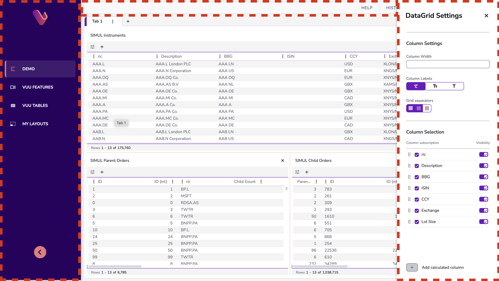
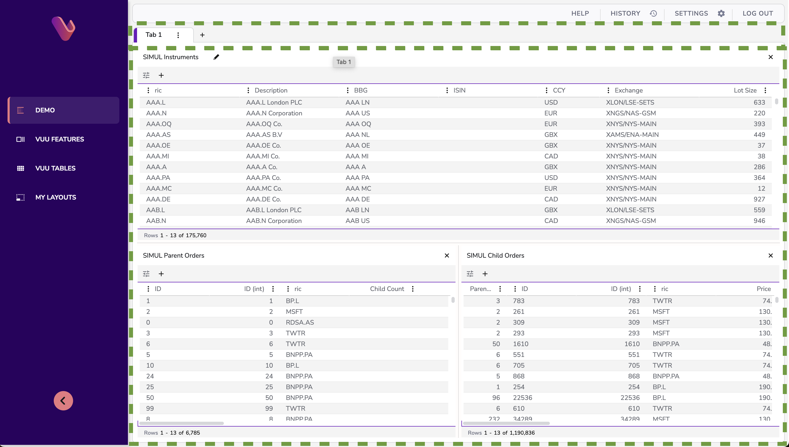
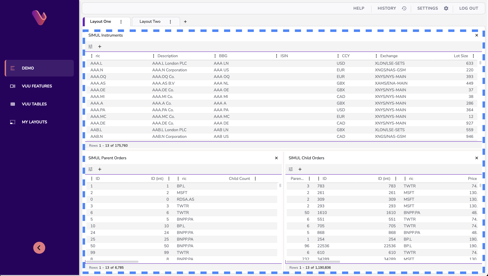
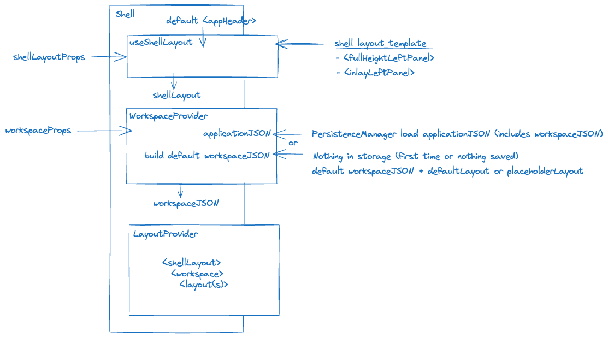
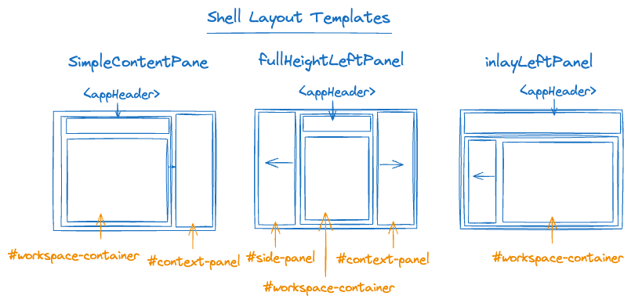

# Vuu Shell

# Shell Layout

One of the functions of the Shell is management of the layout of a Vuu application. It makes use of a number of `helpers` to orchestrate the various layers that together constitute the App layout. There are three tiers to the layout of a Vuu Application, each expressed as JSON documents:

- The `Shell` layout - the outermost 'chrome' of the application
- the `Workspace` - the content area within which user content is rendered.
- One or more `Layout`s, displayed within the Workspace

Each of these layers can be configured to achieve custom structure.

### The Shell Layout

this defines the outermost `chrome` of the application. At its very simplest, this is a Banner across the top of the application and a content area below. There are some built-in templates for pre-defined shell layouts and the Sample App uses one of these. This adds a panel on the left intended for Navigation controls. It also provides a panel to the right of the main content area, which will be hidden by default but can be displayed with arbitrary content at runtime.



### The Workspace

This is the area for user content. Content is actually hosted within Layouts (see below). The workspace allows users to switch between open layouts. It may optionally allow user to create new layouts. Layouts can be removed from the workspace (closed).



### Layouts

A Layout consists of one or more components. In the default Workspace, which is a Tabbed View, it is represented by a Workspace Tab and only one Layout will be active (i.e visible) at a given time. A single Workspace may contain multiple Layouts. In the screenshot below, the Workspace contains two layouts and the active Layout contains two components (both simple Tables).



# Shell API - layout configuration options

There are two props defined on the Shell API that allow configuration of the application layout

### ShellLayoutProps

```typescript
export interface ShellLayoutProps {
  /**
    App Header will be rendered in position determined by layout-template. If not provided, the default AppHeader will be rendered.
   */
  appHeader?: ReactNode;

  /**
    HTML attributes that will be applied to root div.
   */
  htmlAttributes?: HTMLAttributes<HTMLDivElement>;
  /**
    identifier for shell layout template to be used. Default template will be "inlay"
   */
  layoutTemplateId?: "full-height" | "inlay" | "simple-content-pane";
  /**
    If the Shell template renders a LeftSidePanel, these props will be injected
   */
  LeftSidePanelProps?: SidePanelProps;
}
```

### WorkspaceProps

```typescript
export type WorkspaceProps = WorkspaceStackProps & {
  layoutPlaceholderJSON?: LayoutJSON;
  /**
   * layoutJSON defines the default layout to render on first load and until such time as
   * layout state has been persisted. After that, the persisted state will be rendered.
   */
  layoutJSON?: LayoutJSON;
  /**
   * The Vuu workspace is the container into which layouts are loaded. By default, it will be
   * a Tabbed Panel (Stack + Tabstrip), showing a tab per Layout.
   */
  workspaceJSON?: LayoutJSON;
};
```

```typescript
export interface ShellProps extends HTMLAttributes<HTMLDivElement> {
  shellLayoutProps?: ShellLayoutProps;
  workspaceProps?: WorkspaceProps;
}
```

# The Layout 'Helpers'

Each of the three tiers of the layout system are defined as JSON documents. These are combined togther at runtime to create a single JSON document from which the UI is constructed. The Shell Layout tends to be static. Both the Workspace and individual Layouts can be updated at runtime as a result of user interaction. Updates are persisted, so both the Workspace and Layout definitions are retrieved from persistent storage. The saving and retrieval from storage of these documents as well as the composition of the three layers into a single document is managed with the help of the following 'helper' components.



The diagram above shows the components which help manage the various pieces that together form the Application layout.

### useShellLayout hook, Shell Layout templates

This hook provides the Shell Layout. At the time of writing, there are three built-in Shell Layout templates that can be used as the foundation for the Shell UI. The template to be used is determined by the Shell API prop `ShellLayoutProps.templateLayoutId`. The approximate structure of these three templates can be seen below.



Various aspects of these templates can be customised. Each includes an Application Header, a default implementation of this is provided by the Shell, or a custom implementation can be provided via the Shell API prop `ShellLayoutProps.appHeader`. By default, the Shell Layout will be styled to fill the available space of the browser window - `width: 100vw, height 100vh`. The style, along with any other regular HTML attribute, can be overridden via the Shell API prop `ShellLayoutProps.htmlAttributes`. The `FullHeightLeftPanel` template is the tempalte used by the Vuu Sample App. It renders a `SidePanel` container component as a collapsible Drawer on teh left side of the layout. The contents of this SidePanel can be configured using the prop `ShellLayoutProps.LeftSidePanelProps`. `SimpleContentPanel` is the default template used, if `ShellLayoutProps.templateLayoutId` is not specified. Currently, there is no API to define a custom Shell Layout, we may offer support for this in the future.

The illustrations above show that there are a number of special or 'landmark' identifiers used as html #id values for certain key elements within the template structures. These are common across different templates. These are important. They serve a role in the process whereby the various layout documents are composed together. They can also play a role at runtime, when they can be used to target layout operations. For example, to open arbitrary content in the `ContextPanel`, client code can dispatch a layout action with the id `#context-panel` as the action target. Layout actions will be described in detail in the Vuu Layout docs.

### WorkspaceProvider, PersistenceManager

The `WorkspaceProvider`, naturally enough, manages the Workspace. Because the Workspace is persisted across user sessions, the WorkspaceProvider will take care of loading the saved Workspace at the beginning od a user session. It will also save the Workspace following any changes made at runtime by the user, these might include

- switching workspace tabs
- creating a new layout tab or removing a layout tab from the workspace
- modifying the contents of the active layout e.g. applying a sort of filter to a table view which is rendered within the workspace.

Currently, we save the Workspace plus any open layouts as a single JSON structure. We might want to rethink this - there would be advantages to saving layouts individually and the Workspace simply as a list of the open layouts, along with the identifier of the currently active layout (i.e the active layout is the one represented by the selected tab in the tabbed display used by the default Workspace).

In order to save and load the Workspace, the WorkspaceProvider uses a `PersistenceManager`. This is described by the `IPersistenceManager` interface. This is a pluggable component, a custom implementation can be tailored to a specific storage service. THere are default implementattions within Vuu providing persistence to a REST service ot to browser local storage (ther default).

If the user has previously used the app and a saved Workspace exists, all the WorkspaceProvider must do is load that saved Workspace. The first time experience is a little more involved. In this case, the WorkspaceProvider locates the Workspace template, then identifies the default layout(s) to install in that template, merges them and returns the fully loaded Workspace. We allow custom implementations of both the Workspace itself and the default layout to load, using these Shell API props

- `WorkspaceProps.workspaceJSON`
- `WorkspaceProps.layoutJSON`

In the absence of either of these props, the default Workspace is a Tabbed container and the default initial content is a `PlaceHolder` component.

### LayoutProvider

The role of the LayoutProvider is runtime management of the rendered layout.
TBC
