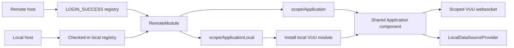

# Getting started with a VUU portal

This guide explains how to create a React portal host and Module Federation
remote applications with both:

- **remote mode**: Keycloak authentication and data from remote VUU servers;
- **local mode**: no external authentication and data from browser-local VUU
  test modules.

It also describes how to migrate an existing suite of standalone React/VUU
SPAs. The examples assume that all applications already use compatible React,
React DOM, React Router, and VUU package versions.

For the underlying runtime behavior, see
[Module Federation runtime integration](../portal-host/docs/module-federation-runtime.md).
For the design rationale, see
[Local and remote portal architecture](../portal-host/docs/local-portal-architecture.md).

## Architecture at a glance

Each application is split into a provider-neutral feature and thin
environment-specific adapters:

```text
application package
├── src/Application.tsx          shared feature component
├── src/ApplicationLocal.ts      local data registration adapter
├── src/index.tsx                standalone remote entry
└── src/index-local.tsx          standalone local entry
```

The portal uses the same Module Federation host and producer manifests in both
modes:



The important boundaries are:

- the **host** owns authentication, module discovery, routing, and the active
  data-source provider;
- a **remote descriptor** says where and how to load an application;
- the **remote feature component** consumes contexts but does not install
  authentication or data providers;
- a **local adapter** registers browser-local VUU tables and then exports the
  same feature component; and
- the host and local remotes share one local VUU module container.

## 1. Create the workspace

A typical workspace contains one host package and one package per remote:

```text
portal/
├── package.json
├── portal-host/
│   ├── package.json
│   ├── public/index.html
│   ├── scripts/rsbuild.ts
│   └── src/
│       ├── App.tsx
│       ├── bootstrap.tsx
│       ├── index.tsx
│       ├── local-bootstrap.tsx
│       ├── local-index.tsx
│       └── local-module-registry.ts
├── orders/
│   ├── package.json
│   └── src/
│       ├── Orders.tsx
│       └── OrdersLocal.ts
└── risk/
    └── ...
```

Use workspaces or another package-management arrangement that guarantees
compatible package versions. The host and producers must agree on the required
versions of all shared packages.

Install the build/runtime dependencies used by the examples:

```sh
npm install --save-dev \
  @module-federation/enhanced \
  @rsbuild/core \
  @rsbuild/plugin-react
```

The host and remotes also need their normal React and VUU dependencies. A
local-capable host or remote needs `@vuu-ui/vuu-data-test` until the reusable
local VUU runtime is moved into `@vuu-ui/vuu-data-local`.

## 2. Define strict shared dependencies

Host and producers must use compatible share declarations. At minimum, share
the packages that contain React contexts or process-wide registries:

```ts
const shared = {
  react: {
    singleton: true,
    strictVersion: true,
    requiredVersion: reactVersion,
  },
  "react-dom": {
    singleton: true,
    strictVersion: true,
    requiredVersion: reactVersion,
  },
  "react-router-dom": {
    singleton: true,
    strictVersion: true,
    requiredVersion: reactRouterVersion,
  },
  "@vuu-ui/core": {
    singleton: true,
    strictVersion: true,
    requiredVersion: vuuVersion,
  },
  "@vuu-ui/core/portal": {
    singleton: true,
    strictVersion: true,
    requiredVersion: vuuVersion,
  },
  "@vuu-ui/vuu-data-editing": {
    singleton: true,
    strictVersion: true,
    requiredVersion: vuuVersion,
  },
  "@vuu-ui/vuu-data-test": {
    singleton: true,
    strictVersion: true,
    requiredVersion: vuuVersion,
  },
};
```

Use the complete consumer/producer declarations from
`vuu-ui/scripts/module-federation-utils.ts` when working in this repository.
In a separate repository, create an equivalent helper that reads versions from
your dependency manifests.

`@vuu-ui/core` must be a singleton because it owns authentication and data
contexts. `@vuu-ui/vuu-data-test` must be a singleton in local mode because it
owns the local `ModuleContainer`. Duplicating either package can produce a
successfully loaded remote that cannot see the host's context or registered
local modules.

Keep `strictVersion: true`. An incompatible React or VUU version should fail
during shared-module negotiation instead of silently creating a second
runtime.

## 3. Build the portal host

### Configure Module Federation

Install `ModuleFederationPlugin` in the host's Rsbuild configuration:

```ts
import { createRsbuild } from "@rsbuild/core";
import { pluginReact } from "@rsbuild/plugin-react";
import { ModuleFederationPlugin } from "@module-federation/enhanced/rspack";

const isLocal = process.argv.includes("--local");

const rsbuild = await createRsbuild({
  config: {
    html: {
      template: "./public/index.html",
    },
    output: {
      module: true,
      target: "web",
    },
    plugins: [pluginReact()],
    source: {
      entry: {
        index: isLocal ? "./src/local-index.tsx" : "./src/index.tsx",
      },
    },
    tools: {
      rspack: {
        output: {
          chunkFormat: "module",
          chunkLoading: "import",
          library: { type: "module" },
        },
        plugins: [
          new ModuleFederationPlugin({
            name: "host",
            remoteType: "module",
            shared: getSharedDependencies("consumer"),
          }),
        ],
      },
    },
  },
});

await rsbuild.build();
```

Do not statically configure `remotes`. The portal receives remote descriptors
at runtime.

The host output is ESM. Ensure the generated script is loaded as a module; the
portal example's `public/index.html` and Rsbuild integration handle this.

### Preserve the asynchronous entry boundary

The remote and local entries should contain only a dynamic import:

```ts
// src/index.tsx
import("./bootstrap");
```

```ts
// src/local-index.tsx
import("./local-bootstrap");
```

This lets the plugin initialize the federation runtime and share scope before
React, VUU, and application imports are evaluated.

### Create the shared portal application

The application obtains descriptors from the active authentication provider
and injects the selected data provider into `PortalShell`:

```tsx
import { useModuleRegistry } from "@vuu-ui/core";
import { PortalShell } from "@vuu-ui/core/portal";
import type { ComponentType, ReactNode } from "react";
import { BrowserRouter } from "react-router-dom";

export interface AppProps {
  DataSourceProvider?: ComponentType<{ children: ReactNode }>;
}

export const App = ({ DataSourceProvider }: AppProps) => {
  const { modules } = useModuleRegistry();

  return (
    <BrowserRouter>
      <PortalShell
        DataSourceProvider={DataSourceProvider}
        remoteModules={modules}
        title="My Portal"
      />
    </BrowserRouter>
  );
};
```

If `DataSourceProvider` is omitted, `PortalShell` uses
`VuuDataSourceProvider`. This preserves the remote-mode default.

### Configure remote mode

The production bootstrap initializes the imperative federation API, then
installs identity authentication:

```tsx
import { init } from "@module-federation/enhanced/runtime";
import {
  AuthenticationErrorBoundary,
  AuthenticationProvider,
  KeycloakAuthHandler,
} from "@vuu-ui/core";
import { createRoot } from "react-dom/client";
import { App } from "./App";

init({ name: "host", remotes: [] });

const config = await vuuConfig;
const root = document.getElementById("root");
if (!root) throw new Error("No React root defined in page");

createRoot(root).render(
  <AuthenticationErrorBoundary
    fallback={(error) => (
      <div role="alert">Unable to authenticate: {error.message}</div>
    )}
  >
    <AuthenticationProvider
      authConfig={config}
      authHandlerClass={KeycloakAuthHandler}
      mode="identity"
    >
      <App />
    </AuthenticationProvider>
  </AuthenticationErrorBoundary>,
);
```

The active sequence is:

1. authenticate the browser with Keycloak;
2. exchange the identity token for a portal VUU token;
3. open the portal VUU websocket;
4. receive `LOGIN_SUCCESS.moduleRegistry`;
5. render navigation and routes from the registry; and
6. authenticate each selected remote's VUU connection when its descriptor has
   `vuu` metadata.

The portal server is responsible for returning only modules the user is
authorized to access.

### Configure local mode

The local bootstrap supplies a deterministic identity, a checked-in registry,
and `LocalDataSourceProvider`:

```tsx
import { init } from "@module-federation/enhanced/runtime";
import { AuthenticationProvider } from "@vuu-ui/core";
import { LocalDataSourceProvider } from "@vuu-ui/vuu-data-test";
import { createRoot } from "react-dom/client";
import { App } from "./App";
import { localPortalModuleRegistry } from "./local-module-registry";

init({ name: "host", remotes: [] });

const root = document.getElementById("root");
if (!root) throw new Error("No React root defined in page");

createRoot(root).render(
  <AuthenticationProvider
    authorizations={["local-developer"]}
    mode="local"
    registry={localPortalModuleRegistry}
    user={{ userName: "local-user" }}
  >
    <App DataSourceProvider={LocalDataSourceProvider} />
  </AuthenticationProvider>,
);
```

Local authentication publishes a synthetic VUU session, so
`useAuthenticatedUser()`, `useModuleRegistry()`, `useVuuConnectionId()`, and
`useVuuAccessToken()` remain structurally available. It does not contact
Keycloak, exchange tokens, or open a websocket.

## 4. Define remote descriptors

A descriptor controls navigation, routing, federation loading, and optional
VUU connection scoping.

### Remote descriptor

The production portal server returns descriptors in
`LOGIN_SUCCESS.moduleRegistry`:

```ts
{
  clientIdentifier: "vuu-orders",
  description: "Order management",
  enabled: true,
  id: 101,
  location: "/Trading/Orders",
  loginRole: "orders-login",
  mfComponent: "Orders",
  mfScope: "orders",
  mfUrl: "https://portal.example.com/remotes/orders",
  name: "orders",
  path: "/trading/orders",
  title: "Orders",
  version: 1,
  vuu: {
    connectionId: "orders",
    restUrl: "https://orders.example.com/api/authn",
    websocketUrl: "wss://orders.example.com/websocket-orders",
  },
}
```

The fields must agree with the producer:

```text
mfScope     = ModuleFederationPlugin.name
mfComponent = exposure key without the leading "./"
mfUrl        = base URL serving mf-manifest.json
```

`RemoteModule` appends `/mf-manifest.json`, registers the remote, and calls:

```ts
loadRemote(`${mfScope}/${mfComponent}`, { from: "runtime" });
```

When `vuu` is present, the feature is wrapped in a connection-specific
`AuthenticationProvider`. Each SPA can therefore retain its own VUU server
after migration.

### Local descriptor

The local descriptor points to the same producer manifest but selects its local
adapter:

```ts
import type { PortalModuleRegistry } from "@vuu-ui/core";

export const localPortalModuleRegistry = {
  modules: [
    {
      clientIdentifier: "local-orders",
      description: "Order management with local data",
      enabled: true,
      id: "local-orders",
      location: "/Trading/Orders",
      loginRole: "local",
      mfComponent: "OrdersLocal",
      mfScope: "orders",
      mfUrl: "http://localhost:5010",
      name: "orders",
      path: "/trading/orders",
      title: "Orders",
      version: 1,
    },
  ],
} satisfies PortalModuleRegistry;
```

**Do not add `vuu` to a local descriptor.** Its presence instructs
`RemoteModule` to perform token exchange and open the configured websocket.
Local mode is selected by the exposure and host provider, not by using fake
`local://` connection URLs.

Use `ComponentProps` when a remote requires environment-specific inputs:

```ts
{
  // descriptor fields
  ComponentProps: {
    tableSchema: localOrdersModule.schemas.orders,
  },
}
```

## 5. Build a remote application

### Keep the feature provider-neutral

The exposed feature should consume VUU services from context:

```tsx
import { useData } from "@vuu-ui/core";
import { useMemo } from "react";

export const Orders = () => {
  const { VuuDataSource } = useData();
  const dataSource = useMemo(
    () =>
      new VuuDataSource({
        table: { module: "ORDERS", table: "orders" },
      }),
    [VuuDataSource],
  );

  return <OrdersView dataSource={dataSource} />;
};

export default Orders;
```

Do not put any of the following inside the shared feature:

- `AuthenticationProvider`;
- `VuuDataSourceProvider`;
- `LocalDataSourceProvider`;
- Keycloak initialization;
- token exchange; or
- direct websocket startup.

Those belong in the host or a standalone bootstrap.

### Add producer metadata

The VUU portal examples use `vuu.module-federation` package metadata:

```json
{
  "name": "orders",
  "scripts": {
    "build": "node ../../scripts/build-remote-module.ts",
    "start": "ws --directory ../../dist_portal/orders --spa index.html --port 5010"
  },
  "dependencies": {
    "@vuu-ui/core": "3.3.12",
    "@vuu-ui/vuu-data-test": "3.3.12"
  },
  "peerDependencies": {
    "react": "^19.2.3",
    "react-dom": "^19.2.3"
  },
  "vuu": {
    "module-federation": {
      "name": "orders",
      "port": 5010,
      "exposes": {
        "./Orders": "./src/Orders",
        "./OrdersLocal": "./src/OrdersLocal"
      }
    }
  }
}
```

`scripts/build-remote-module.ts` configures `ModuleFederationPlugin`, strict
producer shares, the producer public path, and manifest generation. If your
project does not use this script, create an equivalent Rsbuild configuration:

```ts
new ModuleFederationPlugin({
  name: "orders",
  dts: false,
  exposes: {
    "./Orders": "./src/Orders",
    "./OrdersLocal": "./src/OrdersLocal",
  },
  shared: getSharedDependencies("producer"),
});
```

The producer name and exposure keys are API contracts. Changing them requires
updating every registry descriptor.

### Add the local VUU module

Implement the local tables, schemas, menus, and RPCs used by the feature:

```ts
import { VuuModule } from "@vuu-ui/vuu-data-test";

class OrdersModule extends VuuModule<"orders"> {
  constructor() {
    super("ORDERS");
  }

  // Define schemas, tables, menus, services and visual links.
}

export const ordersModule = new OrdersModule();
```

The module name and table names must match the identifiers used by the feature.
Port observable VUU behavior rather than attempting to emulate websocket
transport. The class above is abbreviated: a concrete `VuuModule` must
implement its required schemas, tables, menus, services, and visual links.

Inventory these dependencies before declaring local support:

- every `{ module, table }` passed to `VuuDataSource`;
- table schemas and key columns;
- menu and direct datasource RPCs;
- edit-session behavior;
- visual links;
- ticking or generated updates; and
- calls through `getServerAPI()`.

`LocalDataSourceProvider.serverAPI.rpcCall()` is not a general replacement for
all server RPCs. Prefer module/data-source services or extend the local runtime
deliberately when an application depends on server-level RPC calls.

### Add the local adapter exposure

The local adapter explicitly installs the module and exports the production
feature:

```ts
import {
  ensureVuuModule,
  ordersModule,
} from "@vuu-ui/vuu-data-test";
import Orders from "./Orders";

ensureVuuModule(ordersModule);

export default Orders;
```

`ensureVuuModule()` makes registration idempotent. Use an explicit call;
do not depend on an otherwise-unused side-effect import, which a bundler may
remove.

The adapter must not add authentication or data providers. The local portal
host already supplies both.

### Keep standalone modes

If the application must continue to run independently, preserve its two thin
entry points:

```ts
// index.tsx
import("./bootstrap");
```

```tsx
// bootstrap.tsx
<AuthenticationProvider
  authConfig={config}
  authHandlerClass={KeycloakAuthHandler}
  mode="identity"
>
  <VuuDataSourceProvider>
    <Orders />
  </VuuDataSourceProvider>
</AuthenticationProvider>
```

```ts
// index-local.tsx
import("./local-bootstrap");
```

```tsx
// local-bootstrap.tsx
ensureVuuModule(ordersModule);

<AuthenticationProvider mode="local">
  <LocalDataSourceProvider>
    <Orders />
  </LocalDataSourceProvider>
</AuthenticationProvider>
```

The standalone entries and Module Federation exposures all converge on the
same `Orders` component.

## 6. Build and run

From `vuu-ui`, build the portal example's local host and all producers:

```sh
npm run build:mf:local
```

Build only the local host:

```sh
npm run build:mf -- --portal-host --local
```

Build the authenticated host and restore it at the standard host output path:

```sh
npm run build:mf -- --portal-host
```

The local and authenticated host builds both write
`dist_portal/portal-host`. Building one replaces the other.

The current local example uses:

| Port | Artifact |
| --- | --- |
| 5002 | portal host when run with its package `start:local` script |
| 5003 | user-admin |
| 5004 | vuu-table-viewer, not part of the initial local proof |
| 5005 | basket-trading |
| 5006 | feature-filter-table |

Start the local example in separate terminals:

```sh
npm --prefix portal-examples/user-admin run start
npm --prefix portal-examples/basket-trading run start
npm --prefix portal-examples/feature-filter-table run start
npm --prefix portal-examples/portal-host run start:local
```

Then open `http://localhost:5002`.

When using nginx, map its host listener to `dist_portal/portal-host` and map
each remote origin to its corresponding `dist_portal/<package>` directory. The
standard example deployment uses port 5001 for the host. Remote origins must
allow the host origin through CORS.

Use unique ports and keep these values aligned:

- producer `vuu.module-federation.port`;
- producer `output.publicPath`;
- package start script;
- local registry `mfUrl`; and
- nginx/development-server mapping.

## 7. Migrate existing standalone SPAs

Migrate incrementally. A remote SPA can continue to run standalone while it is
also loaded by the portal.

### Step 1: establish version compatibility

Confirm that every SPA uses the same compatible versions of:

- React and React DOM;
- React Router;
- `@vuu-ui/core` and `@vuu-ui/core/portal`;
- shared VUU editing/shell packages; and
- the local VUU runtime when local mode is required.

The premise for this migration is that React versions already agree. Keep
strict federation version checks so future drift is detected.

### Step 2: extract the provider-neutral application

Move the existing application UI beneath a component that assumes its
authentication, router where appropriate, and data provider already exist.

Before:

```tsx
createRoot(root).render(
  <VuuDataSourceProvider>
    <ExistingApp />
  </VuuDataSourceProvider>,
);
```

After:

```tsx
export default function ExistingApp() {
  // Existing application UI only.
}
```

Keep the old provider composition in standalone bootstrap files.

### Step 3: add the production exposure

Assign a stable federation scope and exposure:

```json
"module-federation": {
  "name": "existingOrders",
  "port": 5010,
  "exposes": {
    "./ExistingOrders": "./src/ExistingApp"
  }
}
```

Add a production descriptor with the application's VUU server details. At this
point, the application can run both standalone and as a remote without any
local-mode work.

### Step 4: preserve per-application VUU servers

Give each remote descriptor a stable, unique connection ID and its own token
exchange and websocket endpoints:

```ts
vuu: {
  connectionId: "existing-orders",
  restUrl: "https://existing-orders.example.com/api/authn",
  websocketUrl: "wss://existing-orders.example.com/websocket",
}
```

The portal browser identity is reused, but each VUU target exchanges its own
token and owns an independently scoped connection. Do not move all remote data
through the portal server unless that is an intentional backend redesign.

### Step 5: port local data behavior

Convert the SPA's current local fixtures into a `VuuModule`:

1. match the production module/table identifiers;
2. reproduce schemas and keys;
3. port mutations, edit sessions, menus, and RPC results;
4. keep fixtures deterministic;
5. add tests for table projection and RPC behavior; and
6. explicitly register the module from a local adapter.

When several tables represent one domain, keep one normalized in-memory store
and project all tables from it. This prevents a successful RPC from updating
one local table while leaving related tables stale.

### Step 6: add the local exposure and descriptor

Expose `<Application>Local`, add it to the checked-in local registry, and omit
`vuu`. Keep the same `mfScope`, URL, route, and navigation metadata unless the
local scenario intentionally differs.

### Step 7: migrate application by application

Do not wait for every SPA to have complete local fixtures. A useful order is:

1. migrate a read-only application with existing local tables;
2. migrate an application with edit sessions;
3. migrate one with domain RPCs;
4. migrate authentication/administration applications last; and
5. only then remove obsolete standalone deployment paths.

The portal can mix:

- fully migrated local/remote applications;
- remote-only applications omitted from the local registry; and
- applications whose local descriptor temporarily selects a reduced fixture
  set.

### Step 8: retire duplicated composition

After portal deployment is stable:

- keep standalone bootstraps only where independent execution is useful;
- move duplicated descriptor data into a generated/shared metadata source;
- generate development server and nginx mappings from the same metadata;
- keep production authorization and registry filtering on the portal server;
  and
- do not use the checked-in local registry in production.

## 8. Validation checklist

### Host

- Both entries are asynchronous dynamic imports.
- Both bootstraps call `init({ name: "host", remotes: [] })`.
- Remote mode receives its registry from portal `LOGIN_SUCCESS`.
- Local mode receives a checked-in `PortalModuleRegistry`.
- Local mode installs `LocalDataSourceProvider`.
- Remote mode retains `VuuDataSourceProvider`.
- Local mode makes no Keycloak, token-exchange, or websocket request.

### Remote

- The production exposure default-exports the provider-neutral React feature.
- `mfScope` exactly matches the producer name.
- `mfComponent` exactly matches an exposure without its leading `./`.
- `mfUrl/mf-manifest.json` is reachable from the host.
- The production descriptor has the correct `vuu` target.
- The local descriptor omits `vuu`.
- The local adapter calls `ensureVuuModule()` and exports the same feature.
- Every table and RPC used by the feature has a tested local implementation.

### Federation and deployment

- React, core VUU contexts, and the local module runtime are strict compatible
  shares.
- Host and remote artifacts were built with compatible federation tooling.
- Manifest URLs, public paths, server ports, and proxy/nginx mappings agree.
- CORS permits the host origin to load remote manifests and chunks.
- The production host does not request local adapter chunks.
- Both portal modes can navigate away from and back to a remote without
  duplicate module-registration errors.

## Reference examples

The following portal examples demonstrate the complete pattern:

- `portal-examples/portal-host`: remote and local host entries;
- `portal-examples/portal-host/src/local-module-registry.ts`: checked-in local
  descriptors;
- `portal-examples/basket-trading`: production and local basket exposures;
- `portal-examples/feature-filter-table`: production and local SIMUL
  exposures;
- `portal-examples/user-admin`: production and local user-admin exposures; and
- `packages/vuu-data-test/src/user-admin`: a browser-local multi-table VUU
  module with domain RPC behavior.
