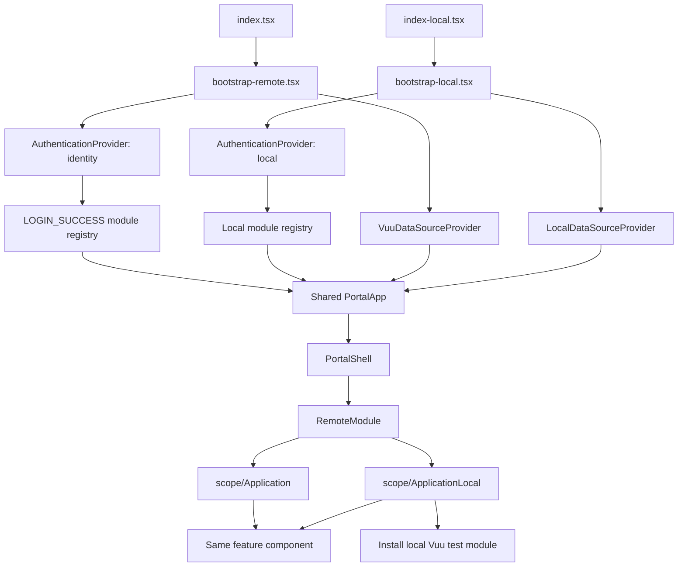
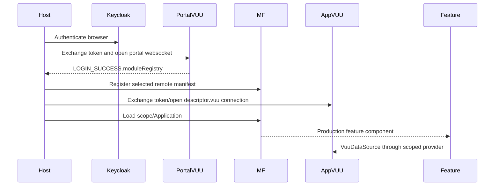
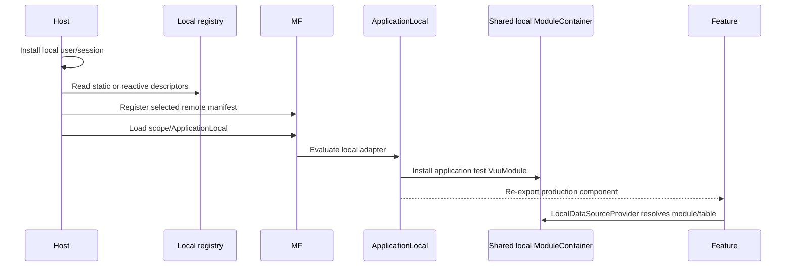

# Local and remote portal architecture

## Status

Proposed design for adding a local, no-authentication version of
`portal-host` and its Module Federation remotes while preserving the production
architecture.

The main recommendation is:

- keep each application feature provider-neutral;
- keep the same Module Federation remote build and remote scope in both modes;
- expose a small local adapter alongside the production feature exposure;
- let the host select authentication, module registry, data provider, and
  exposure through configuration; and
- share the local module runtime and its `ModuleContainer` across the host and
  all remotes.

This exercises Module Federation in local mode rather than replacing remotes
with static imports. It therefore remains useful as an integration environment
for the production portal.

## Goals

1. Support the existing application modes:
   - **remote**: Keycloak authentication, VUU token exchange, and one VUU
     websocket target per application;
   - **local**: no external authentication and in-browser test data.
2. Use the same feature component, routes, portal shell, and federation
   manifest in both modes.
3. Keep mode-specific code at composition boundaries, not inside application
   features.
4. Preserve standalone startup for applications that still need
   `index.tsx` and `index-local.tsx`.
5. Allow each remote to own its local test-data implementation, rather than
   making the host depend directly on every application's test fixtures.
6. Keep local mode deterministic and suitable for development, component
   integration, and browser tests.

Local mode is not intended to reproduce Keycloak authorization or VUU network
behavior. Those remain remote-mode concerns.

## Current implementation and constraints

### The remote component is already mostly provider-neutral

The portal exposes application components such as
`portal-examples/user-admin/src/UserAdmin.tsx` and
`portal-examples/basket-trading/src/VuuBasketTradingFeature.tsx`. Their
standalone `bootstrap.tsx` files add providers, but the exposed feature itself
obtains its data implementation through `useData()`.

That separation is the correct migration boundary:

```text
standalone entry -> mode-specific providers -> shared feature component
portal host      -> mode-specific providers -> federated shared feature component
```

An application's React feature must not create a websocket connection, install
`LocalDataSourceProvider`, or perform Keycloak initialization itself.

### `PortalShell` currently forces remote data

`packages/core/src/portal-shell/PortalShell.tsx` currently wraps all portal
content in `VuuDataSourceProvider`. An outer `LocalDataSourceProvider` would be
shadowed by that inner provider, so a local host cannot switch the data
implementation only in `bootstrap-local.tsx`.

The shell needs a provider injection point, or data-provider ownership must
move out of the shell.

### Local authentication currently has no module registry

`AuthenticationProvider` already has `mode="local"`, but
`LocalAuthenticationProvider` in
`packages/core/src/auth/AuthenticationProvider.tsx` always publishes:

```ts
moduleRegistry: { modules: [] }
```

`portal-host/src/App.tsx` calls `useModuleRegistry()`, so local mode needs a
registry supplied directly rather than obtained from `LOGIN_SUCCESS`.

The local provider also does not currently install a
`VuuConnectionContext`. Features that call `useVuuConnectionId()` or
`useVuuAccessToken()` would fail even if their data source is local.

### Local VUU modules use a process-wide registry

`LocalDataSourceProvider` in
`packages/vuu-data-test/src/local-datasource-provider/LocalDatasourceProvider.tsx`
uses the singleton `ModuleContainer`. Constructing a `VuuModule` registers it
with that container, and the provider resolves tables by module name:

```ts
const module = moduleContainer.get(table.module);
return module.createDataSource(table.table, viewport, config);
```

This works inside one bundle. Across Module Federation boundaries, it works
only if the host and remotes use the **same instance** of the package that owns
`ModuleContainer`. If a remote bundles a private copy of
`@vuu-ui/vuu-data-test`, its module registers into a different container and
the host's `LocalDataSourceProvider` cannot find it.

`@vuu-ui/vuu-data-test` is not currently in
`getSharedDependencies()` in `scripts/module-federation-utils.ts`.

### A local descriptor cannot contain a fake VUU connection

`RemoteModule` wraps a component in
`AuthenticationProvider mode="vuu-connection"` whenever its descriptor has a
`vuu` property. That provider performs token exchange and opens a websocket.

Local descriptors must therefore omit `vuu`; placeholder URLs such as
`local://` are not sufficient. The current protocol type
`VuuModuleRegistry.modules` uses `VuuModuleRecord[]`, whose `vuu` field is
required, so the portal-facing registry type also needs to support descriptors
whose `vuu` connection is optional.

## Proposed architecture



There are two thin host bootstraps and one shared portal application. Each
producer has one manifest containing both the production component exposure and
an optional local adapter exposure. Remote and local registry descriptors
select the appropriate exposure.

## Host composition

### Keep the asynchronous entry boundary in both modes

Both entries must preserve the asynchronous boundary required by the Module
Federation share runtime:

```ts
// src/index.tsx
import("./bootstrap-remote");
```

```ts
// src/index-local.tsx
import("./bootstrap-local");
```

Neither entry should statically import React, the portal application, local test
data, or remote VUU packages. The plugin-generated host and share scope must
initialize before either bootstrap graph is evaluated.

Both bootstraps should call:

```ts
init({ name: "host", remotes: [] });
```

The remote list remains empty because descriptors are registered when selected.
The local host uses the same federation runtime and should not bypass it with
static feature imports.

### Share one `PortalApp`

Extract the current render tree into a shared component whose inputs describe
the environment:

```ts
interface PortalAppProps {
  DataSourceProvider: ComponentType<PropsWithChildren>;
}

const PortalApp = ({ DataSourceProvider }: PortalAppProps) => {
  const { modules } = useModuleRegistry();

  return (
    <BrowserRouter>
      <PortalShell
        DataSourceProvider={DataSourceProvider}
        id="portal-demo"
        remoteModules={modules}
        title="Portal Demo"
      />
    </BrowserRouter>
  );
};
```

`PortalShell` should accept a provider component and default it to
`VuuDataSourceProvider` for compatibility:

```ts
export interface PortalShellProps {
  DataSourceProvider?: ComponentType<PropsWithChildren>;
  // existing props
}

export const PortalShell = ({
  DataSourceProvider = VuuDataSourceProvider,
  ...props
}: PortalShellProps) => (
  <DataSourceProvider>
    {/* existing shell */}
  </DataSourceProvider>
);
```

An alternative is to remove data-provider ownership from `PortalShell`
entirely. That is cleaner long term, but the optional prop is the smaller,
backward-compatible migration.

### Remote bootstrap

Remote mode remains close to the current
`portal-host/src/bootstrap.tsx`:

```tsx
<AuthenticationProvider
  authConfig={config}
  authHandlerClass={KeycloakAuthHandler}
  mode="identity"
>
  <PortalApp DataSourceProvider={VuuDataSourceProvider} />
</AuthenticationProvider>
```

The portal VUU websocket returns `LOGIN_SUCCESS.moduleRegistry`. Descriptors
for applications with their own VUU servers include:

```ts
vuu: {
  connectionId: "user-admin",
  restUrl: "https://...",
  websocketUrl: "wss://..."
}
```

`RemoteModule` then installs the per-remote authenticated VUU scope around the
loaded feature.

### Local bootstrap

Local mode supplies a deterministic user, a local registry, and the local data
provider:

```tsx
<AuthenticationProvider
  mode="local"
  user={{ userName: "local-user" }}
  moduleRegistry={localModuleRegistry}
>
  <PortalApp DataSourceProvider={LocalDataSourceProvider} />
</AuthenticationProvider>
```

This requires extending `LocalAuthenticationProps` with a registry rather than
mocking Keycloak, token exchange, `LOGIN_SUCCESS`, and websocket behavior:

```ts
export interface LocalAuthenticationProps {
  authorizations?: string[];
  children: ReactNode;
  mode: "local";
  moduleRegistry: PortalModuleRegistry;
  user?: User;
}
```

The local provider should also publish a synthetic local VUU connection
context:

```ts
{
  connectionId: "local",
  session: {
    authorizations,
    moduleRegistry,
    token: "",
    user,
  },
}
```

That keeps `useAuthenticatedUser()`, `useModuleRegistry()`,
`useVuuConnectionId()`, and `useVuuAccessToken()` structurally available in
both modes. Empty tokens and local authorizations are test values, not security
boundaries.

### Separate portal registry type from the wire record

Introduce a portal-facing type:

```ts
export interface PortalModuleRegistry {
  modules: RemoteModuleDescriptor[];
}
```

Use it in `IdentityContextValue`, `useModuleRegistry()`, and local host
configuration. The server's `VuuModuleRegistry` remains assignable because its
records contain all descriptor fields, including `vuu`.

This avoids unsafe casts and lets local descriptors omit `vuu`, which is
required to prevent network authentication in local mode.

## Remote package structure

Each migrated SPA should be split into:

```text
src/
  Application.tsx              # provider-neutral feature
  bootstrap-remote.tsx         # standalone remote-mode shell
  bootstrap-local.tsx          # standalone local-mode shell
  index.tsx                    # async import of bootstrap-remote
  index-local.tsx              # async import of bootstrap-local
  local/
    ApplicationLocal.tsx       # local MF adapter
    ApplicationTestModule.ts   # local tables, schemas, RPCs
```

The standalone entries and portal exposures converge on the same
`Application.tsx`.

### Production and local exposures in one remote

Add a local adapter as a second exposure in the existing producer metadata:

```json
{
  "vuu": {
    "module-federation": {
      "name": "userAdmin",
      "port": 5003,
      "exposes": {
        "./UserAdmin": "./src/UserAdmin",
        "./UserAdminLocal": "./src/local/UserAdminLocal"
      }
    }
  }
}
```

The production registry selects `UserAdmin`; the local registry selects
`UserAdminLocal`. Both use scope `userAdmin` and the same `mfUrl`.

The local adapter installs local data and re-exports the same feature:

```ts
import { installUserAdminTestModule } from "./UserAdminTestModule";
import UserAdmin from "../UserAdmin";

installUserAdminTestModule();

export default UserAdmin;
```

`installUserAdminTestModule()` must be idempotent. Use an explicit call rather
than relying only on an unused import, because the portal packages and
`@vuu-ui/vuu-data-test` declare restricted or no module side effects and a
bundler may remove an import used only for registration.

This approach has several advantages:

- `RemoteModule` and its manifest/container/share negotiation remain unchanged.
- The same producer artifact serves remote and local portals.
- Production never requests the local exposure, so its test-data chunk is not
  downloaded or evaluated.
- The application component and its props are identical in both modes.
- Each remote owns and versions its own local fixture implementation.

For applications with no VUU data dependency, the local registry can select
the production exposure directly.

### Keep standalone entries as composition adapters

The existing two-entry convention remains useful:

```tsx
// bootstrap-remote.tsx
<AuthenticationProvider mode="identity" {...auth}>
  <VuuDataSourceProvider>
    <Application />
  </VuuDataSourceProvider>
</AuthenticationProvider>
```

```tsx
// bootstrap-local.tsx
<AuthenticationProvider
  mode="local"
  moduleRegistry={{ modules: [] }}
  user={{ userName: "local-user" }}
>
  <LocalDataSourceProvider>
    <Application />
  </LocalDataSourceProvider>
</AuthenticationProvider>
```

The provider-free `Application` is also the production MF exposure. Its local
adapter installs fixtures but does not add providers, because the local portal
host already owns them.

## Local module registry

Add a checked-in local registry, for example
`portal-host/src/local/local-module-registry.ts`. It should contain the same
navigation and federation metadata as the server registry but:

- select the local adapter exposure where one exists;
- omit every `vuu` property;
- use local URLs for the producer manifests;
- include only modules intended for the local scenario; and
- remain valid `RemoteModuleDescriptor` data.

Example:

```ts
export const localModuleRegistry: PortalModuleRegistry = {
  modules: [
    {
      clientIdentifier: "vuu-user-admin",
      description: "Manage users",
      enabled: true,
      id: "local-user-admin",
      location: "/Admin/Users",
      loginRole: "user-admin-login",
      mfComponent: "UserAdminLocal",
      mfScope: "userAdmin",
      mfUrl: "http://localhost:5003",
      name: "user-admin",
      path: "/users/admin",
      title: "Manage users",
      version: 1,
    },
  ],
};
```

Do not derive local access from Keycloak roles. The local registry itself is
the allow-list. Separate fixtures can represent different users or permission
sets when tests need that behavior.

For a larger suite, avoid maintaining the same descriptor fields in several
places. Extend package metadata or add one checked-in portal module descriptor
per application, then generate:

- the local registry;
- nginx/development server mappings; and
- validation that `mfScope` and `mfComponent` match `name` and `exposes`.

Production authorization must still use the server-produced registry; generated
local metadata must never replace its permission filtering.

## Sharing local data infrastructure

### Initial implementation

Add `@vuu-ui/vuu-data-test` to the federation shared configuration for:

- the local host; and
- every producer that exposes a local adapter.

It must use:

```ts
{
  singleton: true,
  strictVersion: true,
  requiredVersion: vuuVersion
}
```

This is required for correctness, not just bundle size. It ensures that the
remote adapter's `VuuModule` registers with the same `ModuleContainer` used by
the host's `LocalDataSourceProvider`.

Continue sharing `@vuu-ui/core` as a strict singleton. Otherwise a remote could
read a different `DataContext` from the one installed by the host.

### Preferred longer-term extraction

`@vuu-ui/vuu-data-test` currently contains both reusable local runtime
infrastructure and concrete SIMUL/BASKET/test fixtures. A cleaner package
boundary is:

```text
@vuu-ui/vuu-data-local
  LocalDataSourceProvider
  VuuModule
  ModuleContainer
  TableContainer
  local module registration API

@vuu-ui/vuu-data-test
  SIMUL, BASKET, and generic test fixtures
  depends on @vuu-ui/vuu-data-local
```

`@vuu-ui/vuu-data-local` already exists for local array/tree/JSON data sources,
so it is the natural home for the browser-local VUU runtime. The host and
remotes would then share this smaller package as the strict singleton while
test fixtures remain private chunks.

This extraction is not required for the first portal example, but it avoids
making a package named `vuu-data-test` part of the long-term runtime contract.

## Porting the missing test modules

The local adapter is only useful when all VUU tables and RPCs used by the
feature have browser-local equivalents. Port behavior, not server
implementation details.

### User admin

`portal-examples/user-admin` expects the default VUU module
`KEYCLOAK_ADMIN` and these tables, as defined by
`src/data/admin-contract.ts`:

- `users`
- `groups`
- `roles`
- `clients`
- `user_groups`
- `group_roles`
- `user_group_roles`

The local module must provide schemas whose required logical fields match
`admin-contract.ts`. It must also implement the identity and relationship RPCs
used by `admin-mutations.ts`:

- `addUser`, `updateUser`
- `addGroup`, `updateGroup`
- `addClientRole`, `updateRole`
- `assignUserToGroup`, `removeUserFromGroup`
- `assignGroupRole`, `removeGroupRole`

It must implement the module-access RPCs used by `module-access.ts`:

- `getUserModuleAccessOptions`
- `setUserModuleAccess`

The local implementation should mutate one normalized in-memory identity store
and project the seven VUU tables from that store. That prevents table rows,
relationships, and RPC responses from drifting apart. Port fixtures and
business behavior from the existing `vuu-websocket` implementation, but adapt
them to `VuuModule` services rather than reproducing websocket transport.

### Module admin

`portal-examples/module-admin/src/useModuleAdmin.ts` reads and edits:

```ts
{ module: "MODULE_DISCOVERY", table: "modules" }
```

The local module needs the columns in `module-admin/src/columnDescriptors.ts`,
including federation fields and flattened VUU connection fields. Generic
`VuuModule` edit-session support can handle the editable `enabled`, `location`,
and `path` columns if the schema and key are correct.

Use the local portal registry as the source of truth for this table. For basic
local development, changes can become visible after a page reload. For closer
production parity, introduce a small `LocalModuleRegistryStore` with
`getSnapshot()`, `subscribe()`, and update methods:

- `AuthenticationProvider mode="local"` subscribes and publishes the current
  registry;
- the module-discovery test module projects the same store as its `modules`
  table; and
- successful edit-session commits update the store, causing `PortalShell` and
  `PortalNav` to rerender.

This avoids maintaining separate module-admin table data and navigation
registry data.

### Other applications

For each migrated application, inventory:

1. VUU module and table names passed to `VuuDataSource`;
2. schemas and key columns;
3. menus and menu RPCs;
4. direct `dataSource.rpcRequest()` calls;
5. `getServerAPI()` calls, especially `rpcCall`;
6. edit-session behavior and row status columns;
7. visual links and ticking/update behavior; and
8. uses of authentication/connection hooks.

`LocalDataSourceProvider.serverAPI.rpcCall()` currently throws. Applications
that call RPCs through `ServerAPI` rather than a subscribed data source require
that local API to dispatch to an appropriate module service before they can be
considered locally supported.

## Runtime flows

### Remote mode



### Local mode



There is no Keycloak call, token exchange, or websocket in the local sequence.
The Module Federation steps remain real.

## Build and development topology

### Producer build

Continue using `scripts/build-remote-module.ts`. It already reads all
`vuu.module-federation.exposes`, so adding the local adapter exposure requires
no separate producer configuration. Add the shared local runtime dependency as
described above.

One producer artifact is preferable to separate `remote` and `local` producer
builds:

- scope and manifest behavior cannot drift;
- production and local components are compiled by the same toolchain;
- local-only code remains in a separately loaded chunk; and
- the registry controls which exposure is selected.

If policy requires production artifacts to contain no test code, retain the
same metadata contract but add a build flag that filters local exposures and
writes to a separate output directory. This should be an exception, because it
increases build and deployment combinations.

### Host build

Produce two host HTML/entry variants or two build targets:

| Variant | Entry | Authentication | Registry | Data provider |
| --- | --- | --- | --- | --- |
| remote | `index.tsx` | Keycloak identity + VUU sessions | portal `LOGIN_SUCCESS` | `VuuDataSourceProvider` |
| local | `index-local.tsx` | local synthetic user/session | checked-in local registry | `LocalDataSourceProvider` |

Both targets use `ModuleFederationPlugin({ name: "host", ... })`, ESM output,
the asynchronous bootstrap boundary, and runtime remote registration.

The local development launcher should start the host plus the same static
remote asset servers used by remote mode. Only Keycloak and VUU servers are
removed from the topology.

## Failure handling and diagnostics

- Validate the local registry at startup and fail with the descriptor ID when
  `mfUrl`, `mfScope`, `mfComponent`, `path`, or `location` is missing.
- Reject any local descriptor containing `vuu`; otherwise it can accidentally
  initiate network authentication.
- Give a clear error when a local adapter loads but does not register the VUU
  module needed by the feature's first table.
- Detect duplicate local module names instead of silently replacing an
  existing module in `ModuleContainer`.
- Keep `mfUrl|mfScope/mfComponent` in the `RemoteModule` cache key. Production
  and local exposures have different component names and therefore cannot
  reuse the wrong lazy component.
- Keep all shared local runtime and VUU package versions strict. A second local
  container is a correctness bug even when versions happen to match.
- Ensure local adapter initialization is idempotent because React development
  behavior, remounts, and retry paths may evaluate setup more than once.

## Migration plan

### Phase 1: portal infrastructure

1. Add a portal-facing registry type whose descriptors allow `vuu` to be
   absent.
2. Let `AuthenticationProvider mode="local"` accept a module registry,
   authorizations, and a synthetic local connection context.
3. Add the `DataSourceProvider` injection point to `PortalShell`.
4. Add `index-local.tsx`, `bootstrap-local.tsx`, and the local registry to
   `portal-host`.
5. Configure a strict singleton for the local module runtime package.

### Phase 2: prove the pattern with existing local modules

1. Add a local adapter exposure to `basket-trading` using `basketModule`.
2. Add a local adapter exposure to `feature-filter-table` using `simulModule`.
3. Run both through the local portal host, not only through their standalone
   `bootstrap.tsx` files.
4. Confirm navigation, route changes, remote retry behavior, edits, and local
   table discovery.

### Phase 3: fill feature gaps

1. Port `KEYCLOAK_ADMIN` fixtures and RPC behavior for `user-admin`.
2. Implement the `MODULE_DISCOVERY.modules` local module for `module-admin`.
3. Add local adapters for the remaining portal examples.
4. Add contract tests that run each feature against both a local module and a
   mocked remote data-source boundary.

### Phase 4: migrate the application suite

For each SPA:

1. Extract the provider-neutral feature from its two bootstraps.
2. Expose the production feature through Module Federation.
3. Port or create its local `VuuModule`.
4. Add a local adapter exposure.
5. Add remote and local descriptors.
6. Verify that remote descriptors use the application's own VUU connection and
   local descriptors omit `vuu`.
7. Retain thin standalone entries only where standalone execution is still
   valuable.

### Phase 5: harden and simplify

1. Extract the reusable local VUU runtime from `vuu-data-test` into
   `vuu-data-local`.
2. Generate local descriptors and development server configuration from a
   single metadata source.
3. Add live synchronization between module-admin's local module table and the
   local portal registry if required.

## Validation matrix

Each migrated remote should be exercised in these combinations:

| Host | Exposure | Data source | Expected result |
| --- | --- | --- | --- |
| standalone remote | production | application's VUU server | Existing production behavior |
| standalone local | shared feature plus local setup | local module | Existing local behavior |
| portal remote | production | descriptor-scoped VUU server | Feature uses its own authenticated connection |
| portal local | local adapter | shared local module container | Feature loads through MF with no network auth/data |

Also verify:

- no Keycloak, token-exchange, or websocket requests occur in local mode;
- local navigation is populated before any remote feature is selected;
- loading one remote registers only its own local modules;
- two remotes can use different VUU module names without context collision;
- `user-admin` local mutations update related tables consistently;
- strict shared-version failures are surfaced rather than falling back to
  duplicate React, core, or local runtime instances; and
- the production host never downloads a local adapter chunk.

## Recommended first implementation

Implement the local portal with `basket-trading` and
`feature-filter-table` first. Both already demonstrate
`LocalDataSourceProvider` and existing `basketModule`/`simulModule` fixtures in
their standalone bootstraps, so they validate host composition, federated local
adapters, and shared `ModuleContainer` identity without first depending on new
test-module ports.

Once that path works, port `module-admin` and then `user-admin`. User admin is
the larger effort because local parity requires multiple related tables and
domain-specific RPC behavior; it should not block proving the architecture.
