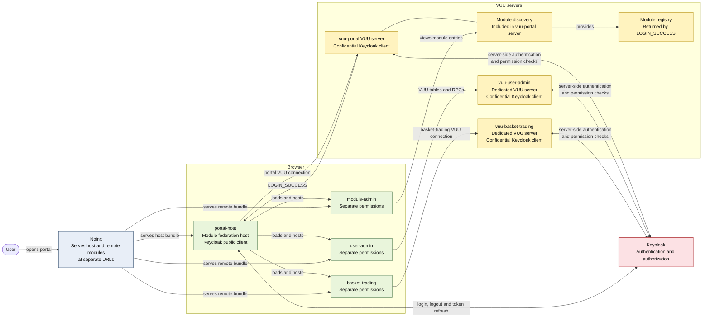

# Module Federation Architecture



The host authenticates the browser through its **public** Keycloak client. Each
VUU server authenticates server-side through its own **confidential** Keycloak
client. Permissions are assigned independently for the portal and each remote
module. `module-admin` shares the portal VUU server, while
`user-admin` uses its standalone VUU server.

The portal and module-admin logical connections both use
`wss://localhost:8091/websocket-portal`. User-admin uses
`wss://localhost:8092/websocket-user-admin`, and basket-trading uses
`wss://localhost:8093/websocket-basket-trading`.

## Local portal

The local host keeps the same asynchronous Module Federation entry boundary and
the same `App`/`PortalShell` UI as the authenticated host. Its bootstrap calls
the federation runtime `init({ name: "host", remotes: [] })`, installs
`AuthenticationProvider` in local mode, and injects `LocalDataSourceProvider`
into `PortalShell`. It does not initialize Keycloak, exchange tokens, or open
VUU websocket connections.

The checked-in local registry loads the `user-admin`, `basket-trading`, and
`feature-filter-table` manifests from ports 5007, 5005, and 5003. Their
production exposures are unchanged; additional local adapter exposures
explicitly ensure `userAdminModule`, `basketModule`, or `simulModule` is
registered and then export the production feature. The local user-admin
descriptor maps its tables to the browser-only `USER_ADMIN` module.
`@vuu-ui/vuu-data-test` is a strict Module Federation singleton so the host
provider and all adapters resolve the same module container.

Build the local proof and all producer artifacts from `vuu-ui`:

```sh
npm run build:mf:local
```

Serve the three generated artifacts in separate terminals:

```sh
npm --prefix portal-examples/feature-filter-table run start
npm --prefix portal-examples/basket-trading run start
npm --prefix portal-examples/user-admin run start
npm --prefix portal-examples/portal-host run start:local
```

Open `http://localhost:5002`. The local build deliberately replaces the
`dist_portal/portal-host` artifact so an existing nginx mapping can serve it
without configuration changes. To rebuild only the local host, run
`npm run build:mf -- --portal-host --local`. The existing `npm run build:mf`
or `portal-host` `build` command restores the authenticated remote host.

When serving through nginx, map ports 5003, 5005, and 5007 to
`feature-filter-table`, `basket-trading`, and `user-admin` respectively, and
allow the host origin in each remote manifest response.
