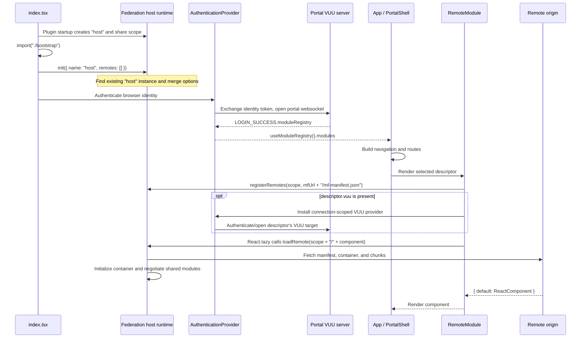

# Module Federation runtime integration

This document describes the current `portal-host` integration with
`@module-federation/enhanced` and the VUU portal module registry. It is intended
both as a reference for this example and as a guide for applications consuming
the same VUU UI libraries.

## Host build-time configuration

`portal-host/scripts/rsbuild.ts` installs
`ModuleFederationPlugin` from `@module-federation/enhanced/rspack`:

```ts
new ModuleFederationPlugin({
  name: "host",
  remoteType: "module",
  shared: getSharedDependencies("consumer"),
});
```

The configuration has four important properties:

- The federation host name is `host`.
- There are no `remotes` or `exposes` entries. Remote modules are discovered
  after login and registered at runtime, and the host does not publish any
  modules of its own.
- The host is emitted as ESM. Rsbuild has `output.module: true`, while Rspack
  uses `chunkFormat: "module"`, `chunkLoading: "import"`, and
  `library.type: "module"`. `remoteType: "module"` tells federation to treat
  compatible remote entries as modules.
- `getSharedDependencies("consumer")`, implemented in
  `vuu-ui/scripts/module-federation-utils.ts`, makes these packages strict
  singletons with versions derived from the portal example package manifests:
  `react`, `react-dom`, `react-router-dom`, `@vuu-ui/core`,
  `@vuu-ui/core/portal`, `@vuu-ui/vuu-data-editing`, and
  `@vuu-ui/vuu-shell`.

The plugin does more than declare remote names. Its generated bundler runtime
creates the host's federation runtime and share scope and records the host
instance in Module Federation's global instance collection. That generated
state is the foundation used later by the imperative runtime API.

## Entry boundary and runtime initialization

`portal-host/src/index.tsx` contains only:

```ts
import("./bootstrap");
```

This asynchronous boundary is deliberate. If the entry statically imported
React, VUU packages, and `App`, those imports could be evaluated as part of the
initial entry graph before the federation runtime had initialized the shared
scope. The dynamic import gives the plugin-generated startup code an initial
chunk in which to establish the federation runtime and share providers before
loading and evaluating the `bootstrap.tsx` graph and its application imports.

`portal-host/src/bootstrap.tsx` then explicitly initializes the runtime API:

```ts
init({
  name: "host",
  remotes: [],
});
```

This does **not** create an unrelated second host. In the runtime used by the
pinned `@module-federation/enhanced` package, `init()` searches the global
federation instances for an instance with the same name (and compatible
version/build identity). Because the plugin-generated bundler runtime has
already created `host`, `init()` calls that instance's `initOptions()` to merge
the supplied options and retains it as the instance used by imperative calls
such as `registerRemotes()` and `loadRemote()`.

The ordering is therefore:

1. The generated bundler runtime creates `host` and initializes its share
   scope.
2. The asynchronous `bootstrap.tsx` graph loads.
3. The explicit `init()` finds and merges the existing `host` instance.
4. Later calls through `@module-federation/enhanced/runtime` operate on that
   instance.

`remotes: []` is valid. It means that the host has no remotes at startup; it
does not disable Module Federation. The host still participates as a consumer
and provider of shared modules, and remote definitions can be added later with
`registerRemotes()`. An empty initial remote list is not an error.

## From authentication to module descriptors

`bootstrap.tsx` renders `AuthenticationProvider` in identity mode with
`KeycloakAuthHandler`:

```tsx
<AuthenticationProvider
  authConfig={config}
  authHandlerClass={KeycloakAuthHandler}
  mode="identity"
>
  <App />
</AuthenticationProvider>
```

The active flow is implemented by the following functions:

1. `KeycloakAuthHandler.authenticate()` in
   `packages/core/src/auth/KeycloakAuthHandler.ts` performs the browser's
   Keycloak login.
2. `IdentityAuthenticationProvider` in
   `packages/core/src/auth/AuthenticationProvider.tsx` constructs the portal
   VUU target from `authConfig.restUrl` and `authConfig.websocketUrl`.
3. `useConnectionSession()` acquires that target from
   `VuuConnectionRegistry`.
4. `IdentityTokenSessionResolver.resolve()` obtains the current identity token
   and `exchangeVuuToken()` exchanges it at the portal target's REST endpoint
   for a VUU token.
5. `VuuConnectionRegistry.#authenticateAndConnect()` calls
   `ConnectionManager.connectWithLoginResponseTo()` for the portal websocket.
   The websocket login response is the VUU protocol
   `LOGIN_SUCCESS` message.
6. The registry copies
   `connectionResult.loginResponse.moduleRegistry` into the authenticated VUU
   session. `AuthenticatedIdentityProvider` then exposes it through
   `IdentityContext`.

`portal-host/src/authentication.ts` is an older direct-cookie connection helper;
it is not imported by the current `bootstrap.tsx` authentication path.

The protocol types in
`packages/vuu-protocol-types/index.d.ts` define
`VuuLoginSuccessResponse.moduleRegistry` and the descriptor shape.
`useModuleRegistry()` in `AuthenticationProvider.tsx` returns that registry and
throws a configuration error if `LOGIN_SUCCESS` omitted it or if it has no
`modules` array.

`portal-host/src/App.tsx` passes the descriptors into the portal:

```tsx
const { modules: remoteModules } = useModuleRegistry();

return <PortalShell remoteModules={remoteModules} title="Portal Demo" />;
```

`PortalShell` in `packages/core/src/portal-shell/PortalShell.tsx` uses the same
array in three ways:

- It passes the array to `PortalNav`.
- It creates one React Router route per descriptor, normalizing `path` to end
  in `/*`.
- It renders `RemoteModule` for the selected route and provides the full
  registry through `PortalModuleRegistryProvider`, allowing a loaded remote to
  discover other registered modules.

`PortalNav` in `packages/core/src/portal-nav/PortalNav.tsx` builds its hierarchy
from `location` (for example, `/Admin/Users`) and uses `path` as the navigation
target.

## Descriptor contract

`VuuModuleDescriptor` is declared in
`packages/vuu-protocol-types/index.d.ts` and re-exported from
`@vuu-ui/core/portal` as `RemoteModuleDescriptor`. Its runtime-critical fields
are:

| Field | Purpose |
| --- | --- |
| `mfUrl` | Base URL from which `RemoteModule` requests `mf-manifest.json`. Supply the remote base, not the manifest filename. |
| `mfScope` | Runtime remote name. It must equal the producer's `ModuleFederationPlugin.name`. |
| `mfComponent` | Exposed module key without the producer's leading `./`. For an exposure named `./UserAdmin`, use `UserAdmin`. |
| `path` | React Router path used by `PortalShell`; `/*` is added when absent. |
| `location` | Slash-separated navigation placement and labels consumed by `PortalNav`. |
| `vuu` | Optional `{ connectionId, restUrl?, websocketUrl? }` describing the VUU data connection to install around this remote. |

The remaining protocol metadata is `clientIdentifier`, `description`,
`enabled`, `id`, `loginRole`, `name`, `title`, and `version`. The current
`PortalShell` receives the server's `modules` array as-is; it does not itself
filter descriptors by `enabled`.

## Dynamic remote loading

The exact loading path is in
`packages/core/src/remote-module/RemoteModule.tsx`.

On the first render of a unique
`mfUrl|mfScope/mfComponent` combination:

1. `getRemoteComponent()` builds the manifest URL by appending
   `/mf-manifest.json` to `mfUrl`.
2. `getLazyComponent()` immediately registers the runtime remote:

   ```ts
   registerRemotes([{ name: scope, entry: manifestUrl }]);
   ```

3. The returned `React.lazy` loader runs when React attempts to render it:

   ```ts
   loadRemote(`${scope}/${component}`, { from: "runtime" });
   ```

4. The runtime fetches and interprets the manifest, loads the referenced
   container/chunks, initializes the remote container against the host share
   scope, negotiates shared dependency versions, and requests the named
   exposure.
5. The loaded exposure must resolve to an object with a React component as its
   `default` export, which is the module shape required by `React.lazy`.
   `RemoteModule` explicitly throws when `loadRemote()` returns `null`.

The lazy component is cached in a module-level `Map`, keyed by URL, scope, and
component. Re-renders and route changes reuse it. `RemoteModuleErrorBoundary`
renders an error message and logs the failure. Its `onError` handler removes
the failed component from the cache, so a subsequent mount can create a fresh
lazy loader; the boundary currently showing the error does not automatically
retry in place.

The `mfUrl` contract is intentionally a base URL. Passing a URL that already
ends in `mf-manifest.json` would cause the filename to be appended a second
time.

## Federation loading versus VUU connection scoping

Module Federation and VUU authentication solve separate problems:

- `registerRemotes()` and `loadRemote()` locate and execute JavaScript and
  negotiate shared JavaScript dependencies.
- A descriptor's optional `vuu` property selects the authenticated VUU REST
  and websocket connection used by the rendered component.

`RawRemoteModule` first obtains the federated React component independently of
`vuu`. When `vuu` is present, it wraps that component in:

```tsx
<AuthenticationProvider mode="vuu-connection" connection={vuu}>
  {remoteComponent}
</AuthenticationProvider>
```

That provider reuses the browser identity handler, exchanges a VUU token for
the specified target, opens or reuses the connection keyed by `connectionId`,
and installs a connection-scoped `VuuDataSource` and server API. If the
descriptor's `connectionId` is the portal connection, omitted endpoints may
inherit the portal endpoints; a distinct connection must supply both REST and
websocket URLs. A remote with no `vuu` metadata still loads and renders through
Module Federation, inheriting the surrounding portal VUU context rather than
creating a separate connection.

Conversely, successfully authenticating a VUU connection does not register or
load a federated container. Failures should be diagnosed on the appropriate
side of this boundary.

## Building a producer

Portal producer packages run `vuu-ui/scripts/build-remote-module.ts`, normally
through a package script such as:

```json
"build": "node ../../scripts/build-remote-module.ts"
```

The script reads the current package's `package.json` and requires:

```json
{
  "name": "user-admin",
  "vuu": {
    "module-federation": {
      "name": "userAdmin",
      "port": 5003,
      "exposes": {
        "./UserAdmin": "./src/UserAdmin"
      }
    }
  }
}
```

The top-level package `name` selects the output directory
`dist_portal/<package-name>`. The nested `vuu.module-federation` object supplies
the federation `name`, development/public-path `port`, and `exposes`.
`normalizeExposes()` adds a leading `./` to source requests beginning with
`src/`; exposure keys are passed through unchanged.

The producer plugin configuration is:

```ts
new ModuleFederationPlugin({
  name,
  dts: false,
  exposes: normalizeExposes(exposes),
  shared: getSharedDependencies("producer"),
});
```

The enhanced plugin emits the producer container assets and
`mf-manifest.json`; TypeScript federation declaration generation is disabled.
Producer chunks use `chunkFormat: "array-push"` and
`chunkLoading: "jsonp"`, with `publicPath` set from the configured port so the
manifest/container can locate their chunks.

Producer sharing uses strict required versions for `react`, `react-dom`,
`react-router-dom`, `@vuu-ui/core`, `@vuu-ui/core/portal`,
`@vuu-ui/vuu-data-editing`, and `@vuu-ui/vuu-shell`.
`react-router-dom`, `@vuu-ui/core`, `@vuu-ui/core/portal`, and
`@vuu-ui/vuu-data-editing` are producer singletons; React, React DOM, and
`@vuu-ui/vuu-shell` are strict but are not marked singleton in the producer
configuration. The consumer marks all seven as singletons.

The registry descriptor must correspond to the producer metadata:

```text
descriptor.mfScope     == package.json vuu.module-federation.name
descriptor.mfComponent == exposure key with the leading "./" removed
descriptor.mfUrl        == base URL serving the generated mf-manifest.json
```

For the example above, the load request is `userAdmin/UserAdmin`.

`getSharedDependencies()` first scans the portal example package manifests and
requires consistent declared versions for React, React Router, and VUU
packages. Inconsistent declarations can therefore fail the build configuration
before assets are emitted.

## End-to-end sequence



## Troubleshooting

### `ReferenceError: __name is not defined`

`__name` is a helper emitted by a bundler or transform (commonly esbuild-based
transforms) to preserve or assign function/class names. It is **not** a Module
Federation remote name, scope, host name, or configuration variable.

This error means that an emitted artifact references the generated helper
without the helper declaration being present in the JavaScript scope where the
artifact executes. Typical causes are:

- an artifact was transformed, concatenated, or split after its original
  bundler emitted it;
- a chunk crossed an incompatible bundler/runtime format boundary;
- a toolchain optimization removed or failed to inject the helper; or
- host and remote assets were produced by incompatible transform assumptions.

Inspect the first failing generated file and its source map, verify that every
chunk is served from the build that produced its manifest, and compare the
host/producer Rsbuild, Rspack, enhanced federation, and transform versions.
Do not try to fix the error by adding a remote called `__name`.

The error can occur before any application remote is registered. The host's
entry, plugin-generated federation runtime, and imported runtime libraries are
already emitted/transformed JavaScript and execute while establishing the host
and share scope. A missing generated helper in that startup path fails before
`RemoteModule` reaches `registerRemotes()`.

### Remote cannot be resolved

- Confirm that `<mfUrl>/mf-manifest.json` is reachable and that `mfUrl` does
  not already include the manifest filename.
- Confirm that `mfScope` exactly matches the producer federation `name`.
- Confirm that `mfComponent` matches an `exposes` key after removing only its
  leading `./`.
- Confirm that the exposure has a default React component export.
- Confirm that the manifest and all referenced chunks come from the same
  producer build and are available at the producer's configured public path.

### Shared dependency/version failure

All configured shares use `strictVersion: true`. The host also requires each
consumer share to be a singleton. If the producer requires a React, React DOM,
React Router, or VUU version that cannot be satisfied by the available share
scope, the likely failure is during `loadRemote()` while the remote container
is initialized and shared modules are negotiated, before the remote component
renders. Treat messages about an unavailable or unsatisfied shared version as
a host/producer dependency alignment problem, not as a registry URL problem.

React and React DOM are especially sensitive because a remote must render
against a compatible React runtime. VUU packages must likewise use versions
compatible with the host's singleton `@vuu-ui/core` and related shares. Align
the portal package manifests and rebuild both host and producer rather than
relaxing strictness or permitting duplicate singleton libraries.

### VUU connection failure after the remote loads

If runtime registration succeeds but a descriptor with `vuu` does not render,
inspect its `vuu.connectionId`, `restUrl`, and `websocketUrl`, along with the
token exchange and websocket login. The connection provider waits for its VUU
session before rendering the lazy child, so `loadRemote()` may not run until
that authentication completes. This remains separate from federation manifest
resolution: use network/runtime evidence to determine whether the failure is
in the VUU connection or the later manifest/container/share load.
