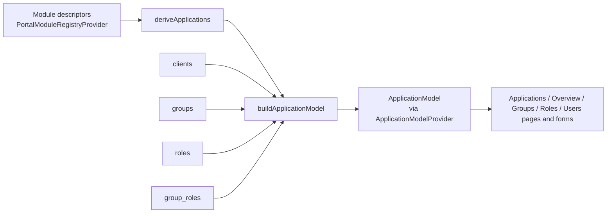

# Application model

The application model is the in-browser view that turns module descriptors and
Keycloak tables into "applications". Keycloak is the only store, so nothing is
persisted: the model is rebuilt in the browser from the module descriptors and
the Keycloak read models. It lives in `src/data/applications.ts`.

The naming rules it relies on are summarised in
[keycloak-naming.md](../keycloak-naming.md).

## Inputs

1. **Descriptors → `PortalApplication`** (`deriveApplications`).
   - Each remote module supplies `name`, `title`, `accessRole` and `clientIdentifier`.
   - The group prefix is derived from the access role: `basket-trading-access` becomes `basket-trading-`.
   - Descriptors whose access role doesn't end in `-access`, or which reuse another module's access role, become issues and are left out.
   - Overlapping group prefixes are also flagged.
2. **Keycloak tables.** `useLoadApplicationModel` subscribes to `clients`, `groups`, `roles` and `group_roles`, loading up to 1000 rows each. These are live subscriptions, so the model rebuilds when Keycloak data changes. Realm roles and Keycloak administrator roles are never loaded.

## Classification (`buildApplicationModel`)

- **Roles** (`classifyRole`):
  - A role on `vuu-portal` whose name equals a descriptor's `accessRole` is that application's **access** role.
  - A role on an application's own client is one of that application's **application** roles.
  - Anything else goes into `unmatchedRoles`.
- **Groups** (`applicationForGroupName`):
  - The group name is the last `group_path` segment.
  - The group belongs to the application with the longest matching prefix; otherwise it goes into `unmatchedGroups`.
  - Each group also records its role IDs, whether it has the access role, and any `foreignRoles` (roles from another application, or from none).
- **Clients** are matched to applications by `clientIdentifier`.

## Output: `ApplicationModel`

| Field | Contents |
| --- | --- |
| `applications` / `byName` | One `ApplicationDetails` per application. Each has the descriptor, its `accessRole`, `client`, `groups`, own `roles` and `issues`. |
| `groupsById`, `rolesById` | Lookups over every group and role. |
| `groupApplication`, `roleApplication` | The application each group or role ID belongs to. |
| `unmatchedGroups`, `unmatchedRoles` | The "Unassigned" bucket, i.e. naming drift. |
| `issues` | All health issues. Per-application ones are also on each entry. |

**Per-application checks:**

- access role missing
- client missing
- no groups
- a group without the access role
- a group with foreign roles
- a role that's in no group

## How it's used

- **`ApplicationModelProvider`** (wrapped around the routes in `UserAdmin.tsx`) exposes `{ loading, error, model }` through `useApplicationModel()`.
- **Scoping pages:** `groupIdsFor` and `roleIdsFor` turn an application into an ID-based `in` filter for the Groups and Roles tables (`useApplicationScope`). Users are scoped separately, using the server's `module_access` column.
- **Cell renderers and forms** read the model to:
  - show the Application column and the "Access" tag
  - fix the group name prefix
  - always include the access role
  - limit the role picker to the application's own roles
  - pick a new role's client

## Limits

- **Browser-side only:** it depends on the client-side lookups, so tables with more than 1000 rows would be incomplete.
- **Group names:** they come from the path, because the groups table has no name column.
- **Server matching differs:** `getUserModuleAccessOptions` links groups by whether they include the access role, not by name prefix. The group checks catch the cases where the two disagree.
