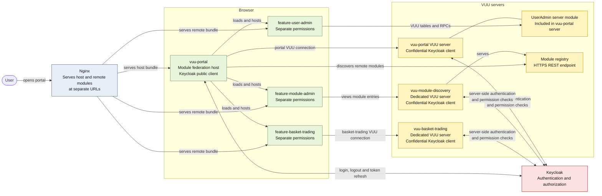

# Module Federation Architecture

The host authenticates the browser through its **public** Keycloak client. Each
VUU server authenticates server-side through its own **confidential** Keycloak
client. Permissions are assigned independently for the portal and each remote
module, while `feature-user-admin` shares the portal's VUU server deployment.
